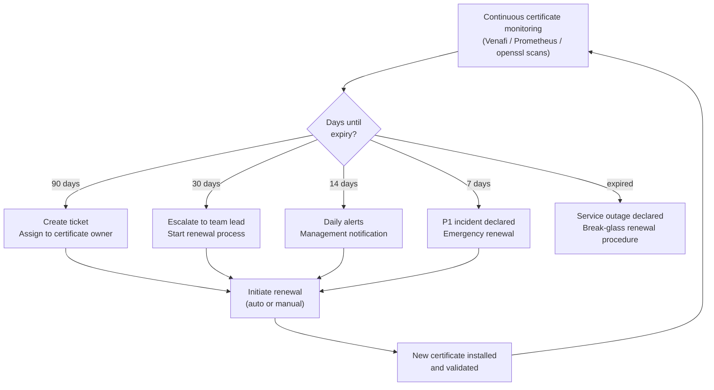

---
tags:
  - operations
  - security
---
# Certificates — Health Checks

<div class="kb-summary">
Weekly operations include reviewing the certificate expiry dashboard for certificates expiring within 30, 60, and 90 days, checking CRL and OCSP responder availability for all CAs, verifying CA service health (for ADCS: check Certificate Services in Server Manager and confirm the
</div>

```d2
direction: right

begin_checks: "Begin Checks" {shape: oval}
run_this_routine: "Run This Routine" {shape: rectangle}
certificate_expiry_monitoring_flow: "Certificate Expiry Monitoring Flow" {shape: rectangle}
certificate_expiration_monitoring: "Certificate Expiration Monitoring" {shape: rectangle}
verify: "Verify" {shape: rectangle}
generate_report: "Generate Report" {shape: oval}

begin_checks -> run_this_routine
run_this_routine -> certificate_expiry_monitoring_flow
certificate_expiry_monitoring_flow -> certificate_expiration_monitoring
certificate_expiration_monitoring -> verify
verify -> generate_report
```

## Before you begin

- **Access:** Admin credentials on all affected systems
- **Timing:** safe to run during business hours unless a step is marked ⚠ (causes interruption)
- **Dependencies:** no active upgrades or migrations on the same infrastructure
- **Logging:** capture command output — paste into the change record on completion

---

## Run This Routine

1. **CA certificate expiry** — On the CA server, open the Certification Authority MMC snap-in, right-click the CA, select **Properties → General**, and note the CA certificate expiry date; alternatively run `certutil -verify -urlfetch <ca-cert-file>` to validate the chain; flag if expiry is within 6 months.
2. **Issued cert expiry scan** — On the CA server run `certutil -store CA | findstr /i "not after"` to list certificate expiry dates; flag any issued certificate expiring within 60 days and assign a renewal ticket to the certificate owner.
3. **CRL freshness** — Run `certutil -URL <crl-distribution-point-url>` to open the URL retrieval tool and verify the CRL is retrievable and currently valid; a stale or unreachable CRL will cause certificate validation failures across all relying services.
4. **OCSP responder health** — Run `curl -s -o /dev/null -w "%{http_code}" "http://<ocsp-server>/ocsp"` and confirm the response is `200`; if the OCSP responder is offline, clients configured for OCSP stapling will fail or fall back to CRL.
5. **Auto-enrollment compliance** — Run `certutil -dstemplate` to list all published certificate templates; verify that templates used for auto-enrollment are present and that permissions are intact for the target computer/user groups.
6. **Certificate services status** — Run `Get-Service CertSvc | Select-Object Name, Status` on the CA server; the service must show `Running`; a stopped CertSvc means no new certificates can be issued and renewals will fail.
7. **Failed certificate requests** — Open the Certification Authority MMC, expand the CA, and click **Failed Requests**; filter for requests in the last 24 hours; investigate any failures for pattern — common causes are template misconfiguration, permission errors, or CSR format issues.

 service is running), and confirming auto-renewal jobs completed successfully. Monthly, audit newly issued certificates against naming and validity standards.

## Certificate Expiry Monitoring Flow



OCSP and CRL freshness must be checked proactively — a stale CRL can cause widespread certificate validation failures across services that depend on it.

**Weekly checklist:**

- [ ] Review expiry dashboard — 30 / 60 / 90-day buckets
- [ ] Check CRL freshness and OCSP responder health for each CA
- [ ] Verify ADCS Certificate Services is running (`Get-Service -Name CertSvc`)
- [ ] Confirm auto-renewal jobs (Venafi / ACME) completed without error
- [ ] Review any newly discovered unmanaged certificates

**Monthly checklist:**

- [ ] Audit newly issued certificates against naming and validity standards
- [ ] Review wildcard certificate usage
- [ ] Confirm CA certificate expiry dates and plan renewals if within 6 months

---

## Certificate Expiration Monitoring

Expired certificates cause immediate service outages. Monitoring expiry and alerting well in advance (90/30/7 day thresholds) is essential.

### Checking Expiry with openssl

```bash
# Check expiry date of a remote server cert
echo | openssl s_client -connect example.com:443 2>/dev/null \
    | openssl x509 -noout -dates

# Check expiry of a local cert file
openssl x509 -in server.crt -noout -enddate

# Check if cert expires within N days (exit code 1 if expired)
openssl x509 -in server.crt -noout -checkend $((30 * 86400))
# Exit 0 = valid for 30+ days; Exit 1 = expires within 30 days

# Get expiry as epoch for scripting
openssl x509 -in server.crt -noout -enddate \
    | cut -d= -f2 | date -f - +%s
```

### Alert Thresholds

| Threshold | Action |
|---|---|
| 90 days | Ticket creation, assigned to cert owner |
| 30 days | Escalation to team lead, renewal started |
| 14 days | Daily alerts, management notification |
| 7 days | P1 incident, emergency renewal |
| Expired | Outage declared, break-glass procedure |

### Bulk Expiry Check Script (Bash)

```bash
#!/bin/bash
# Check expiry for a list of hosts
HOSTS=("example.com:443" "api.example.com:443" "intranet.corp.example.com:8443")
WARN_DAYS=30

for HOST in "${HOSTS[@]}"; do
    EXPIRY=$(echo | openssl s_client -connect "$HOST" 2>/dev/null \
        | openssl x509 -noout -enddate 2>/dev/null | cut -d= -f2)
    if [ -z "$EXPIRY" ]; then
        echo "UNREACHABLE: $HOST"
        continue
    fi
    EXPIRY_EPOCH=$(date -d "$EXPIRY" +%s 2>/dev/null || date -j -f "%b %d %T %Y %Z" "$EXPIRY" +%s)
    NOW_EPOCH=$(date +%s)
    DAYS_LEFT=$(( (EXPIRY_EPOCH - NOW_EPOCH) / 86400 ))
    if [ "$DAYS_LEFT" -le "$WARN_DAYS" ]; then
        echo "WARNING: $HOST expires in $DAYS_LEFT days ($EXPIRY)"
    else
        echo "OK: $HOST expires in $DAYS_LEFT days"
    fi
done
```

### Windows Certificate Expiry Checks

```powershell
# Check all certs in local machine store expiring within 90 days
Get-ChildItem Cert:\LocalMachine\My |
    Where-Object {$_.NotAfter -lt (Get-Date).AddDays(90)} |
    Select-Object Subject, Thumbprint, NotAfter | Sort-Object NotAfter

# Check a remote host cert
$tcp = New-Object System.Net.Sockets.TcpClient("example.com", 443)
$ssl = New-Object System.Net.Security.SslStream($tcp.GetStream())
$ssl.AuthenticateAsClient("example.com")
$cert = $ssl.RemoteCertificate
[System.Security.Cryptography.X509Certificates.X509Certificate2]::new($cert) |
    Select-Object Subject, NotAfter
$ssl.Close(); $tcp.Close()
```

### Monitoring Integration

```bash
# Nagios/Icinga check_ssl_cert style check
openssl s_client -connect example.com:443 </dev/null 2>/dev/null \
    | openssl x509 -noout -checkend $((14 * 86400))
echo "Exit: $?"

# Export expiry dates for Prometheus node exporter (textfile collector)
EXPIRY=$(echo | openssl s_client -connect example.com:443 2>/dev/null \
    | openssl x509 -noout -enddate | cut -d= -f2)
EPOCH=$(date -d "$EXPIRY" +%s)
echo "ssl_cert_expiry_seconds{host=\"example.com\"} $EPOCH" \
    > /var/lib/node_exporter/textfile_collector/ssl.prom
```

---

## Verify

- Confirm the operation completed without errors in the log or management UI
- Verify the expected state change is visible (service running, object created, config applied)
- Document the outcome in the change record

## See also

- [Certificates — Procedures](../procedures/)
- [Certificates — CLI Reference](../cli-reference/)
- [Certificates — Scripts](../scripts/)
- [Certificates — Backup and Restore](../backup-restore/)
- [Certificates — Install and Upgrade](../install-upgrade/)
- [Certificates — Common Issues](../../troubleshooting/common-issues/)
