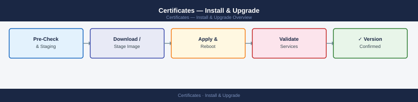
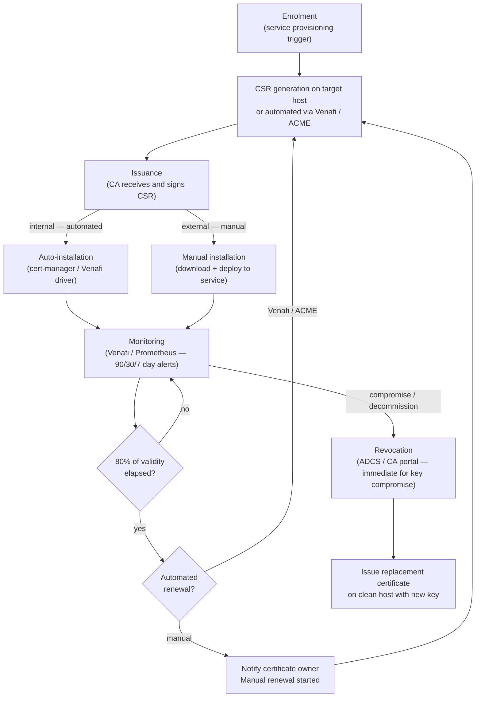

---
tags:
  - operations
  - security
---
# Certificates — Install & Upgrade


<div class="kb-summary">
The certificate lifecycle spans six stages: enrolment, issuance, installation, monitoring, renewal, and revocation. Auto-renewal must be configured wherever possible (Venafi, ACME, cert-manager). Manual processes are a fallback only.
</div>



```d2
direction: right

plan: "Plan" {shape: oval}
full_certificate_lifecycle: "Full Certificate Lifecycle" {shape: rectangle}
lifecycle_overview: "Lifecycle Overview" {shape: rectangle}
csr_generation: "CSR Generation" {shape: rectangle}
certificate_issuance_internal_adcs: "Certificate Issuance (Internal ADCS)" {shape: rectangle}
certificate_installation: "Certificate Installation" {shape: rectangle}
certificate_renewal: "Certificate Renewal" {shape: rectangle}
validate: "Validate" {shape: oval}

plan -> full_certificate_lifecycle
full_certificate_lifecycle -> lifecycle_overview
lifecycle_overview -> csr_generation
csr_generation -> certificate_issuance_internal_adcs
certificate_issuance_internal_adcs -> certificate_installation
certificate_installation -> certificate_renewal
certificate_renewal -> validate
```

## Before you begin

- **Access:** Admin credentials on all affected systems
- **Timing:** safe to run during business hours unless a step is marked ⚠ (causes interruption)
- **Dependencies:** no active upgrades or migrations on the same infrastructure
- **Logging:** capture command output — paste into the change record on completion

---

## Full Certificate Lifecycle




---
## Lifecycle Overview

| Stage | Trigger | Owner | Target SLA |
|---|---|---|---|
| Enrolment | Service provisioning or renewal request | Application / infra team | — |
| Issuance | CA receives valid CSR | CA (automated or manual) | < 1 hour (internal), same day (external) |
| Installation | Certificate issued | Application / infra team | Same day |
| Monitoring | Continuous | Venafi / monitoring team | Alert at 30 days, escalate at 7 days |
| Renewal | 80% of validity elapsed | Automated (Venafi / ACME) | Before expiry |
| Revocation | Compromise, decommission, or policy violation | Certificate owner + CA admin | Immediate for key compromise |

---

## CSR Generation

Always generate the key pair on the target host or in an HSM — never send private keys over the network.

```bash
# Generate a 4096-bit RSA key and CSR (Linux)
openssl req -new -newkey rsa:4096 -nodes \
  -keyout server.key \
  -out server.csr \
  -subj "/CN=app.corp.example.com/O=Example Corp/C=GB"

# Generate with SANs using a config file
cat > san.cnf <<EOF
[req]
distinguished_name = req_distinguished_name
req_extensions     = v3_req
prompt             = no

[req_distinguished_name]
CN = app.corp.example.com

[v3_req]
subjectAltName = @alt_names

[alt_names]
DNS.1 = app.corp.example.com
DNS.2 = app-internal.corp.example.com
IP.1  = 10.10.10.50
EOF

openssl req -new -newkey rsa:4096 -nodes \
  -keyout server.key -out server.csr -config san.cnf
```

```powershell
# Generate CSR on Windows using certreq
# 1. Create request INF
$inf = @"
[NewRequest]
Subject       = "CN=app.corp.example.com, O=Example Corp, C=GB"
KeyAlgorithm  = RSA
KeyLength     = 4096
HashAlgorithm = SHA256
Exportable    = FALSE
MachineKeySet = TRUE

[Extensions]
2.5.29.17 = "{text}dns=app.corp.example.com&dns=app-internal.corp.example.com"
"@
$inf | Out-File "C:\Temp\request.inf" -Encoding ASCII

# 2. Generate CSR
certreq -new "C:\Temp\request.inf" "C:\Temp\request.csr"
```

---

## Certificate Issuance (Internal ADCS)

```powershell
# Submit CSR to internal ADCS CA and retrieve certificate
certreq -submit -attrib "CertificateTemplate:WebServer-Internal" `
  "C:\Temp\request.csr" "C:\Temp\issued.cer"

# If pending (requires manager approval), retrieve after approval
certreq -retrieve <RequestID> "C:\Temp\issued.cer"

# Install the issued certificate
certreq -accept "C:\Temp\issued.cer"
```

---

## Certificate Installation

```bash
# Verify certificate and key match before installation
openssl x509 -noout -modulus -in server.crt | md5sum
openssl rsa  -noout -modulus -in server.key | md5sum
# Output must match

# Combine into PEM bundle (cert + intermediates)
cat server.crt intermediate-ca.crt > bundle.pem

# Verify the full chain
openssl verify -CAfile root-ca.crt -untrusted intermediate-ca.crt server.crt
```

---

## Certificate Renewal

Renewal should be initiated at 80% of the certificate's validity period.

```powershell
# Trigger auto-enrollment renewal on a Windows host
certutil -pulse
```

---

## Certificate Revocation

### Revoke via ADCS

```powershell
# Revoke a certificate by serial number
$serial = "1f2e3d4c5b6a7988"
certutil -revoke $serial 3   # Reason code 3 = Key Compromise

# Publish a new CRL immediately after revocation
certutil -CRL

# Verify the revoked certificate appears in the CRL
certutil -verify -urlfetch <revoked-cert.cer>
```

Reason codes: 0 = Unspecified, 1 = Key Compromise, 2 = CA Compromise, 3 = Affiliation Changed, 4 = Superseded, 5 = Cessation of Operation.

---

## Verify

- Confirm the operation completed without errors in the log or management UI
- Verify the expected state change is visible (service running, object created, config applied)
- Document the outcome in the change record

## See also

- [Certificates — Procedures](../procedures/)
- [Certificates — Health Checks](../health-checks/)
- [Certificates — CLI Reference](../cli-reference/)
- [Certificates — Scripts](../scripts/)
- [Certificates — Backup and Restore](../backup-restore/)
- [Certificates — Common Issues](../../troubleshooting/common-issues/)
