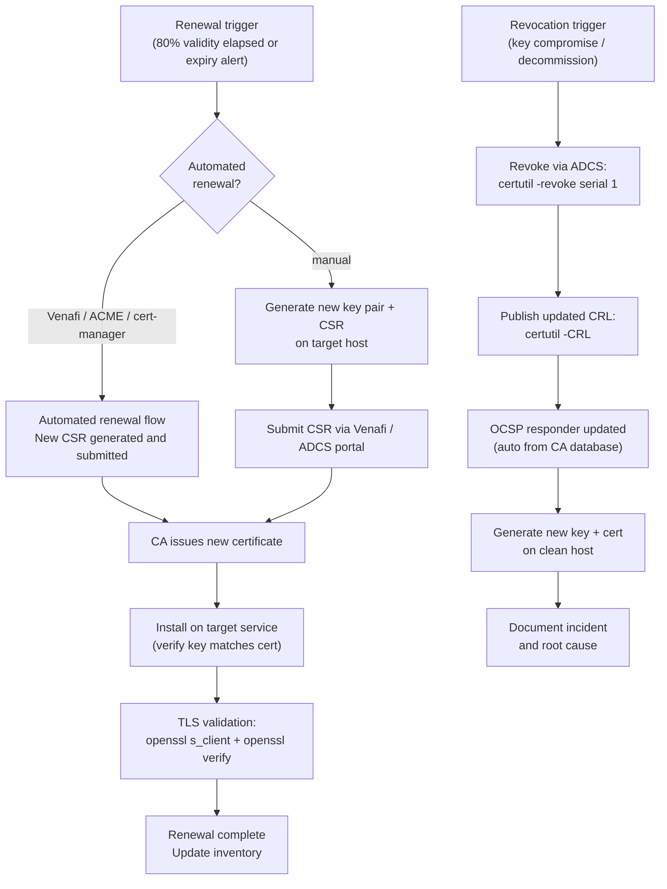

---
tags:
  - operations
  - security
---
# Certificates — Procedures

<div class="kb-summary">
Procedures reference covering Certificate Renewal and Revocation Workflow, Renewal, Inventory, TLS Validation.
</div>

## Before you begin

- **Access:** Admin credentials on all affected systems
- **Timing:** safe to run during business hours unless a step is marked ⚠ (causes interruption)
- **Dependencies:** no active upgrades or migrations on the same infrastructure
- **Logging:** capture command output — paste into the change record on completion

---

## Certificate Renewal and Revocation Workflow



---

## Renewal

Certificate renewal should be initiated at 80% of the certificate's validity period (e.g., for a 2-year certificate, renew after ~20 months).

```powershell
# Trigger auto-enrollment renewal on a Windows host
certutil -pulse

# Force renewal of a specific certificate (using Venafi API — see Venafi lifecycle page)
# Or: request a new certificate using the same template and replace the binding
```

### Renewing a CA Certificate

CA certificate renewal is a planned event requiring co-ordination with all relying parties:

1. Generate a new key pair and CSR on the CA.
2. Have the parent CA (or Root CA key ceremony) sign the new CA certificate.
3. Publish the new CA certificate to AD (auto-distributes to domain members via GPO):

```powershell
# Publish new Issuing CA certificate to AD
certutil -dspublish -f IssuingCA.cer SubCA
```

4. Update CDP and AIA extensions to reference the new certificate.
5. Update any trust stores that reference the CA certificate explicitly (non-domain systems, network devices, Java keystores).

### Emergency Revocation Checklist

- [ ] Revoke certificate via ADCS or vendor portal
- [ ] Publish updated CRL immediately
- [ ] Notify service owner to replace certificate
- [ ] Verify revocation propagated to OCSP responder
- [ ] Audit which services were using the revoked certificate
- [ ] Generate and install replacement certificate
- [ ] Verify replacement is correctly installed and trusted
- [ ] Document incident with timeline and root cause

---

## Inventory

Maintaining an accurate certificate inventory prevents surprise expirations. Inventory should cover all certificates: public-facing TLS, internal services, code signing, client authentication.

### Discovery Methods

| Method | Coverage | Effort |
|---|---|---|
| Port scanning with nmap | External/internal TLS endpoints | Low — automated |
| openssl per host | Targeted host checks | Low — scriptable |
| Venafi / DigiCert One | Managed certificates | Low (integrated) |
| AD Certificate Services | Internally issued certs | Low (ADCS reports) |
| Manual tracking spreadsheet | Small environments | Medium — human |
| Shodan / Censys | External internet-facing | Low (API) |

### Port Scanning for Certificates

```bash
# Scan a subnet for TLS on common ports
nmap -p 443,8443,636,993,995 --script ssl-cert 192.168.1.0/24 \
    -oX ssl-scan.xml

# Extract CN and expiry from nmap XML output
grep -A5 "ssl-cert" ssl-scan.xml | grep -E "commonName|notAfter"

# Quick single-host TLS cert dump
nmap -p 443 --script ssl-cert example.com \
    | grep -E "Subject:|Not valid after"
```

### openssl-Based Discovery

```bash
# Grab cert details from a live endpoint
echo | openssl s_client -connect example.com:443 2>/dev/null \
    | openssl x509 -noout -subject -issuer -dates -fingerprint

# Check SAN entries (Subject Alternative Names)
echo | openssl s_client -connect example.com:443 2>/dev/null \
    | openssl x509 -noout -text | grep -A2 "Subject Alternative Name"

# Extract cert to file for further analysis
echo | openssl s_client -connect example.com:443 2>/dev/null \
    | openssl x509 > example-com.pem
```

### Windows Certificate Store Inventory

```powershell
# List all certs in the local machine Personal store
Get-ChildItem Cert:\LocalMachine\My |
    Select-Object Subject, Issuer, Thumbprint, NotBefore, NotAfter |
    Export-Csv C:\CertInventory.csv -NoTypeInformation

# List certs across all stores
foreach ($store in @("My","CA","Root","TrustedPeople")) {
    Get-ChildItem "Cert:\LocalMachine\$store" |
        Select-Object @{N="Store";E={$store}}, Subject, NotAfter, Thumbprint
}

# Find certs issued by a specific CA
Get-ChildItem Cert:\LocalMachine\My |
    Where-Object {$_.Issuer -like "*Internal CA*"} |
    Select-Object Subject, NotAfter, Thumbprint
```

### Tracking Spreadsheet Columns

Minimum fields for a useful inventory:

| Field | Notes |
|---|---|
| FQDN / Subject CN | Primary identifier |
| SANs | All covered hostnames |
| Issuer / CA | Root or intermediate that issued it |
| Expiry Date | ISO 8601 format |
| Owner / Team | Who is responsible for renewal |
| Renewal Method | Manual / Venafi / ACME / ADCS |
| Last Renewed | Track renewal history |
| Notes | Any special install steps |

### Venafi Inventory Queries (REST API)

```bash
# Authenticate and get API token
curl -s -X POST https://tpp.corp.example.com/vedauth/authorize \
    -H "Content-Type: application/json" \
    -d '{"Username":"svc-venafi","Password":"P@ssw0rd!"}' \
    | jq '.APIKey'

# List certificates expiring in 90 days
curl -s https://tpp.corp.example.com/vedsdk/certificates \
    -H "X-Venafi-API-Key: $TOKEN" \
    -G --data-urlencode "ValidToLess=2026-08-01" \
    | jq '.Certificates[] | {CN: .Name, Expiry: .ValidTo}'
```

---

## TLS Validation

```bash
# Test TLS handshake and show server certificate
openssl s_client -connect <host>:443 -servername <host>

# Check specific TLS version support
openssl s_client -connect <host>:443 -tls1_2
openssl s_client -connect <host>:443 -tls1_3

# Show full certificate chain from a live endpoint
openssl s_client -connect <host>:443 -showcerts </dev/null 2>/dev/null

# Verify certificate against a CA bundle
openssl verify -CAfile ca-bundle.pem cert.pem

# Verify full chain (intermediate + root)
openssl verify -CAfile root.pem -untrusted intermediate.pem cert.pem
```

---

## Request a Certificate via Web Enrollment

Use the ADCS Web Enrollment portal to submit a CSR and download the issued certificate when auto-enrollment is not available (non-domain systems, network appliances, Linux hosts).

1. Browse to `https://<ca>/certsrv` and authenticate with a domain account that has Enroll permission on the target template.
2. Select **Request a Certificate** → **Advanced certificate request**.
3. Paste the Base-64 encoded CSR into the **Saved Request** field.
4. Select the appropriate certificate template from the **Certificate Template** drop-down.
5. Click **Submit** — if CA policy requires manager approval, the request will be marked Pending.
6. Once issued, return to `https://<ca>/certsrv` → **View the status of a pending certificate request** → select the request → **Download certificate** (Base-64 or DER).
7. Install the certificate on the target host and bind it to the relevant service.

Verify the issued certificate includes the correct Subject CN, SANs, and issuing CA using `openssl x509 -noout -text -in cert.pem`.

---

## Export a Certificate with Private Key (PFX)

Export a certificate and its private key from the Windows certificate store for backup or migration to another host.

1. Open **Certificate Manager** (`certlm.msc`) — this opens the Local Machine store.
2. Expand **Personal → Certificates** and locate the certificate.
3. Right-click the certificate → **All Tasks → Export**.
4. In the Certificate Export Wizard, select **Yes, export the private key** → **Next**.
5. Leave format as **Personal Information Exchange — PKCS #12 (.PFX)** → check **Include all certificates in the certification path** → **Next**.
6. Set a strong password to protect the private key → **Next**.
7. Choose the save location → **Finish**.

```powershell
# Export via PowerShell (alternative)
$cert = Get-ChildItem Cert:\LocalMachine\My | Where-Object {$_.Subject -like "*webserver*"}
$pwd = ConvertTo-SecureString "ExportP@ss!" -AsPlainText -Force
Export-PfxCertificate -Cert $cert -FilePath C:\Export\webserver.pfx -Password $pwd
```

Store the PFX and password in separate secure locations. Delete the exported file after completing the migration.

---

## Configure Auto-Enrollment GPO

Auto-enrollment automatically issues and renews certificates for domain members based on certificate templates, eliminating manual renewal for internal certificates.

1. Open **Group Policy Management** and create or edit a GPO linked to the target OU (or domain).
2. Navigate to **Computer Configuration → Windows Settings → Security Settings → Public Key Policies → Certificate Services Client — Auto-Enrollment**.
3. Set **Configuration Model** to **Enabled**.
4. Check **Renew expired certificates, update pending certificates, and remove revoked certificates**.
5. Check **Update certificates that use certificate templates**.
6. Click **OK** and close the editor.
7. Force a policy refresh and trigger auto-enrollment:

```cmd
gpupdate /force
certutil -pulse
```

8. Verify issued certificates appear in `certlm.msc` under **Personal → Certificates**.

Ensure the certificate template has **Autoenroll** permission granted to the target computers or users security group. The CA must be published in AD for auto-enrollment to locate it.

---

## Monitor Certificate Expiry (PowerShell)

Run this script on all servers to identify certificates approaching expiry before they cause service outages.

```powershell
# Find certs expiring within 60 days on the local machine
Get-ChildItem Cert:\LocalMachine\My |
    Where-Object {$_.NotAfter -lt (Get-Date).AddDays(60)} |
    Select-Object Subject, Issuer, NotAfter, Thumbprint |
    Sort-Object NotAfter

# Run against multiple remote servers
$servers = "web01","web02","app01","app02"
foreach ($server in $servers) {
    Invoke-Command -ComputerName $server -ScriptBlock {
        Get-ChildItem Cert:\LocalMachine\My |
            Where-Object {$_.NotAfter -lt (Get-Date).AddDays(60)} |
            Select-Object @{N="Server";E={$env:COMPUTERNAME}}, Subject, NotAfter
    }
}

# Export results to CSV for tracking
Get-ChildItem Cert:\LocalMachine\My |
    Where-Object {$_.NotAfter -lt (Get-Date).AddDays(60)} |
    Select-Object Subject, NotAfter, Thumbprint |
    Export-Csv C:\Reports\ExpiringCerts.csv -NoTypeInformation
```

Flag any certificate with fewer than 60 days remaining for immediate renewal. Certificates with fewer than 14 days are critical — raise a P1 change if the service is production.

---

## Revoke and Republish CRL

Revoke a compromised or decommissioned certificate and publish an updated CRL so relying parties stop trusting the certificate immediately.

### Revoke the Certificate

1. Open **Certification Authority** MMC (`certsrv.msc`) on the issuing CA.
2. Expand the CA node → **Issued Certificates**.
3. Locate the certificate by serial number or subject → right-click → **All Tasks → Revoke Certificate**.
4. Select the revocation reason (Key Compromise, CA Compromise, Affiliation Changed, Superseded, Cessation of Operation, or Certificate Hold).
5. Confirm the revocation date and click **Yes**.

```cmd
# Revoke by serial number from the command line
certutil -revoke <SerialNumber> <ReasonCode>
# Reason codes: 0=Unspecified, 1=KeyCompromise, 3=Affiliation, 4=Superseded, 5=CessationOfOperation
```

### Publish an Updated CRL

```cmd
# Publish a new CRL immediately (bypasses normal publication schedule)
certutil -CRL

# Verify the CRL was published and check the next update time
certutil -URL <CRLDistributionPoint-URL>
```

6. Browse to the CRL Distribution Point (CDP) URL configured in the CA and confirm the updated CRL is downloadable.
7. Verify the revoked serial number appears in the CRL:

```bash
openssl crl -in crl.pem -text -noout | grep -A2 "Revoked"
```

Notify service owners relying on the revoked certificate to install a replacement immediately.

---

## Request and Issue a Certificate via certreq

Use `certreq` for CSR-based certificate requests on Windows hosts, especially for server certificates and non-auto-enrolled scenarios.

1. Generate a CSR and private key using a `request.inf` file that specifies Subject, KeyLength, and EnhancedKeyUsage:

```cmd
certreq -new request.inf request.csr
```

2. Submit the CSR to the CA:

```cmd
certreq -submit -attrib "CertificateTemplate:<TemplateName>" -config "<CA-Server>\<CA-Name>" request.csr response.cer
```

3. If the CA requires manager approval, approve the pending request in the Certificate Authority MMC under **Pending Requests**.

4. Retrieve the signed certificate:

```cmd
certreq -retrieve <RequestID> response.cer
```

5. Accept and install the certificate:

```cmd
certreq -accept response.cer
```

6. Verify the certificate appears in the local machine certificate store:

```powershell
Get-ChildItem Cert:\LocalMachine\My | Where-Object Subject -like "*<CN>*"
```

---

## Add a Certificate Template

Duplicate and publish a new certificate template to AD CS when a new certificate type is required (e.g., a new application, code signing, or LDAPS).

1. Open the **Certificate Templates** console (`certtmpl.msc`).

2. Right-click an existing template that is closest to the required use case → **Duplicate Template**.

3. Set the **Compatibility** tab to the minimum CA/recipient OS version in your environment.

4. On the **General** tab, set a unique **Template display name** and **Template name** (no spaces).

5. Configure the **Subject Name**, **Extensions** (EKU, Key Usage), **Security** (who can enrol), and **Request Handling** tabs as required.

6. Click **OK** to save the new template.

7. In the **Certificate Authority** MMC (`certsrv.msc`), right-click **Certificate Templates** → **New** → **Certificate Template to Issue**.

8. Select the new template and click **OK** — the template is now available for enrolment.

9. If auto-enrolment is needed, confirm the template has **Autoenroll** permission granted to the target security group, then configure Group Policy (see **Configure Auto-Enrollment GPO** above).

---

## Check CA Service Health

Run these checks on the Issuing CA server to confirm operational status before and after maintenance.

```powershell
# Confirm CA service is running
Get-Service -Name CertSvc

# List CA configuration
certutil -getconfig

# View pending certificate requests
certutil -view -restrict "disposition=9" -out "requestID,requesterName,CommonName,NotAfter"

# Check CRL validity at distribution point
certutil -URL <crl-distribution-point-url>

# Verify CRL freshness and OCSP
certutil -verifyCRL C:\Windows\System32\certsrv\CertEnroll\<ca>.crl

# View recently issued certificates
certutil -view -restrict "Disposition=20" -out "RequestID,CommonName,NotBefore,NotAfter,Requester" | head -100
```

| Event | Action Required |
|---|---|
| Certificate expiring in 60 days | Initiate renewal |
| Certificate expiring in 30 days | Escalate if not renewed |
| Certificate expiring in 7 days | Emergency renewal; notify service owners |
| CA certificate expiring in 6 months | Plan CA renewal (impacts all issued certs) |
| Key compromise suspected | Revoke immediately; issue replacement |

---

## Verify

- Confirm the operation completed without errors in the log or management UI
- Verify the expected state change is visible (service running, object created, config applied)
- Document the outcome in the change record

## See also

- [Certificates — Health Checks](../health-checks/)
- [Certificates — CLI Reference](../cli-reference/)
- [Certificates — Scripts](../scripts/)
- [Certificates — Backup and Restore](../backup-restore/)
- [Certificates — Install and Upgrade](../install-upgrade/)
- [Certificates — Common Issues](../../troubleshooting/common-issues/)
