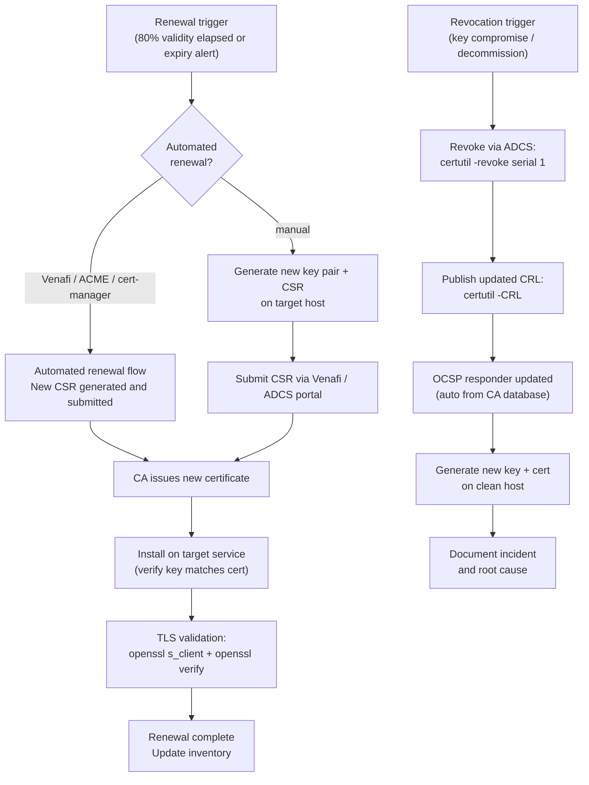

# Certificates — Procedures


<div class="kb-summary">
Procedures reference covering Certificate Renewal and Revocation Workflow, Renewal, Inventory, TLS Validation.
</div>
```
┌────────────────────── Security Certificates Operations — Operational Procedures ──────────────────────┐
│                                                                                                       │
│   ┌───────────────────────────────────────────────────────────────────────────────────────────────┐   │
│   │          Certificates operational procedures: standard tasks for day-2 administration         │   │
│   │           Covers: provisioning, expansion, maintenance, DR testing, and decommission          │   │
│   │           Pre/post checks required for all maintenance activities affecting storage           │   │
│   │            All procedures require approved change management tickets in production            │   │
│   └───────────────────────────────────────────────────────────────────────────────────────────────┘   │
│                                                                                                       │
│    Open change → pre-check → execute → verify → post-check → close                                    │
│                                                                                                       │
│                  ▼                                ▼                                ▼                  │
│                                                                                                       │
│   ┌─────────────────────────────┐  ┌─────────────────────────────┐  ┌─────────────────────────────┐   │
│   │            Layer            │  │          Component          │  │            Notes            │   │
│   │             Core            │  │       Primary service       │  │        Main function        │   │
│   │          Management         │  │        Control plane        │  │         Admin access        │   │
│   │          Monitoring         │  │         Health/perf         │  │      Alerts/dashboards      │   │
│   │           Security          │  │         Auth/encrypt        │  │        Access control       │   │
│   │         Integration         │  │        APIs/plug-ins        │  │         Third-party         │   │
│   └─────────────────────────────┘  └─────────────────────────────┘  └─────────────────────────────┘   │
│                                                                                                       │
│                          ▼                                                 ▼                          │
│                                                                                                       │
│   ┌───────────────────────────────────────────────────────────────────────────────────────────────┐   │
│   │    Procedure     │    Pre-check     │       Steps       │      Verify      │    Post-check    │   │
│   │    Provision     │  Capacity free?  │   Create volume   │   Host access    │   Monitor I/O    │   │
│   │      Expand      │   Pool space?    │    Grow volume    │    FS resize     │   Verify size    │   │
│   │     Snapshot     │   Policy set?    │   Take snapshot   │   Snap listed    │   Consistency    │   │
│   │     Failover     │  Repl. in sync?  │    Break repl.    │    App online    │    Verify RTO    │   │
│   └───────────────────────────────────────────────────────────────────────────────────────────────┘   │
│                                                                                                       │
│    Physical: Security Certificates Operations infrastructure · management network · monitoring        │
│                                                                                                       │
│    Key terms:                                                                                         │
│                                                                                                       │
│    Certificates       = Security Certificates Operations platform overview and core concepts          │
│    Management         = management console and command-line interface for administration              │
│    Monitoring         = health and performance monitoring dashboards and alerting                     │
│    Automation         = REST API, scripting, and pipeline integration capabilities                    │
│    Security           = access control, authentication, and encryption configuration                  │
│    Backup             = backup and recovery procedures and schedule configuration                     │
│    Upgrade            = software version upgrades and firmware patching procedures                    │
│    Troubleshooting    = diagnostic procedures and common issue resolution steps                       │
│    Escalation         = vendor support escalation path and severity triage process                    │
│    Documentation      = vendor knowledge base and official product documentation                      │
│    Change management  = change ticket requirements for production modifications                       │
│    Audit log          = admin action logging for compliance and security review                       │
│                                                                                                       │
└───────────────────────────────────────────────────────────────────────────────────────────────────────┘
```


## Certificate Renewal and Revocation Workflow



---

## Renewal

Certificate renewal should be initiated at 80% of the certificate's validity period (e.g., for a 2-year certificate, renew after ~20 months).

```powershell
# Trigger auto-enrollment renewal on a Windows host
certutil -pulse

# Force renewal of a specific certificate (using Venafi API — see Venafi lifecycle page)
# Or: request a new certificate using the same template and replace the binding
```

### Renewing a CA Certificate

CA certificate renewal is a planned event requiring co-ordination with all relying parties:

1. Generate a new key pair and CSR on the CA.
2. Have the parent CA (or Root CA key ceremony) sign the new CA certificate.
3. Publish the new CA certificate to AD (auto-distributes to domain members via GPO):

```powershell
# Publish new Issuing CA certificate to AD
certutil -dspublish -f IssuingCA.cer SubCA
```

4. Update CDP and AIA extensions to reference the new certificate.
5. Update any trust stores that reference the CA certificate explicitly (non-domain systems, network devices, Java keystores).

### Emergency Revocation Checklist

- [ ] Revoke certificate via ADCS or vendor portal
- [ ] Publish updated CRL immediately
- [ ] Notify service owner to replace certificate
- [ ] Verify revocation propagated to OCSP responder
- [ ] Audit which services were using the revoked certificate
- [ ] Generate and install replacement certificate
- [ ] Verify replacement is correctly installed and trusted
- [ ] Document incident with timeline and root cause

---

## Inventory

Maintaining an accurate certificate inventory prevents surprise expirations. Inventory should cover all certificates: public-facing TLS, internal services, code signing, client authentication.

### Discovery Methods

| Method | Coverage | Effort |
|---|---|---|
| Port scanning with nmap | External/internal TLS endpoints | Low — automated |
| openssl per host | Targeted host checks | Low — scriptable |
| Venafi / DigiCert One | Managed certificates | Low (integrated) |
| AD Certificate Services | Internally issued certs | Low (ADCS reports) |
| Manual tracking spreadsheet | Small environments | Medium — human |
| Shodan / Censys | External internet-facing | Low (API) |

### Port Scanning for Certificates

```bash
# Scan a subnet for TLS on common ports
nmap -p 443,8443,636,993,995 --script ssl-cert 192.168.1.0/24 \
    -oX ssl-scan.xml

# Extract CN and expiry from nmap XML output
grep -A5 "ssl-cert" ssl-scan.xml | grep -E "commonName|notAfter"

# Quick single-host TLS cert dump
nmap -p 443 --script ssl-cert example.com \
    | grep -E "Subject:|Not valid after"
```

### openssl-Based Discovery

```bash
# Grab cert details from a live endpoint
echo | openssl s_client -connect example.com:443 2>/dev/null \
    | openssl x509 -noout -subject -issuer -dates -fingerprint

# Check SAN entries (Subject Alternative Names)
echo | openssl s_client -connect example.com:443 2>/dev/null \
    | openssl x509 -noout -text | grep -A2 "Subject Alternative Name"

# Extract cert to file for further analysis
echo | openssl s_client -connect example.com:443 2>/dev/null \
    | openssl x509 > example-com.pem
```

### Windows Certificate Store Inventory

```powershell
# List all certs in the local machine Personal store
Get-ChildItem Cert:\LocalMachine\My |
    Select-Object Subject, Issuer, Thumbprint, NotBefore, NotAfter |
    Export-Csv C:\CertInventory.csv -NoTypeInformation

# List certs across all stores
foreach ($store in @("My","CA","Root","TrustedPeople")) {
    Get-ChildItem "Cert:\LocalMachine\$store" |
        Select-Object @{N="Store";E={$store}}, Subject, NotAfter, Thumbprint
}

# Find certs issued by a specific CA
Get-ChildItem Cert:\LocalMachine\My |
    Where-Object {$_.Issuer -like "*Internal CA*"} |
    Select-Object Subject, NotAfter, Thumbprint
```

### Tracking Spreadsheet Columns

Minimum fields for a useful inventory:

| Field | Notes |
|---|---|
| FQDN / Subject CN | Primary identifier |
| SANs | All covered hostnames |
| Issuer / CA | Root or intermediate that issued it |
| Expiry Date | ISO 8601 format |
| Owner / Team | Who is responsible for renewal |
| Renewal Method | Manual / Venafi / ACME / ADCS |
| Last Renewed | Track renewal history |
| Notes | Any special install steps |

### Venafi Inventory Queries (REST API)

```bash
# Authenticate and get API token
curl -s -X POST https://tpp.corp.example.com/vedauth/authorize \
    -H "Content-Type: application/json" \
    -d '{"Username":"svc-venafi","Password":"P@ssw0rd!"}' \
    | jq '.APIKey'

# List certificates expiring in 90 days
curl -s https://tpp.corp.example.com/vedsdk/certificates \
    -H "X-Venafi-API-Key: $TOKEN" \
    -G --data-urlencode "ValidToLess=2026-08-01" \
    | jq '.Certificates[] | {CN: .Name, Expiry: .ValidTo}'
```

---

## TLS Validation

```bash
# Test TLS handshake and show server certificate
openssl s_client -connect <host>:443 -servername <host>

# Check specific TLS version support
openssl s_client -connect <host>:443 -tls1_2
openssl s_client -connect <host>:443 -tls1_3

# Show full certificate chain from a live endpoint
openssl s_client -connect <host>:443 -showcerts </dev/null 2>/dev/null

# Verify certificate against a CA bundle
openssl verify -CAfile ca-bundle.pem cert.pem

# Verify full chain (intermediate + root)
openssl verify -CAfile root.pem -untrusted intermediate.pem cert.pem
```
