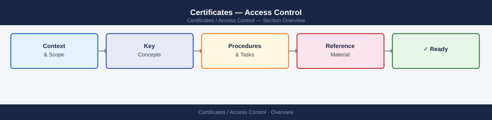
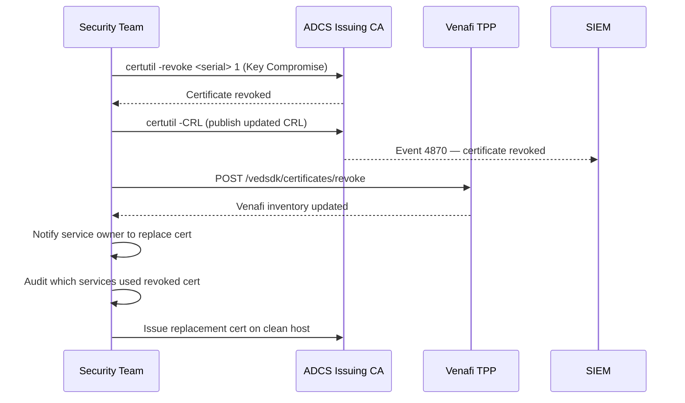

---
tags:
  - security
---
# Certificates — Access Control


<div class="kb-summary">
Access Control reference covering Emergency Revocation Sequence, Audit Logging, Certificate Pinning, Revocation Emergency Procedure.
</div>



```d2
direction: down

root: "Access Control\nAccess Control" {shape: hexagon}
emergency_revocation_sequence: "Emergency Revocation Sequence" {shape: rectangle}
audit_logging: "Audit Logging" {shape: rectangle}
certificate_pinning: "Certificate Pinning" {shape: rectangle}
revocation_emergency_procedure: "Revocation Emergency Procedure" {shape: rectangle}
resources: Protected Resources {shape: cylinder}

root -> emergency_revocation_sequence: role
emergency_revocation_sequence -> resources: scoped
root -> audit_logging: role
audit_logging -> resources: scoped
root -> certificate_pinning: role
certificate_pinning -> resources: scoped
root -> revocation_emergency_procedure: role
revocation_emergency_procedure -> resources: scoped
```

## Before you begin

- **Access:** Admin credentials on all affected systems
- **Change management:** security changes require CAB approval in most environments
- **Rollback plan:** document current state before any security control change
- **Testing:** validate in a non-production environment first where possible

---

## Emergency Revocation Sequence



---

## Audit Logging

```powershell
# Enable ADCS audit logging (on Issuing CA)
auditpol /set /subcategory:"Certification Services" /success:enable /failure:enable

# View CA audit events (Event ID 4870 = cert revoked, 4886 = cert requested, 4887 = cert issued)
Get-WinEvent -ComputerName issuingca -FilterHashtable @{
    LogName='Security'; Id=4886,4887,4870
} -MaxEvents 200 | Select-Object TimeCreated, Id, Message | Format-List
```

## Certificate Pinning

Document all pinned certificates — coordinate renewals carefully to avoid breaking pinned connections.

| Application | Pinned To | Renewal Coordination Required |
|---|---|---|
| Mobile app | Issuing CA public key | Yes — app release required |
| Internal service | Leaf certificate | Yes — both sides must update together |
| HSTS preload | Root CA | Rare — only at root rotation |

## Revocation Emergency Procedure

```powershell
# Revoke a certificate on ADCS Issuing CA
# Get the certificate serial number first
certutil -view -restrict "RequesterName=CORP\compromised-user" | findstr "Serial"

# Revoke
certutil -revoke <SerialNumber> 1   # 1 = Key Compromise reason code

# Publish updated CRL immediately
certutil -CRL

# Notify Venafi to update its records
# Venafi API: POST /vedsdk/certificates/revoke
```

## See also

- [Certificates — Authentication](../authentication/)
- [Certificates — Encryption](../encryption/)
- [Certificates — Security Hardening](../hardening/)
- [Certificates — Common Issues](../../troubleshooting/common-issues/)
