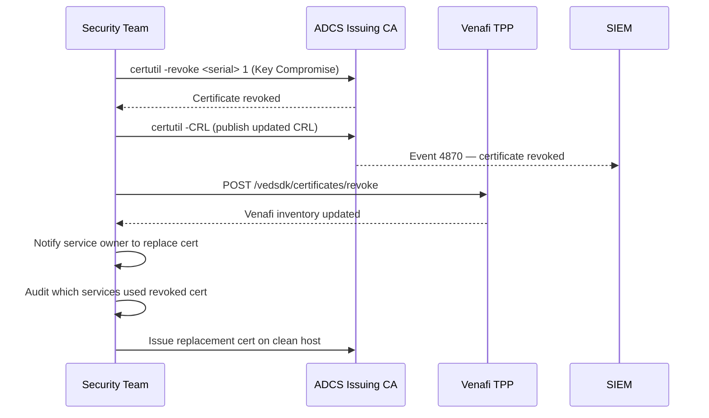

---
tags:
  - security
---
# Certificates — Access Control


<div class="kb-summary">
Access Control reference covering Emergency Revocation Sequence, Audit Logging, Certificate Pinning, Revocation Emergency Procedure.
</div>
```text
┌─────────────────────────── Security Certificates Security — Access Control ───────────────────────────┐
│                                                                                                       │
│   ┌───────────────────────────────────────────────────────────────────────────────────────────────┐   │
│   │       Certificates access control: RBAC roles, least-privilege, and access audit logging      │   │
│   │        Roles: admin (full), operator (read/modify), read-only (view); map to AD groups        │   │
│   │       Authentication: local accounts, LDAP/AD integration, and MFA for privileged users       │   │
│   │          Audit: log all admin actions; review access logs monthly; rotate credentials         │   │
│   └───────────────────────────────────────────────────────────────────────────────────────────────┘   │
│                                                                                                       │
│    Identify user → assign role → enforce MFA → audit → review quarterly                               │
│                                                                                                       │
│                  ▼                                ▼                                ▼                  │
│                                                                                                       │
│   ┌─────────────────────────────┐  ┌─────────────────────────────┐  ┌─────────────────────────────┐   │
│   │            Layer            │  │          Component          │  │            Notes            │   │
│   │             Core            │  │       Primary service       │  │        Main function        │   │
│   │          Management         │  │        Control plane        │  │         Admin access        │   │
│   │          Monitoring         │  │         Health/perf         │  │      Alerts/dashboards      │   │
│   │           Security          │  │         Auth/encrypt        │  │        Access control       │   │
│   │         Integration         │  │        APIs/plug-ins        │  │         Third-party         │   │
│   └─────────────────────────────┘  └─────────────────────────────┘  └─────────────────────────────┘   │
│                                                                                                       │
│                          ▼                                                 ▼                          │
│                                                                                                       │
│   ┌───────────────────────────────────────────────────────────────────────────────────────────────┐   │
│   │       Role       │   Permissions    │       Scope       │       Auth       │   Review cycle   │   │
│   │      Admin       │    Full CRUD     │       Global      │   MFA required   │     Monthly      │   │
│   │     Operator     │   Read/modify    │      Assigned     │   MFA required   │    Quarterly     │   │
│   │    Read-only     │    View only     │      Assigned     │     Password     │    Quarterly     │   │
│   │   Service acct   │     API only     │    Specific API   │    Token/cert    │      Annual      │   │
│   └───────────────────────────────────────────────────────────────────────────────────────────────┘   │
│                                                                                                       │
│    Physical: Security Certificates Security infrastructure · management network · monitoring          │
│                                                                                                       │
│    Key terms:                                                                                         │
│                                                                                                       │
│    Certificates       = Security Certificates Security platform overview and core concepts            │
│    Management         = management console and command-line interface for administration              │
│    Monitoring         = health and performance monitoring dashboards and alerting                     │
│    Automation         = REST API, scripting, and pipeline integration capabilities                    │
│    Security           = access control, authentication, and encryption configuration                  │
│    Backup             = backup and recovery procedures and schedule configuration                     │
│    Upgrade            = software version upgrades and firmware patching procedures                    │
│    Troubleshooting    = diagnostic procedures and common issue resolution steps                       │
│    Escalation         = vendor support escalation path and severity triage process                    │
│    Documentation      = vendor knowledge base and official product documentation                      │
│    Change management  = change ticket requirements for production modifications                       │
│    Audit log          = admin action logging for compliance and security review                       │
│                                                                                                       │
└───────────────────────────────────────────────────────────────────────────────────────────────────────┘
```


## Emergency Revocation Sequence



---

## Audit Logging

```powershell
# Enable ADCS audit logging (on Issuing CA)
auditpol /set /subcategory:"Certification Services" /success:enable /failure:enable

# View CA audit events (Event ID 4870 = cert revoked, 4886 = cert requested, 4887 = cert issued)
Get-WinEvent -ComputerName issuingca -FilterHashtable @{
    LogName='Security'; Id=4886,4887,4870
} -MaxEvents 200 | Select-Object TimeCreated, Id, Message | Format-List
```

## Certificate Pinning

Document all pinned certificates — coordinate renewals carefully to avoid breaking pinned connections.

| Application | Pinned To | Renewal Coordination Required |
|---|---|---|
| Mobile app | Issuing CA public key | Yes — app release required |
| Internal service | Leaf certificate | Yes — both sides must update together |
| HSTS preload | Root CA | Rare — only at root rotation |

## Revocation Emergency Procedure

```powershell
# Revoke a certificate on ADCS Issuing CA
# Get the certificate serial number first
certutil -view -restrict "RequesterName=CORP\compromised-user" | findstr "Serial"

# Revoke
certutil -revoke <SerialNumber> 1   # 1 = Key Compromise reason code

# Publish updated CRL immediately
certutil -CRL

# Notify Venafi to update its records
# Venafi API: POST /vedsdk/certificates/revoke
```
