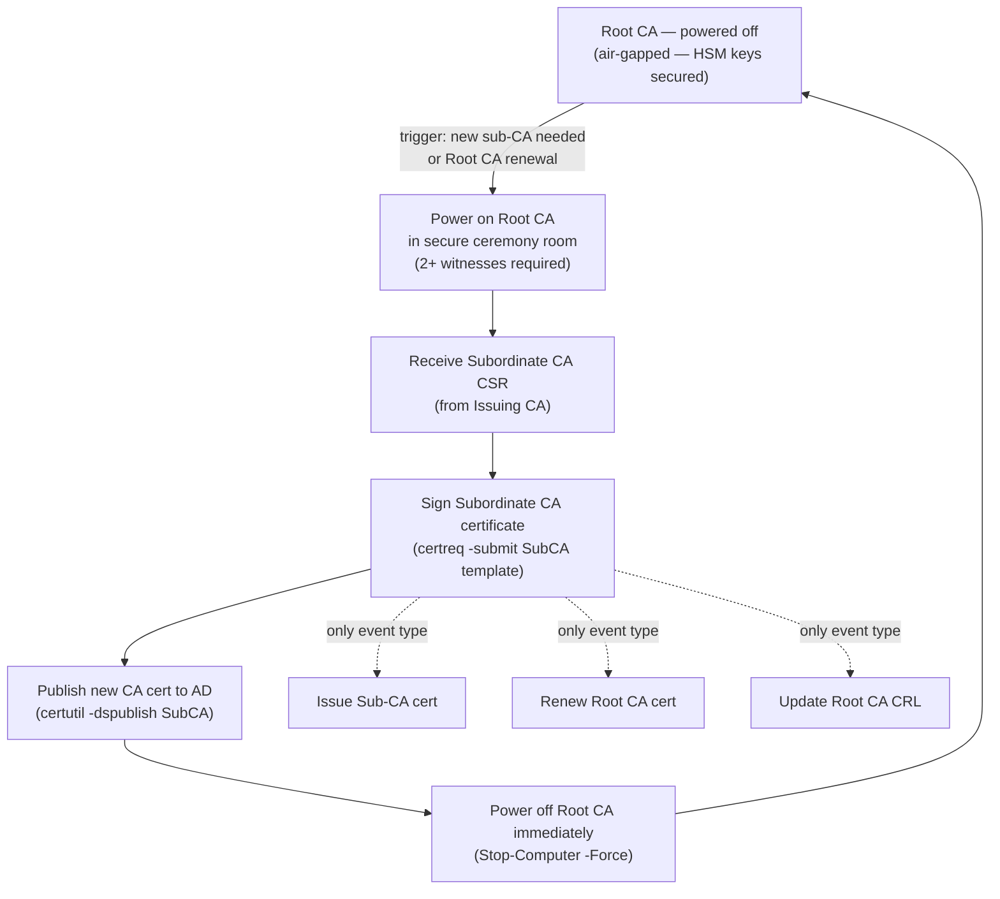

---
tags:
  - security
---
# Certificates — Authentication


<div class="kb-summary">
Authentication reference covering Root CA Lifecycle — Offline Operation Flow, Root CA Offline Procedure, Certificate Transparency (CT).
</div>
```text
┌─────────────────────────── Security Certificates Security — Authentication ───────────────────────────┐
│                                                                                                       │
│   ┌───────────────────────────────────────────────────────────────────────────────────────────────┐   │
│   │       Certificates authentication: local accounts, LDAP/AD, RADIUS, and SAML SSO options      │   │
│   │        MFA: time-based OTP or hardware token required for all privileged admin accounts       │   │
│   │         Service accounts: dedicated accounts for automation; API tokens/keys preferred        │   │
│   │       Session: idle timeout enforced; concurrent session limits for admin role accounts       │   │
│   └───────────────────────────────────────────────────────────────────────────────────────────────┘   │
│                                                                                                       │
│    Login → authenticate LDAP/SAML/local → MFA → authorise role → session                              │
│                                                                                                       │
│                  ▼                                ▼                                ▼                  │
│                                                                                                       │
│   ┌─────────────────────────────┐  ┌─────────────────────────────┐  ┌─────────────────────────────┐   │
│   │            Layer            │  │          Component          │  │            Notes            │   │
│   │             Core            │  │       Primary service       │  │        Main function        │   │
│   │          Management         │  │        Control plane        │  │         Admin access        │   │
│   │          Monitoring         │  │         Health/perf         │  │      Alerts/dashboards      │   │
│   │           Security          │  │         Auth/encrypt        │  │        Access control       │   │
│   │         Integration         │  │        APIs/plug-ins        │  │         Third-party         │   │
│   └─────────────────────────────┘  └─────────────────────────────┘  └─────────────────────────────┘   │
│                                                                                                       │
│                          ▼                                                 ▼                          │
│                                                                                                       │
│   ┌───────────────────────────────────────────────────────────────────────────────────────────────┐   │
│   │      Method      │     Use case     │  Config location  │       MFA        │     Priority     │   │
│   │     LDAP/AD      │  Staff accounts  │   Auth settings   │     Required     │     Primary      │   │
│   │     SAML SSO     │    Federated     │    SSO settings   │   IdP-enforced   │    Preferred     │   │
│   │      Local       │   Break-glass    │    Local users    │     Required     │  Emergency only  │   │
│   │    API token     │    Automation    │  Service account  │   N/A (token)    │    Automation    │   │
│   └───────────────────────────────────────────────────────────────────────────────────────────────┘   │
│                                                                                                       │
│    Physical: Security Certificates Security infrastructure · management network · monitoring          │
│                                                                                                       │
│    Key terms:                                                                                         │
│                                                                                                       │
│    Certificates       = Security Certificates Security platform overview and core concepts            │
│    Management         = management console and command-line interface for administration              │
│    Monitoring         = health and performance monitoring dashboards and alerting                     │
│    Automation         = REST API, scripting, and pipeline integration capabilities                    │
│    Security           = access control, authentication, and encryption configuration                  │
│    Backup             = backup and recovery procedures and schedule configuration                     │
│    Upgrade            = software version upgrades and firmware patching procedures                    │
│    Troubleshooting    = diagnostic procedures and common issue resolution steps                       │
│    Escalation         = vendor support escalation path and severity triage process                    │
│    Documentation      = vendor knowledge base and official product documentation                      │
│    Change management  = change ticket requirements for production modifications                       │
│    Audit log          = admin action logging for compliance and security review                       │
│                                                                                                       │
└───────────────────────────────────────────────────────────────────────────────────────────────────────┘
```


## Before you begin

- **Access:** Admin credentials on all affected systems
- **Change management:** security changes require CAB approval in most environments
- **Rollback plan:** document current state before any security control change
- **Testing:** validate in a non-production environment first where possible

---

## Root CA Lifecycle — Offline Operation Flow



## Root CA Offline Procedure

The Root CA is powered on only for these specific events:
1. Issuing a new Subordinate/Issuing CA certificate
2. Renewing the Root CA certificate itself
3. Updating the CRL (if Root CA issues CRL directly)

```powershell
# On Root CA — issue a subordinate CA certificate from a PKCS#10 CSR
certreq -submit -attrib "CertificateTemplate:SubCA" SubCA-Request.req SubCA-Certificate.cer

# After signing, power down Root CA immediately
Stop-Computer -Force
```

## Certificate Transparency (CT)

All publicly trusted certificates must be submitted to CT logs (required by CA/Browser Forum Baseline Requirements).

```bash
# Verify a certificate has SCT (Signed Certificate Timestamps) embedded
openssl x509 -in cert.pem -noout -text | grep -A 10 "CT Precertificate SCTs"

# Check certificate in public CT logs
# https://crt.sh/?q=<hostname> — search by domain
# curl example:
curl -s "https://crt.sh/?q=corp.example.com&output=json" | jq '.[0:5] | .[] | {id, issuer_name, not_before, not_after}'
```

## See also

- [Certificates — Access Control](access-control/)
- [Certificates — Encryption](encryption/)
- [Certificates — Security Hardening](hardening/)
- [Certificates — Common Issues](../../troubleshooting/common-issues/)
