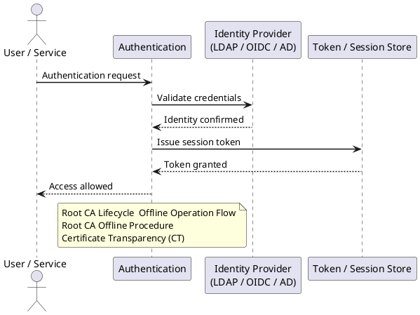

---
tags:
  - security
description: "Authentication reference covering Root CA Lifecycle — Offline Operation Flow, Root CA Offline Procedure, Certificate Transparency (CT)."
---
# Certificates — Authentication

<div class="kb-summary">
Authentication reference covering Root CA Lifecycle — Offline Operation Flow, Root CA Offline Procedure, Certificate Transparency (CT).
</div>



## Before you begin

- **Access:** Admin credentials on all affected systems
- **Change management:** security changes require CAB approval in most environments
- **Rollback plan:** document current state before any security control change
- **Testing:** validate in a non-production environment first where possible

---

## Root CA Lifecycle — Offline Operation Flow

```d2
direction: right

rootNormal: "Root CA — powered off\n(air-gapped — HSM keys secured" {shape: rectangle}
powerOn: "Power on Root CA\nin secure ceremony room\n(2+ witnesses required" {shape: rectangle}
submitCSR: "Receive Subordinate CA CSR\n(from Issuing CA" {shape: rectangle}
signCert: "Sign Subordinate CA certificate\n(certreq -submit SubCA template" {shape: rectangle}
publishAD: "Publish new CA cert to AD\n(certutil -dspublish SubCA" {shape: rectangle}
powerOff: "Power off Root CA immediately\n(Stop-Computer -Force" {shape: rectangle}

rootNormal -> powerOn
powerOn -> submitCSR
submitCSR -> signCert
signCert -> publishAD
publishAD -> powerOff
powerOff -> rootNormal
```

## Root CA Offline Procedure

The Root CA is powered on only for these specific events:
1. Issuing a new Subordinate/Issuing CA certificate
2. Renewing the Root CA certificate itself
3. Updating the CRL (if Root CA issues CRL directly)

```powershell
# On Root CA — issue a subordinate CA certificate from a PKCS#10 CSR
certreq -submit -attrib "CertificateTemplate:SubCA" SubCA-Request.req SubCA-Certificate.cer

# After signing, power down Root CA immediately
Stop-Computer -Force
```

## Certificate Transparency (CT)

All publicly trusted certificates must be submitted to CT logs (required by CA/Browser Forum Baseline Requirements).

```bash
# Verify a certificate has SCT (Signed Certificate Timestamps) embedded
openssl x509 -in cert.pem -noout -text | grep -A 10 "CT Precertificate SCTs"

# Check certificate in public CT logs
# https://crt.sh/?q=<hostname> — search by domain
# curl example:
curl -s "https://crt.sh/?q=corp.example.com&output=json" | jq '.[0:5] | .[] | {id, issuer_name, not_before, not_after}'
```


```text title="Expected output"
X509v3 CT Precertificate SCTs:
                    Signed Certificate Timestamp:
                        Version   : v1 (0x0)
                        Log ID    : A4:B9:0A:45:16:BA:86:23:ED:B8:A3:4E:21:F4:CB:72:
                                    29:2F:B9:F5:78:6B:CA:BC:EA:7F:3D:D4:EF:CA:2C:F8
                        Timestamp : May 15 14:32:18 2024 GMT
                        Extensions: none
                        Signature : 04:12:03:45:67:89:AB:CD:EF:01:23:45:67:89:AB:CD
{
  "id": 847291,
  "issuer_name": "R3",
  "not_before": "2024-01-10T08:15:22",
  "not_after": "2024-04-09T08:15:21"
}
{
  "id": 847292,
  "issuer_name": "R3",
  "not_before": "2024-01-10T08:15:23",
  "not_after": "2024-04-09T08:15:22"
}
{
  "id": 847293,
  "issuer_name": "E1",
  "not_before": "2024-02-14T12:45:10",
  "not_after": "2024-05-14T12:45:09"
}
```

!!! warning "Common errors"
    | Error | Fix |
    |---|---|
    | `grep: (standard input): No such file or directory` | Verify the certificate file exists at the specified path and use the correct filename (e.g., `openssl x509 -in /path/to/cert.pem`). |
    | `jq: parse error: Invalid numeric literal at line 1 column 7` | Ensure the crt.sh API response is valid JSON by checking your domain name spelling and network connectivity with `curl -s "https://crt.sh/?q=corp.example.com&output=json" | head -c 200`. |
## See also

- [Certificates — Access Control](../access-control/)
- [Certificates — Encryption](../encryption/)
- [Certificates — Security Hardening](../hardening/)
- [Certificates — Common Issues](../../troubleshooting/common-issues/)
