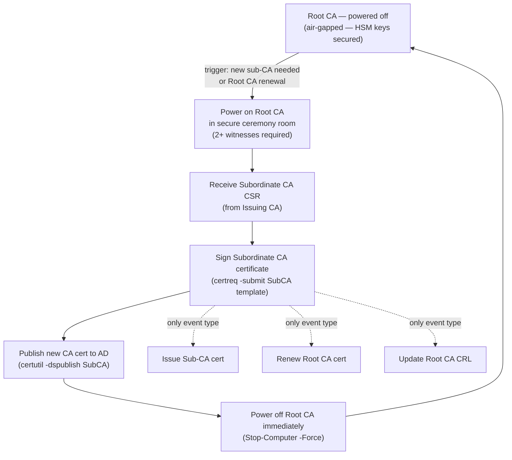

# Certificates — Authentication

## Root CA Lifecycle — Offline Operation Flow



## Root CA Offline Procedure

The Root CA is powered on only for these specific events:
1. Issuing a new Subordinate/Issuing CA certificate
2. Renewing the Root CA certificate itself
3. Updating the CRL (if Root CA issues CRL directly)

```powershell
# On Root CA — issue a subordinate CA certificate from a PKCS#10 CSR
certreq -submit -attrib "CertificateTemplate:SubCA" SubCA-Request.req SubCA-Certificate.cer

# After signing, power down Root CA immediately
Stop-Computer -Force
```

## Certificate Transparency (CT)

All publicly trusted certificates must be submitted to CT logs (required by CA/Browser Forum Baseline Requirements).

```bash
# Verify a certificate has SCT (Signed Certificate Timestamps) embedded
openssl x509 -in cert.pem -noout -text | grep -A 10 "CT Precertificate SCTs"

# Check certificate in public CT logs
# https://crt.sh/?q=<hostname> — search by domain
# curl example:
curl -s "https://crt.sh/?q=corp.example.com&output=json" | jq '.[0:5] | .[] | {id, issuer_name, not_before, not_after}'
```
