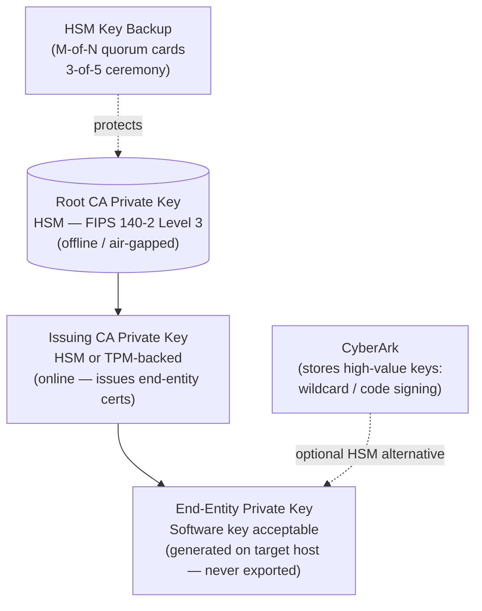

---
tags:
  - security
---
# Certificates — Encryption


<div class="kb-summary">
Encryption reference covering CA Key Protection Hierarchy, CA Key Protection, CRL Availability.
</div>
```text
┌───────────────────────────── Security Certificates Security — Encryption ─────────────────────────────┐
│                                                                                                       │
│   ┌───────────────────────────────────────────────────────────────────────────────────────────────┐   │
│   │      Certificates encryption: data at rest and in transit encryption for all stored data      │   │
│   │          At rest: AES-256 encryption using controller-managed or external key manager         │   │
│   │          In transit: TLS 1.2+ for management; protocol encryption for data in flight          │   │
│   │         Key management: external KMIP-compatible KMS or built-in key lifecycle manager        │   │
│   └───────────────────────────────────────────────────────────────────────────────────────────────┘   │
│                                                                                                       │
│    Enable encryption → configure KMS → verify → audit → rotate keys                                   │
│                                                                                                       │
│                  ▼                                ▼                                ▼                  │
│                                                                                                       │
│   ┌─────────────────────────────┐  ┌─────────────────────────────┐  ┌─────────────────────────────┐   │
│   │            Layer            │  │          Component          │  │            Notes            │   │
│   │             Core            │  │       Primary service       │  │        Main function        │   │
│   │          Management         │  │        Control plane        │  │         Admin access        │   │
│   │          Monitoring         │  │         Health/perf         │  │      Alerts/dashboards      │   │
│   │           Security          │  │         Auth/encrypt        │  │        Access control       │   │
│   │         Integration         │  │        APIs/plug-ins        │  │         Third-party         │   │
│   └─────────────────────────────┘  └─────────────────────────────┘  └─────────────────────────────┘   │
│                                                                                                       │
│                          ▼                                                 ▼                          │
│                                                                                                       │
│   ┌───────────────────────────────────────────────────────────────────────────────────────────────┐   │
│   │      Layer       │     Standard     │     Key source    │       KMS        │      Notes       │   │
│   │     At rest      │     AES-256      │     Controller    │  Internal/KMIP   │    Always on     │   │
│   │    In transit    │     TLS 1.2+     │      PKI cert     │   Internal CA    │   Mgmt + data    │   │
│   │   Key rotation   │      Annual      │     KMS policy    │   External KMS   │    Automated     │   │
│   │    Key escrow    │     Required     │     KMS vault     │   External KMS   │    DR access     │   │
│   └───────────────────────────────────────────────────────────────────────────────────────────────┘   │
│                                                                                                       │
│    Physical: Security Certificates Security infrastructure · management network · monitoring          │
│                                                                                                       │
│    Key terms:                                                                                         │
│                                                                                                       │
│    Certificates       = Security Certificates Security platform overview and core concepts            │
│    Management         = management console and command-line interface for administration              │
│    Monitoring         = health and performance monitoring dashboards and alerting                     │
│    Automation         = REST API, scripting, and pipeline integration capabilities                    │
│    Security           = access control, authentication, and encryption configuration                  │
│    Backup             = backup and recovery procedures and schedule configuration                     │
│    Upgrade            = software version upgrades and firmware patching procedures                    │
│    Troubleshooting    = diagnostic procedures and common issue resolution steps                       │
│    Escalation         = vendor support escalation path and severity triage process                    │
│    Documentation      = vendor knowledge base and official product documentation                      │
│    Change management  = change ticket requirements for production modifications                       │
│    Audit log          = admin action logging for compliance and security review                       │
│                                                                                                       │
└───────────────────────────────────────────────────────────────────────────────────────────────────────┘
```


## Before you begin

- **Access:** Admin credentials on all affected systems
- **Change management:** security changes require CAB approval in most environments
- **Rollback plan:** document current state before any security control change
- **Testing:** validate in a non-production environment first where possible

---

## CA Key Protection Hierarchy



## CA Key Protection

Root CA and Issuing CA private keys must be protected by HSMs — software-only key storage is not acceptable for CA keys.

| CA Tier | Key Storage Requirement | Online Status |
|---|---|---|
| Root CA | HSM (FIPS 140-2 Level 3 minimum) | Offline / air-gapped |
| Issuing CA | HSM or TPM-backed key | Online — issues end-entity certs |
| End-entity cert | Software key acceptable | Per-application |

```powershell
# Verify ADCS CA uses HSM-backed key (look for CSP = Microsoft Smart Card or nCipher)
certutil -getreg CA\CSP\Provider
# Desired: hardware CSP listed (e.g., "nFast RSA and DH" or "SafeNet")

# Check CA key protection on the issuing CA
certutil -store My | findstr /i "provider\|key"
```

## CRL Availability

CRL Distribution Points must remain highly available — unavailability can cause soft-fail clients to proceed with revoked certificates.

```bash
# Test CRL download
curl -I http://crl.example.local/IssuingCA.crl
# Verify: HTTP 200, Content-Type: application/pkix-crl

# Check CRL freshness (nextUpdate)
openssl crl -in IssuingCA.crl -inform DER -noout -text | grep "Next Update"
# CRL should be published at least 2x before expiry (overlap period)
```

```powershell
# Monitor CRL validity from ADCS CA
Get-ItemProperty -Path "HKLM:\System\CurrentControlSet\Services\CertSvc\Configuration\IssuingCA" |
    Select-Object CRLPeriodUnits, CRLPeriod, CRLDeltaPeriodUnits, CRLDeltaPeriod
```
