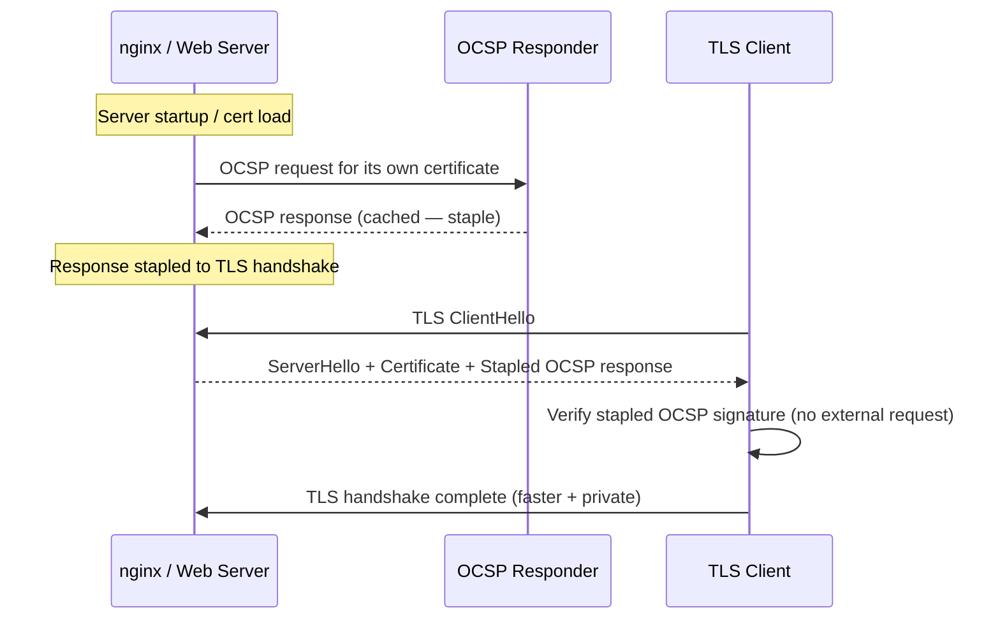

---
tags:
  - security
---
# Certificates — Hardening

<div class="kb-summary">
Hardening reference covering OCSP Stapling Flow, OCSP Stapling, Security Checklist.
</div>

```d2
direction: down

ocsp_stapling_flow: "OCSP Stapling Flow" {shape: rectangle}
ocsp_stapling: "OCSP Stapling" {shape: rectangle}
security_checklist: "Security Checklist" {shape: rectangle}

ocsp_stapling_flow -> ocsp_stapling: hardens
ocsp_stapling -> security_checklist: hardens
```

## Before you begin

- **Access:** Admin credentials on all affected systems
- **Change management:** security changes require CAB approval in most environments
- **Rollback plan:** document current state before any security control change
- **Testing:** validate in a non-production environment first where possible

---

## OCSP Stapling Flow



## OCSP Stapling

Enforce OCSP stapling on all public TLS endpoints to avoid privacy leakage and improve connection performance.

```nginx
# nginx — OCSP stapling configuration
ssl_stapling on;
ssl_stapling_verify on;
ssl_trusted_certificate /etc/ssl/certs/chain.pem;
resolver 8.8.8.8 valid=300s;
resolver_timeout 5s;
```

```bash
# Verify OCSP stapling is working
openssl s_client -connect host.corp.example.com:443 -status -tlsextdebug 2>&1 | \
  grep -i "OCSP Response"
# Should show: OCSP Response Status: successful (0x0)
```


```text title="Expected output"
OCSP Response Status: successful (0x0)
```

!!! warning "Common errors"
    **`OCSP Response Status: failed (0x1)`** — The OCSP responder is unreachable or the server certificate chain is incomplete; verify the OCSP responder URL in the certificate and ensure the server has intermediate certificates configured.
    **`grep: (standard input): No such file or directory`** — The openssl command failed to connect; verify the hostname is resolvable, the server is listening on port 443, and your firewall allows outbound HTTPS connections.
## Security Checklist

- [ ] Root CA is offline and air-gapped
- [ ] Root CA key stored on HSM (FIPS 140-2 Level 3)
- [ ] Issuing CA key stored on HSM or equivalent
- [ ] ADCS audit logging enabled (event IDs 4886/4887 forwarded to SIEM)
- [ ] CRL published with adequate overlap (republish at 50% of validity)
- [ ] OCSP stapling enforced on all public endpoints
- [ ] CT log submission verified for public certificates
- [ ] Certificate pinning registry maintained and up to date
- [ ] Weak algorithm certs (SHA-1, RSA-1024) identified and replaced
- [ ] Venafi TPP expiry alerting configured for all managed certificates
- [ ] Emergency revocation procedure documented and tested annually

## See also

- [Certificates — Access Control](../access-control/)
- [Certificates — Authentication](../authentication/)
- [Certificates — Encryption](../encryption/)
- [Certificates — Common Issues](../../troubleshooting/common-issues/)
