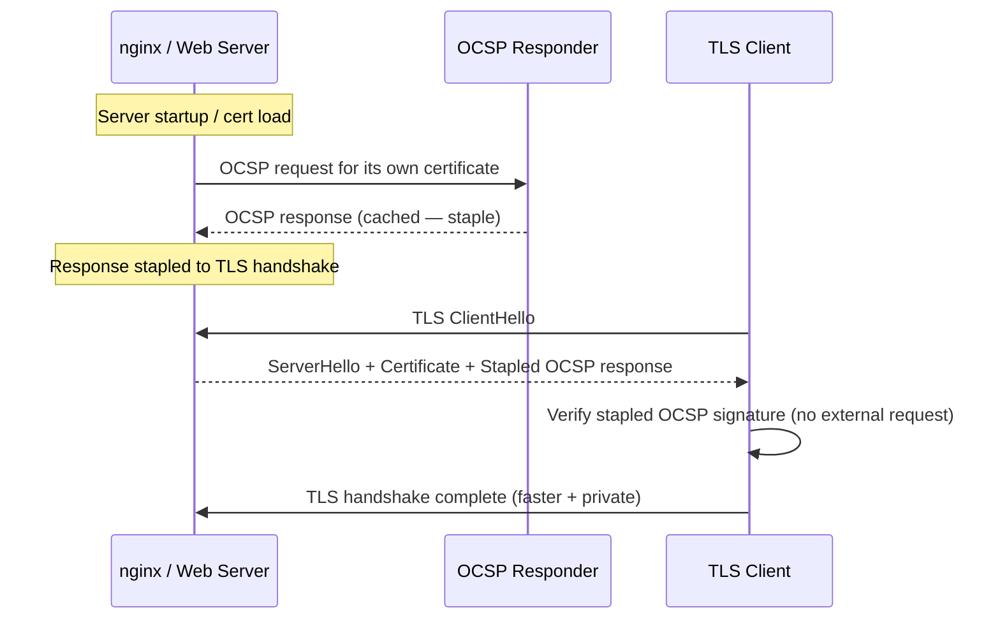

---
tags:
  - security
---
# Certificates — Hardening


<div class="kb-summary">
Hardening reference covering OCSP Stapling Flow, OCSP Stapling, Security Checklist.
</div>
```text
┌───────────────────────── Security Certificates Security — Security Hardening ─────────────────────────┐
│                                                                                                       │
│   ┌───────────────────────────────────────────────────────────────────────────────────────────────┐   │
│   │     Certificates hardening: disable unused protocols, enforce encryption, restrict access     │   │
│   │         Network: dedicated storage VLAN; restrict management access to jump hosts only        │   │
│   │        Auth: disable default accounts; enforce password complexity and rotation policy        │   │
│   │         Audit: forward syslog to SIEM; alert on privilege escalation and failed logins        │   │
│   └───────────────────────────────────────────────────────────────────────────────────────────────┘   │
│                                                                                                       │
│    Baseline config → disable unused → enforce MFA → enable logging → audit                            │
│                                                                                                       │
│                  ▼                                ▼                                ▼                  │
│                                                                                                       │
│   ┌─────────────────────────────┐  ┌─────────────────────────────┐  ┌─────────────────────────────┐   │
│   │            Layer            │  │          Component          │  │            Notes            │   │
│   │             Core            │  │       Primary service       │  │        Main function        │   │
│   │          Management         │  │        Control plane        │  │         Admin access        │   │
│   │          Monitoring         │  │         Health/perf         │  │      Alerts/dashboards      │   │
│   │           Security          │  │         Auth/encrypt        │  │        Access control       │   │
│   │         Integration         │  │        APIs/plug-ins        │  │         Third-party         │   │
│   └─────────────────────────────┘  └─────────────────────────────┘  └─────────────────────────────┘   │
│                                                                                                       │
│                          ▼                                                 ▼                          │
│                                                                                                       │
│   ┌───────────────────────────────────────────────────────────────────────────────────────────────┐   │
│   │       Area       │     Control      │      Standard     │      Verify      │    Frequency     │   │
│   │     Accounts     │ Disable defaults │  No default creds │   Login audit    │      Deploy      │   │
│   │    Protocols     │  Disable unused  │   TLS 1.2+ only   │    Port scan     │     Monthly      │   │
│   │       MFA        │ Enforce all admi │   TOTP/hardware   │    Auth logs     │    Continuous    │   │
│   │     Logging      │ SIEM forwarding  │  All admin events │   SIEM alerts    │      Daily       │   │
│   └───────────────────────────────────────────────────────────────────────────────────────────────┘   │
│                                                                                                       │
│    Physical: Security Certificates Security infrastructure · management network · monitoring          │
│                                                                                                       │
│    Key terms:                                                                                         │
│                                                                                                       │
│    Certificates       = Security Certificates Security platform overview and core concepts            │
│    Management         = management console and command-line interface for administration              │
│    Monitoring         = health and performance monitoring dashboards and alerting                     │
│    Automation         = REST API, scripting, and pipeline integration capabilities                    │
│    Security           = access control, authentication, and encryption configuration                  │
│    Backup             = backup and recovery procedures and schedule configuration                     │
│    Upgrade            = software version upgrades and firmware patching procedures                    │
│    Troubleshooting    = diagnostic procedures and common issue resolution steps                       │
│    Escalation         = vendor support escalation path and severity triage process                    │
│    Documentation      = vendor knowledge base and official product documentation                      │
│    Change management  = change ticket requirements for production modifications                       │
│    Audit log          = admin action logging for compliance and security review                       │
│                                                                                                       │
└───────────────────────────────────────────────────────────────────────────────────────────────────────┘
```


## Before you begin

- **Access:** Admin credentials on all affected systems
- **Change management:** security changes require CAB approval in most environments
- **Rollback plan:** document current state before any security control change
- **Testing:** validate in a non-production environment first where possible

---

## OCSP Stapling Flow



## OCSP Stapling

Enforce OCSP stapling on all public TLS endpoints to avoid privacy leakage and improve connection performance.

```nginx
# nginx — OCSP stapling configuration
ssl_stapling on;
ssl_stapling_verify on;
ssl_trusted_certificate /etc/ssl/certs/chain.pem;
resolver 8.8.8.8 valid=300s;
resolver_timeout 5s;
```

```bash
# Verify OCSP stapling is working
openssl s_client -connect host.corp.example.com:443 -status -tlsextdebug 2>&1 | \
  grep -i "OCSP Response"
# Should show: OCSP Response Status: successful (0x0)
```

## Security Checklist

- [ ] Root CA is offline and air-gapped
- [ ] Root CA key stored on HSM (FIPS 140-2 Level 3)
- [ ] Issuing CA key stored on HSM or equivalent
- [ ] ADCS audit logging enabled (event IDs 4886/4887 forwarded to SIEM)
- [ ] CRL published with adequate overlap (republish at 50% of validity)
- [ ] OCSP stapling enforced on all public endpoints
- [ ] CT log submission verified for public certificates
- [ ] Certificate pinning registry maintained and up to date
- [ ] Weak algorithm certs (SHA-1, RSA-1024) identified and replaced
- [ ] Venafi TPP expiry alerting configured for all managed certificates
- [ ] Emergency revocation procedure documented and tested annually
