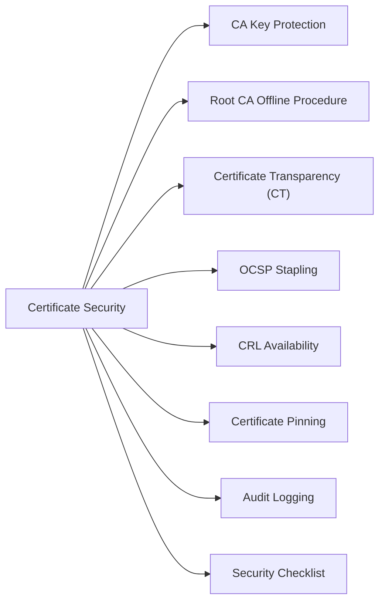

# Certificate Security



## CA Key Protection

Root CA and Issuing CA private keys must be protected by HSMs — software-only key storage is not acceptable for CA keys.

| CA Tier | Key Storage Requirement | Online Status |
|---|---|---|
| Root CA | HSM (FIPS 140-2 Level 3 minimum) | Offline / air-gapped |
| Issuing CA | HSM or TPM-backed key | Online — issues end-entity certs |
| End-entity cert | Software key acceptable | Per-application |

```powershell
# Verify ADCS CA uses HSM-backed key (look for CSP = Microsoft Smart Card or nCipher)
certutil -getreg CA\CSP\Provider
# Desired: hardware CSP listed (e.g., "nFast RSA and DH" or "SafeNet")

# Check CA key protection on the issuing CA
certutil -store My | findstr /i "provider\|key"
```

## Root CA Offline Procedure

The Root CA is powered on only for these specific events:
1. Issuing a new Subordinate/Issuing CA certificate
2. Renewing the Root CA certificate itself
3. Updating the CRL (if Root CA issues CRL directly)

```powershell
# On Root CA — issue a subordinate CA certificate from a PKCS#10 CSR
certreq -submit -attrib "CertificateTemplate:SubCA" SubCA-Request.req SubCA-Certificate.cer

# After signing, power down Root CA immediately
Stop-Computer -Force
```

## Certificate Transparency (CT)

All publicly trusted certificates must be submitted to CT logs (required by CA/Browser Forum Baseline Requirements).

```bash
# Verify a certificate has SCT (Signed Certificate Timestamps) embedded
openssl x509 -in cert.pem -noout -text | grep -A 10 "CT Precertificate SCTs"

# Check certificate in public CT logs
# https://crt.sh/?q=<hostname> — search by domain
# curl example:
curl -s "https://crt.sh/?q=corp.example.com&output=json" | jq '.[0:5] | .[] | {id, issuer_name, not_before, not_after}'
```

## OCSP Stapling

Enforce OCSP stapling on all public TLS endpoints to avoid privacy leakage and improve connection performance.

```nginx
# nginx — OCSP stapling configuration
ssl_stapling on;
ssl_stapling_verify on;
ssl_trusted_certificate /etc/ssl/certs/chain.pem;
resolver 8.8.8.8 valid=300s;
resolver_timeout 5s;
```

```bash
# Verify OCSP stapling is working
openssl s_client -connect host.corp.example.com:443 -status -tlsextdebug 2>&1 | \
  grep -i "OCSP Response"
# Should show: OCSP Response Status: successful (0x0)
```

## CRL Availability

CRL Distribution Points must remain highly available — unavailability can cause soft-fail clients to proceed with revoked certificates.

```bash
# Test CRL download
curl -I http://crl.corp.local/IssuingCA.crl
# Verify: HTTP 200, Content-Type: application/pkix-crl

# Check CRL freshness (nextUpdate)
openssl crl -in IssuingCA.crl -inform DER -noout -text | grep "Next Update"
# CRL should be published at least 2x before expiry (overlap period)
```

```powershell
# Monitor CRL validity from ADCS CA
Get-ItemProperty -Path "HKLM:\System\CurrentControlSet\Services\CertSvc\Configuration\IssuingCA" |
    Select-Object CRLPeriodUnits, CRLPeriod, CRLDeltaPeriodUnits, CRLDeltaPeriod
```

## Certificate Pinning

Document all pinned certificates — coordinate renewals carefully to avoid breaking pinned connections.

| Application | Pinned To | Renewal Coordination Required |
|---|---|---|
| Mobile app | Issuing CA public key | Yes — app release required |
| Internal service | Leaf certificate | Yes — both sides must update together |
| HSTS preload | Root CA | Rare — only at root rotation |

## Audit Logging

```powershell
# Enable ADCS audit logging (on Issuing CA)
auditpol /set /subcategory:"Certification Services" /success:enable /failure:enable

# View CA audit events (Event ID 4870 = cert revoked, 4886 = cert requested, 4887 = cert issued)
Get-WinEvent -ComputerName issuingca -FilterHashtable @{
    LogName='Security'; Id=4886,4887,4870
} -MaxEvents 200 | Select-Object TimeCreated, Id, Message | Format-List
```

## Security Checklist

- [ ] Root CA is offline and air-gapped
- [ ] Root CA key stored on HSM (FIPS 140-2 Level 3)
- [ ] Issuing CA key stored on HSM or equivalent
- [ ] ADCS audit logging enabled (event IDs 4886/4887 forwarded to SIEM)
- [ ] CRL published with adequate overlap (republish at 50% of validity)
- [ ] OCSP stapling enforced on all public endpoints
- [ ] CT log submission verified for public certificates
- [ ] Certificate pinning registry maintained and up to date
- [ ] Weak algorithm certs (SHA-1, RSA-1024) identified and replaced
- [ ] Venafi TPP expiry alerting configured for all managed certificates
- [ ] Emergency revocation procedure documented and tested annually

## Revocation Emergency Procedure

```powershell
# Revoke a certificate on ADCS Issuing CA
# Get the certificate serial number first
certutil -view -restrict "RequesterName=CORP\compromised-user" | findstr "Serial"

# Revoke
certutil -revoke <SerialNumber> 1   # 1 = Key Compromise reason code

# Publish updated CRL immediately
certutil -CRL

# Notify Venafi to update its records
# Venafi API: POST /vedsdk/certificates/revoke
```
