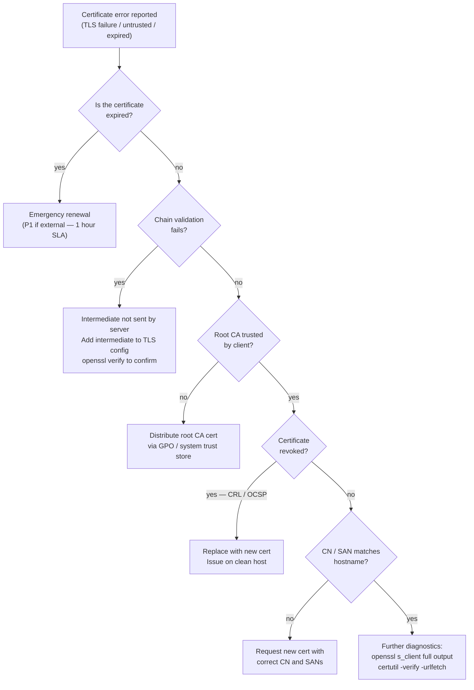

---
tags:
  - security
  - troubleshooting
---
# Certificates — Common Issues


<div class="kb-summary">
Common Issues reference covering Certificate Issue Triage Flow, Common checks, Incident notes, Change notes, Known issues and 2 more sections.
</div>
```text
┌──────────────────────── Security Certificates Troubleshooting — Common Issues ────────────────────────┐
│                                                                                                       │
│   ┌───────────────────────────────────────────────────────────────────────────────────────────────┐   │
│   │        Certificates common issues: quick-reference for frequently encountered problems        │   │
│   │         Issues: path failures, connectivity errors, capacity alerts, and auth failures        │   │
│   │         For each issue: symptoms, root cause, diagnostic steps, and resolution actions        │   │
│   │           Escalate to vendor support if the issue persists after standard procedures          │   │
│   └───────────────────────────────────────────────────────────────────────────────────────────────┘   │
│                                                                                                       │
│    Identify symptom → check logs → diagnose root cause → resolve → verify                             │
│                                                                                                       │
│                  ▼                                ▼                                ▼                  │
│                                                                                                       │
│   ┌─────────────────────────────┐  ┌─────────────────────────────┐  ┌─────────────────────────────┐   │
│   │            Layer            │  │          Component          │  │            Notes            │   │
│   │             Core            │  │       Primary service       │  │        Main function        │   │
│   │          Management         │  │        Control plane        │  │         Admin access        │   │
│   │          Monitoring         │  │         Health/perf         │  │      Alerts/dashboards      │   │
│   │           Security          │  │         Auth/encrypt        │  │        Access control       │   │
│   │         Integration         │  │        APIs/plug-ins        │  │         Third-party         │   │
│   └─────────────────────────────┘  └─────────────────────────────┘  └─────────────────────────────┘   │
│                                                                                                       │
│                          ▼                                                 ▼                          │
│                                                                                                       │
│   ┌───────────────────────────────────────────────────────────────────────────────────────────────┐   │
│   │      Layer       │    Component     │      Function     │      Notes       │       Auth       │   │
│   │       Core       │ Primary service  │   Main function   │     See docs     │       RBAC       │   │
│   │    Management    │  Control plane   │    Admin access   │     See docs     │       RBAC       │   │
│   │    Monitoring    │   Health/perf    │  Alerts/dashboard │     See docs     │       RBAC       │   │
│   │     Security     │   Auth/encrypt   │   Access control  │     See docs     │       RBAC       │   │
│   └───────────────────────────────────────────────────────────────────────────────────────────────┘   │
│                                                                                                       │
│    Physical: Security Certificates Troubleshooting infrastructure · management network · monitoring   │
│                                                                                                       │
│    Key terms:                                                                                         │
│                                                                                                       │
│    Certificates       = Security Certificates Troubleshooting platform overview and core concepts     │
│    Management         = management console and command-line interface for administration              │
│    Monitoring         = health and performance monitoring dashboards and alerting                     │
│    Automation         = REST API, scripting, and pipeline integration capabilities                    │
│    Security           = access control, authentication, and encryption configuration                  │
│    Backup             = backup and recovery procedures and schedule configuration                     │
│    Upgrade            = software version upgrades and firmware patching procedures                    │
│    Troubleshooting    = diagnostic procedures and common issue resolution steps                       │
│    Escalation         = vendor support escalation path and severity triage process                    │
│    Documentation      = vendor knowledge base and official product documentation                      │
│    Change management  = change ticket requirements for production modifications                       │
│    Audit log          = admin action logging for compliance and security review                       │
│                                                                                                       │
└───────────────────────────────────────────────────────────────────────────────────────────────────────┘
```


## Before you begin

- **Access:** Admin credentials on all affected systems
- **Gather first:** recent error message text, event timestamps, and affected object names
- **Scope:** confirm whether the issue affects a single object, host, cluster, or site
- **Escalation:** open a vendor support ticket before running any destructive step
- **Logging:** document each command and output — required if escalation is needed

---

## Certificate Issue Triage Flow



## Common checks

- Confirm current health
- Review active alerts
- Check recent changes
- Confirm dependencies
- Check logs, events, and monitoring
- Capture current state before changes

## Incident notes

Capture:

- Symptom
- Start time
- Impact
- System or service name
- Error message
- What changed
- What was checked
- Next action

## Change notes

- Confirm change approval
- Confirm maintenance window
- Confirm rollback plan
- Capture current state
- Make one change at a time
- Validate after the change

## Known issues

Add known issues here as they come up.

## Common ADCS Issues

| Symptom | First Check | Command |
|---|---|---|
| Auto-enrollment not working | GPO applied, CA reachable, template permissions | `certutil -pulse; gpresult /r` |
| CRL download failing | HTTP/LDAP CDP accessibility | `certutil -URL <cdp_url>` |
| CA service fails to start | CA cert or CRL expired | Check `certsvc` event log, `certutil -verify` |
| Certificate request pending | Template requires CA Manager approval | `certsrv.msc` → Pending Requests |

## Expired Certificate Response

```powershell
# Find all expired certificates in the machine store
Get-ChildItem Cert:\LocalMachine\My |
  Where-Object { $_.NotAfter -lt (Get-Date) } |
  Select-Object Subject, NotAfter, Thumbprint

# Check which service is using an expired certificate
netsh http show sslcert | Select-String -Pattern "Thumbprint|IP:port"
```

Target resolution time: expired internal certificate — 2 hours. Expired external/public certificate — 1 hour (P1 incident).
