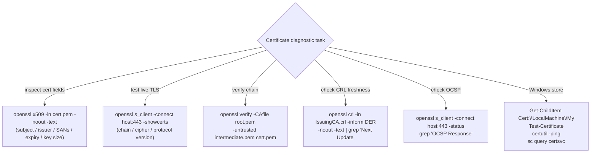

---
tags:
  - security
  - troubleshooting
---
# Certificates — Diagnostics


<div class="kb-summary">
Diagnostics reference covering Certificate Diagnostic Tool Map, Useful Commands, Chain Validation.
</div>
```text
┌───────────────────────── Security Certificates Troubleshooting — Diagnostics ─────────────────────────┐
│                                                                                                       │
│   ┌───────────────────────────────────────────────────────────────────────────────────────────────┐   │
│   │       Certificates diagnostics: log collection, health checks, and performance analysis       │   │
│   │          Tools: management CLI, REST API, vendor support bundle, and system event log         │   │
│   │          Performance: check I/O latency, throughput, queue depth, and cache hit rate          │   │
│   │       Collect support bundle before contacting vendor support to reduce time-to-resolve       │   │
│   └───────────────────────────────────────────────────────────────────────────────────────────────┘   │
│                                                                                                       │
│    Identify issue → collect logs → run diagnostics → analyse → resolve                                │
│                                                                                                       │
│                  ▼                                ▼                                ▼                  │
│                                                                                                       │
│   ┌─────────────────────────────┐  ┌─────────────────────────────┐  ┌─────────────────────────────┐   │
│   │            Layer            │  │          Component          │  │            Notes            │   │
│   │             Core            │  │       Primary service       │  │        Main function        │   │
│   │          Management         │  │        Control plane        │  │         Admin access        │   │
│   │          Monitoring         │  │         Health/perf         │  │      Alerts/dashboards      │   │
│   │           Security          │  │         Auth/encrypt        │  │        Access control       │   │
│   │         Integration         │  │        APIs/plug-ins        │  │         Third-party         │   │
│   └─────────────────────────────┘  └─────────────────────────────┘  └─────────────────────────────┘   │
│                                                                                                       │
│                          ▼                                                 ▼                          │
│                                                                                                       │
│   ┌───────────────────────────────────────────────────────────────────────────────────────────────┐   │
│   │      Layer       │    Component     │      Function     │      Notes       │       Auth       │   │
│   │       Core       │ Primary service  │   Main function   │     See docs     │       RBAC       │   │
│   │    Management    │  Control plane   │    Admin access   │     See docs     │       RBAC       │   │
│   │    Monitoring    │   Health/perf    │  Alerts/dashboard │     See docs     │       RBAC       │   │
│   │     Security     │   Auth/encrypt   │   Access control  │     See docs     │       RBAC       │   │
│   └───────────────────────────────────────────────────────────────────────────────────────────────┘   │
│                                                                                                       │
│    Physical: Security Certificates Troubleshooting infrastructure · management network · monitoring   │
│                                                                                                       │
│    Key terms:                                                                                         │
│                                                                                                       │
│    Certificates       = Security Certificates Troubleshooting platform overview and core concepts     │
│    Management         = management console and command-line interface for administration              │
│    Monitoring         = health and performance monitoring dashboards and alerting                     │
│    Automation         = REST API, scripting, and pipeline integration capabilities                    │
│    Security           = access control, authentication, and encryption configuration                  │
│    Backup             = backup and recovery procedures and schedule configuration                     │
│    Upgrade            = software version upgrades and firmware patching procedures                    │
│    Troubleshooting    = diagnostic procedures and common issue resolution steps                       │
│    Escalation         = vendor support escalation path and severity triage process                    │
│    Documentation      = vendor knowledge base and official product documentation                      │
│    Change management  = change ticket requirements for production modifications                       │
│    Audit log          = admin action logging for compliance and security review                       │
│                                                                                                       │
└───────────────────────────────────────────────────────────────────────────────────────────────────────┘
```


## Certificate Diagnostic Tool Map



## Useful Commands

```bash
# View certificate fields
openssl x509 -in cert.pem -noout -text

# Check expiry of a remote server cert
echo | openssl s_client -connect example.com:443 2>/dev/null \
    | openssl x509 -noout -dates

# Test TLS handshake
openssl s_client -connect <host>:443 -servername <host>

# Verify certificate against a CA bundle
openssl verify -CAfile ca-bundle.pem cert.pem

# Check CRL freshness
openssl crl -in IssuingCA.crl -inform DER -noout -text | grep "Next Update"

# Test OCSP stapling
openssl s_client -connect host.corp.example.com:443 -status -tlsextdebug 2>&1 | \
  grep -i "OCSP Response"
```

```powershell
# Find certificates expiring within 30 days
$cutoff = (Get-Date).AddDays(30)
Get-ChildItem Cert:\LocalMachine\My | Where-Object { $_.NotAfter -lt $cutoff }

# Validate certificate chain
Get-ChildItem Cert:\LocalMachine\My | Test-Certificate

# Check ADCS CA service
certutil -ping
sc query certsvc
certutil -cainfo
```

---

## Chain Validation

A certificate chain links an end-entity certificate back to a trusted root CA through one or more intermediates. Chain building failures are the most common cause of TLS trust errors in production.

### Chain Structure

| Position | Role | Trust Anchor |
|---|---|---|
| Root CA | Self-signed, in OS/browser trust store | Yes |
| Intermediate CA | Signed by Root, signs end-entity certs | No — trusted via root |
| End-Entity | Signed by Intermediate, used by server/client | No — trusted via chain |

Clients build the chain by following the Authority Information Access (AIA) extension in each certificate to retrieve the next intermediate.

### Inspecting a Certificate Chain

```bash
# Show full chain presented by a server
openssl s_client -connect example.com:443 -showcerts </dev/null 2>/dev/null

# Save chain to a file and inspect each cert
openssl s_client -connect example.com:443 -showcerts </dev/null 2>/dev/null \
    | openssl storeutl -noout -text -certs /dev/stdin

# Check AIA (issuer URL for intermediate download) and CDP (CRL)
openssl x509 -in server.crt -noout -text | grep -A5 "Authority Information"
openssl x509 -in server.crt -noout -text | grep -A3 "CRL Distribution"

# Verify a certificate against a specific CA bundle
openssl verify -CAfile /etc/ssl/certs/ca-certificates.crt server.crt

# Verify a chain manually with intermediate
openssl verify -CAfile root.crt -untrusted intermediate.crt server.crt
```

### AIA and CDP Extensions

AIA (Authority Information Access) contains the URL to download the issuing CA's certificate. CDP (CRL Distribution Points) contains the URL for the CRL. Both must be reachable from the client for chain building and revocation checking.

```bash
# Extract AIA URL from a certificate
openssl x509 -in server.crt -noout -text | grep -A2 "CA Issuers"

# Download intermediate CA cert from AIA URL
curl -o intermediate.crt http://aia.example.com/issuing-ca.crt

# Convert DER to PEM if needed
openssl x509 -inform DER -in intermediate.crt -out intermediate.pem

# Extract CDP URL
openssl x509 -in server.crt -noout -text | grep -A2 "CRL Distribution"
```

### Distributing Intermediate Certificates

Servers should always send the full chain (end-entity + all intermediates). Missing intermediates cause chain build failures on clients that do not cache or fetch via AIA.

```bash
# Build a full chain bundle for Apache/nginx
cat server.crt intermediate.crt > fullchain.crt

# Verify the bundle is ordered correctly (leaf first)
openssl storeutl -noout -text -certs fullchain.crt | grep "Subject:"

# Check nginx is serving the full chain
openssl s_client -connect myserver.example.com:443 -showcerts </dev/null 2>/dev/null \
    | grep -c "BEGIN CERTIFICATE"
# Should return 2 or 3 (leaf + intermediates)
```

### Root CA Trust

```bash
# List trusted root CAs on Linux
ls /etc/ssl/certs/ | head -20

# Add a new root CA to the system trust store (Debian/Ubuntu)
cp internal-root-ca.crt /usr/local/share/ca-certificates/
update-ca-certificates

# Add root CA on RHEL/CentOS
cp internal-root-ca.crt /etc/pki/ca-trust/source/anchors/
update-ca-trust

# Verify root CA is now trusted
openssl verify -CAfile /etc/ssl/certs/ca-certificates.crt internal-server.crt
```

### Common Chain Issues

- Intermediate not sent by server: add intermediate to the server TLS config
- Root CA not in client trust store: distribute root via GPO or system package
- AIA URL unreachable from DMZ clients: publish AIA on an internet-accessible URL
- Expired intermediate: renew and replace on all servers issuing from that CA
