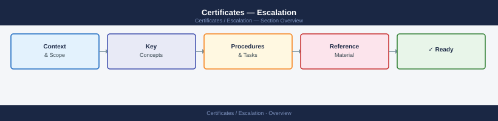
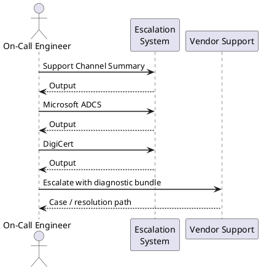
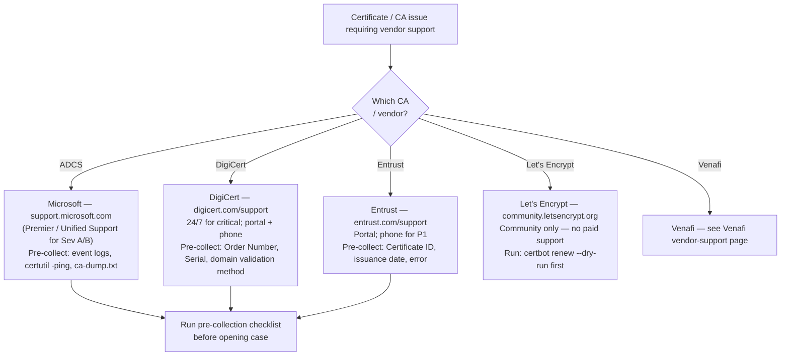

---
tags:
  - security
  - troubleshooting
search:
  boost: 1.5
---
# Certificates — Escalation


<div class="kb-summary">
Procedures for raising support cases with Microsoft ADCS, commercial CAs (DigiCert, Entrust), and Let's Encrypt. Pre-collect diagnostics before opening any case to reduce round-trip delays.
</div>



---



## Before you begin

- **Access:** Admin credentials on all affected systems
- **Gather first:** recent error message text, event timestamps, and affected object names
- **Scope:** confirm whether the issue affects a single object, host, cluster, or site
- **Escalation:** open a vendor support ticket before running any destructive step
- **Logging:** document each command and output — required if escalation is needed

---

## Support Channel Summary

| Vendor | Support Channel | SLA Notes |
|---|---|---|
| Microsoft ADCS | support.microsoft.com | Premier / Unified Support required for Sev A/B |
| DigiCert | digicert.com/support | 24/7 for critical; portal + phone |
| Entrust | entrust.com/support | Portal; phone for P1 |
| Let's Encrypt | community.letsencrypt.org | Community only; no paid support |
| Venafi | support.venafi.com | See Venafi vendor-support page |

---

## Microsoft ADCS

### Pre-Collection Checklist

Before opening a Microsoft support case, collect:

```powershell
# 1. Export CA event logs
wevtutil epl Application C:\Temp\Application.evtx
wevtutil epl System C:\Temp\System.evtx

# 2. Test CA RPC connectivity
certutil -ping

# 3. Check CRL freshness
certutil -getreg CA\CRLNextPublish
certutil -CRL

# 4. Verify CA service health
sc query certsvc
certutil -cainfo

# 5. Export CA configuration for review
certutil -dump > C:\Temp\ca-dump.txt
certutil -getreg CA > C:\Temp\ca-registry.txt

# 6. Collect certificate database statistics
certutil -view -restrict "Disposition=20" -out "RequestID,CommonName,NotAfter" > C:\Temp\issued-certs.txt
```

### Common ADCS Issues

| Symptom | First Check | Command |
|---|---|---|
| Auto-enrollment not working | GPO applied, CA reachable, template permissions | `certutil -pulse; gpresult /r` |
| CRL download failing | HTTP/LDAP CDP accessibility | `certutil -URL <cdp_url>` |
| CA service fails to start | CA cert or CRL expired | Check `certsvc` event log, `certutil -verify` |
| Certificate request pending | Template requires CA Manager approval | `certsrv.msc` → Pending Requests |

---

## DigiCert

### Pre-Collection Checklist

- Certificate **Order Number** (from DigiCert portal)
- Certificate **Serial Number** (`certutil -dump <cert.cer>` or from browser)
- Full **error message and timestamp**
- Domain validation method used (DNS, HTTP, email)
- For ACME: ACME client version, configuration, and challenge log output

### Emergency Certificate Procedures

DigiCert offers a **Certificate Replacement** (rekey) at no charge within the validity period:

1. Log in to DigiCert portal → **Orders** → locate the certificate.
2. Select **Reissue Certificate** and provide a new CSR.
3. For emergency same-day issuance, call DigiCert Priority Support.

Revocation (when key compromise suspected):

1. Log in to DigiCert portal → **Orders** → **Revoke Certificate**.
2. Provide reason code (Key Compromise, Affiliation Changed, Superseded, etc.).
3. DigiCert revokes within 24 hours for standard reasons, 24 hours maximum for key compromise per BR requirements.

---

## Entrust

### Pre-Collection Checklist

- Entrust **Certificate ID** (from Entrust portal)
- Issuance **date and time**
- Full error message from the requesting application
- Whether the issue affects issuance, renewal, or validation

### Emergency Procedures

For P1 certificate outages (production service down):

1. Open a case via entrust.com/support.
2. Call the Entrust support phone line and reference the case number.
3. For revocation due to key compromise, Entrust complies with CA/Browser Forum 24-hour revocation requirement.

---

## Let's Encrypt

Let's Encrypt provides no paid support. All issues are handled via the community forum at **community.letsencrypt.org**.

### ACME Troubleshooting

```bash
# Test ACME challenge accessibility (HTTP-01)
curl -v http://<domain>/.well-known/acme-challenge/<token>

# Check certificate issuance logs (Certbot)
journalctl -u certbot.service
cat /var/log/letsencrypt/letsencrypt.log

# Force a dry-run to validate ACME flow without issuing
certbot renew --dry-run --cert-name <domain>

# Check current certificate expiry
certbot certificates
```

Common failure causes:
- Port 80 blocked by firewall during HTTP-01 challenge
- DNS propagation delay during DNS-01 challenge
- Rate limit exceeded (5 duplicate certificates per week; 50 per domain per week)

Check current rate limit status: **crt.sh** — search for your domain to see recently issued certificates.

---

## Escalation Path by Vendor



---

## Certificate Emergency Response

### Suspected Key Compromise

1. **Immediately revoke** the certificate via the issuing CA or vendor portal.
2. Generate a new key pair and CSR on a clean, verified host.
3. Re-issue the certificate with the new key.
4. Replace the certificate in all affected services.
5. Audit access logs for the period the key may have been exposed.
6. Document the incident and notify the security team.

### Expired Certificate Response

```powershell
# Find all expired certificates in the machine store
Get-ChildItem Cert:\LocalMachine\My |
  Where-Object { $_.NotAfter -lt (Get-Date) } |
  Select-Object Subject, NotAfter, Thumbprint

# Check which service is using an expired certificate
netsh http show sslcert | Select-String -Pattern "Thumbprint|IP:port"
```

Target resolution time: expired internal certificate — 2 hours. Expired external/public certificate — 1 hour (P1 incident).

---

## Verify resolution

- Confirm the original symptom no longer occurs
- Check logs for any residual errors related to the issue
- Monitor for 10–15 minutes to confirm the fix is stable

## See also

- [Certificates — Common Issues](../common-issues/)
- [Certificates — Diagnostics](../diagnostics/)
- [Certificates — Procedures](../../operations/procedures/)
