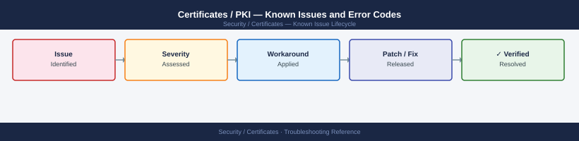

---
tags:
  - troubleshooting
  - certificates
  - pki
  - tls
  - known-issues
---
# Certificates / PKI — Known Issues and Error Codes

<div class="kb-summary">
Catalog of known PKI and certificate bugs, error codes, and workarounds covering ADCS, OCSP, CRL, and ACME / Let's Encrypt.

*Applies to: Microsoft ADCS, Let's Encrypt, general TLS/PKI*
</div>



```d2
direction: down

symptom: Identify Symptom {shape: diamond}
adcs: "ADCS" {shape: rectangle}
ocsp_crl: "OCSP / CRL" {shape: rectangle}
lets_encrypt_acme: "Let's Encrypt / ACME" {shape: rectangle}
general_tls: "General TLS" {shape: rectangle}
resolution: Resolve or Escalate {shape: oval}

symptom -> adcs: investigate
symptom -> ocsp_crl: investigate
symptom -> lets_encrypt_acme: investigate
symptom -> general_tls: investigate
adcs -> resolution
ocsp_crl -> resolution
lets_encrypt_acme -> resolution
general_tls -> resolution
```

## Before you begin

- Certificate errors surface in many forms — browser warnings, application SSL errors, or authentication failures.
- Diagnose with: `openssl s_client -connect <host>:443` to inspect the certificate chain.
- OCSP and CRL responders must be reachable from all client zones — this is the most common silent failure.

## ADCS

| Error / Symptom | Affected Versions | Cause | Workaround / Fix | Fixed In |
|---|---|---|---|---|
| `The RPC server is unavailable` when connecting to CA | ADCS | TCP 135 + dynamic RPC range blocked | Open 135 + 49152-65535 TCP from requestor to CA; or use ADCS Web Enrollment (443) | N/A |
| Certificate template not visible to end users | ADCS | Template not published to AD; enrollment permissions missing | Publish template: CA MMC → Certificate Templates → New → Certificate Template to Issue | N/A |
| `Denied by policy module` during enrollment | ADCS | Certificate template requires manager approval; or SAN not matching policy | Check policy module settings; or use autoenrollment group policy | N/A |
| ADCS Web Enrollment 404 after CA server patch | ADCS | IIS CertSrv role broken by Windows update | Reinstall IIS `CertificateServices` role via Server Manager | N/A |

## OCSP / CRL

| Error / Symptom | Affected Versions | Cause | Workaround / Fix | Fixed In |
|---|---|---|---|---|
| `OCSP responder not responding` — certificate validation fails | All | HTTP port 80 blocked to OCSP URL | Open TCP 80 from client networks to OCSP responder URL (embedded in cert AIA extension) | N/A |
| CRL `This certificate has an invalid digital signature` | All | CRL expired; CA not publishing new CRL | Manually publish CRL: `certutil -crl` on ADCS CA server | N/A |
| Application shows `revocation check failed` despite valid cert | All | CRL Distribution Point URL not reachable | Verify CDP URL in cert with `certutil -dump <cert>` is reachable from client | N/A |

## Let's Encrypt / ACME

| Error / Symptom | Affected Versions | Cause | Workaround / Fix | Fixed In |
|---|---|---|---|---|
| HTTP-01 challenge fails: `Connection refused on port 80` | Let's Encrypt | Inbound port 80 blocked from LE validation servers to ACME client | Open inbound TCP 80 from internet; or switch to DNS-01 challenge | N/A |
| `Rate limit exceeded` | Let's Encrypt | Too many certificate issuances for the same domain in 7 days | Wait 7 days; use Let's Encrypt staging environment for testing | N/A |
| `Certificate not yet valid` immediately after issuance | Let's Encrypt | Client clock skew; cert validity starts in future relative to client | Sync NTP on client; check clock accuracy | N/A |

## General TLS

| Error / Symptom | Affected Versions | Cause | Workaround / Fix | Fixed In |
|---|---|---|---|---|
| `SSL_ERROR_RX_RECORD_TOO_LONG` in browser | All | Server sending plaintext on HTTPS port; or TLS version mismatch | Verify server is actually serving TLS; check server TLS config | N/A |
| `Certificate name mismatch` warning | All | CN or SAN in cert doesn't match hostname | Reissue cert with correct SAN; modern browsers ignore CN — must use SAN | N/A |

## See also

- [Certificates — Common Issues](../common-issues/)
- [Venafi — Known Issues](../../products/venafi/troubleshooting/known-issues.md)
- [Active Directory — Known Issues](../../../compute/windows-server/active-directory/troubleshooting/known-issues.md)
