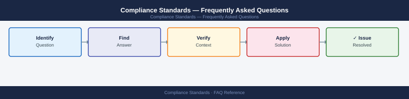

---
tags:
  - compliance-standards
  - faq
  - operations
---
# Compliance Standards — Frequently Asked Questions

*Applies to: All products (Security)*

Common questions about Compliance Standards operations, configuration, and troubleshooting. For step-by-step procedures, see the <a href="index.md">Operations</a> section.

## General

**Q: How do I determine which compliance frameworks apply to my organisation?**
A: Review regulatory requirements by industry (PCI-DSS for payments, HIPAA for healthcare, SOX for public companies) and geography (GDPR for EU data). Map against your data classification and system inventory.

**Q: How do I check the current Compliance Standards version?**
A: `Review GRC platform → Frameworks → Active`

## Configuration

**Q: What is the default control review frequency under ISO 27001?**
A: ISO 27001 requires annual internal audits at minimum. Critical controls (access management, incident response) should be reviewed quarterly. Some controls (patch management, backup verification) need monthly evidence collection.

**Q: How do I enable continuous compliance monitoring?**
A: Deploy a CSPM tool (Prisma Cloud, AWS Security Hub, Azure Defender for Cloud) for cloud controls. For on-premises, use a vulnerability scanner (Tenable, Qualys) with scheduled scans mapped to compliance controls in your GRC tool.

## Operations

**Q: How do I transition from a manual compliance programme to a GRC platform?**
A: Start with control inventory in the GRC tool. Map evidence sources. Automate evidence collection for technical controls first. Migrate risk register and audit findings. Train control owners on evidence upload process.

**Q: What is the correct procedure to add a new system to the compliance scope?**
A: Classify the system by data type and regulatory relevance. Assign a system owner. Add to the CMDB and GRC asset inventory. Identify applicable controls. Schedule initial baseline assessment within 30 days of go-live.

## Troubleshooting

**Q: GRC tool shows a control with 'Evidence Overdue'. What does it mean?**
A: The scheduled evidence collection date has passed without submission. Escalate to the control owner immediately. Late evidence is an audit finding. Investigate whether the control activity is occurring — the gap may indicate a real deficiency.

**Q: Compliance programme is generating too many low-quality findings — where do I start?**
A: Tune risk thresholds in your GRC tool to suppress accepted risks. Consolidate duplicate findings from overlapping frameworks (map ISO 27001 to SOC 2 controls). Focus remediation effort on high-risk, high-impact findings first.

## Backup and Recovery

**Q: How long should I retain compliance evidence?**
A: PCI-DSS: 12 months online, 12 months offline. SOX: 7 years. ISO 27001: duration of certification + 3 years. GDPR: as long as processing continues plus applicable statute of limitations. Store in tamper-evident repository.

**Q: Can I retroactively collect compliance evidence after an audit period?**
A: No — evidence must be contemporaneous (collected at the time of the control activity). Retroactive collection is not acceptable to auditors. If evidence was not collected, the control is considered not operating effectively for that period.

## See Also

- [Compliance Standards Operations](index.md)
- [Compliance Standards Troubleshooting](../../troubleshooting/index.md)
