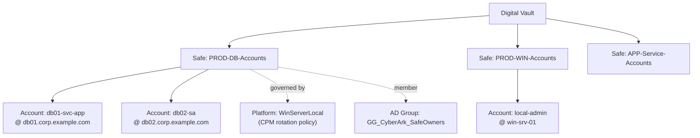
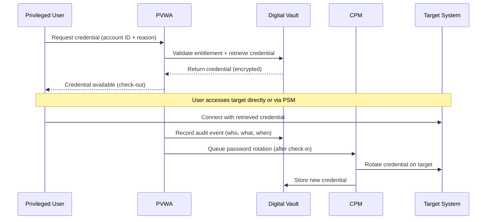
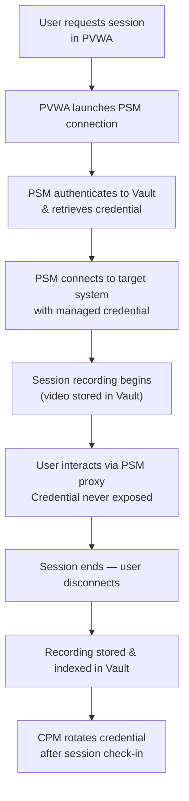

# CyberArk — Components

## Safe / Account / Platform Hierarchy



---

## Digital Vault

The Vault runs on a hardened Windows Server — only the CyberArk Vault service and required OS components are present. No other roles are installed.

- All credentials stored encrypted with AES-256
- Vault OS hardened per CyberArk Vault Hardening Guide (firewall restricts all traffic except port 1858 from CPM/PSM/PVWA and replication to DR Vault)
- Vault event logs forwarded to SIEM via syslog

```powershell
# Check Vault service health (run locally on Vault server)
Get-Service -Name "CyberArk Vault"

# View Vault operational logs
Get-Content "C:\Program Files (x86)\PrivateArk\Server\Logs\vault.log" -Tail 100

# Check replication status to DR Vault
Get-Content "C:\Program Files (x86)\PrivateArk\Server\Logs\dbsync.log" -Tail 50
```

---

## Safes

Safes are the organisational unit within the Vault. Each safe holds a set of accounts and has its own membership and access policy.

_Add safe-specific notes, checks, and commands here._

---

## Central Policy Manager (CPM)

CPM connects to target systems on schedule or on-demand to rotate passwords. Each CPM instance handles a partition of accounts determined by safe assignment.

```powershell
# Check CPM service health
Get-Service -Name "CyberArk Central Policy Manager Scanner"

# View CPM operational logs
Get-Content "C:\Program Files (x86)\CyberArk\Password Manager\Logs\pm.log" -Tail 100

# Find accounts with failed rotation (via PVWA REST API — see scripts page)
# Or: In PVWA -> Reports -> CPM Status Report
```

Common CPM failure reasons:
- Target host unreachable (firewall / network change)
- Credentials already changed manually (out-of-sync)
- Account locked by CPM rotation attempt
- Platform plugin misconfiguration

---

## Credential Checkout Sequence



---

## Privileged Session Manager (PSM)

PSM proxies privileged sessions — the user connects to the PSM, which then connects to the target using the managed credential. The user never sees the password.

- Sessions are recorded as video files and stored in the Vault.
- Session isolation: PSM uses a Windows Server with AppLocker and restricted user profile.
- PSM nodes are load-balanced; session stickiness is not required (each session is independent).

```powershell
# Check PSM service health
Get-Service -Name "Cyber-Ark Privileged Session Manager"

# View PSM connection logs
Get-Content "C:\Program Files (x86)\CyberArk\PSM\Logs\PSMConsole.log" -Tail 100

# List active sessions (via PVWA REST API)
$headers = @{ Authorization = "Bearer $token" }
Invoke-RestMethod -Uri "https://pvwa.corp.example.com/PasswordVault/API/LiveSessions" `
  -Headers $headers -Method Get
```

---

## Session Isolation Flow



---

## PVWA (Password Vault Web Access)

PVWA is the primary interface for users and administrators. It provides:
- Account credential retrieval and check-out
- PSM session launch
- Safe and account management
- REST API gateway for automation

PVWA is deployed as an IIS application on Windows Server, behind a load balancer.

```powershell
# Check PVWA IIS application pool health
Get-WebConfiguration -Filter "system.applicationHost/applicationPools/add[@name='DefaultAppPool']"
Get-WebApplication -Site "Default Web Site" -Name "PasswordVault"

# Verify PVWA can reach the Vault (from PVWA server)
Test-NetConnection -ComputerName vault01.corp.example.com -Port 1858
```
