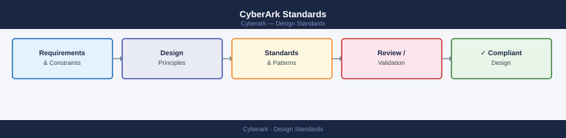

---
tags:
  - architecture
  - security
---
# CyberArk Standards

Safe names follow the pattern `ENV-TEAM-PURPOSE` (e.g., `PROD-INFRA-SERVERS`, `DEV-APP-SQLSVC`) to make ownership and scope immediately clear in PVWA.

*Applies to: CyberArk PAM*

 Account names use either `accountname@domain` for domain accounts or `local-admin@hostname` for local administrator accounts, ensuring uniqueness within each safe. Dual-control access policy is mandatory for all production safes, requiring a second approver before a password can be retrieved, and rotation frequencies are tiered by account sensitivity.

| Standard | Value |
|---|---|
| Safe naming | `ENV-TEAM-PURPOSE` |
| Domain account naming | `username@domain.fqdn` |
| Local account naming | `local-admin@hostname` |
| Dual-control enforcement | Required for all PROD safes |
| Service account rotation | 90 days |
| Admin account rotation | 60 days |
| Root / local admin rotation | 30 days |
| Max safe member count | 20 (review if exceeded) |
| Master Policy base | Require dual control, enforce check-in/out |

## Before you begin

- **Access:** Admin credentials on all affected systems
- **Change management:** security changes require CAB approval in most environments
- **Rollback plan:** document current state before any security control change
- **Testing:** validate in a non-production environment first where possible

---

