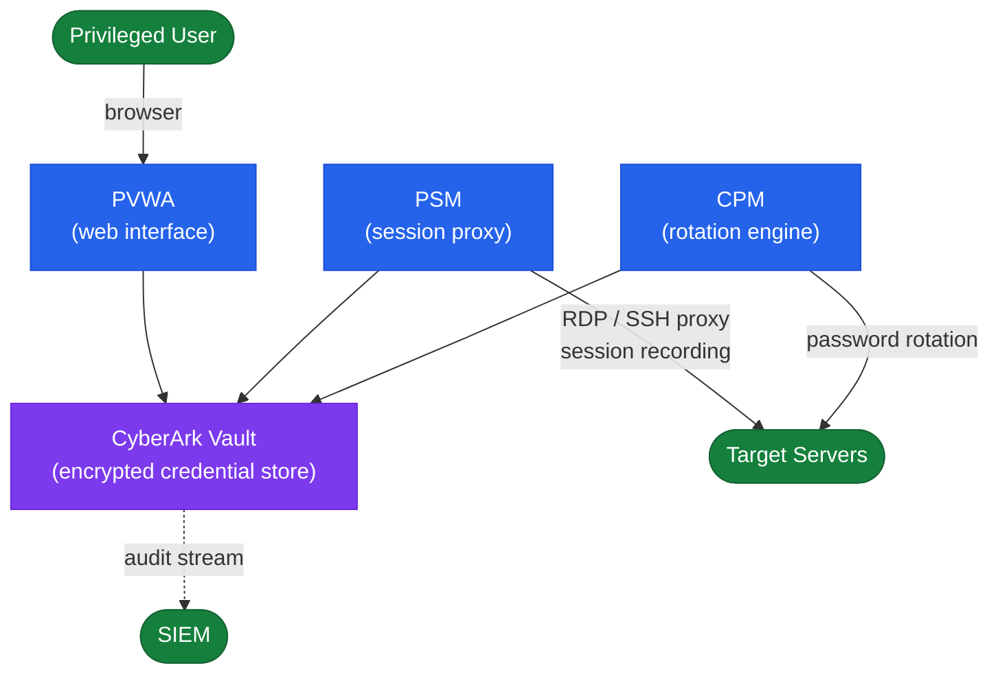
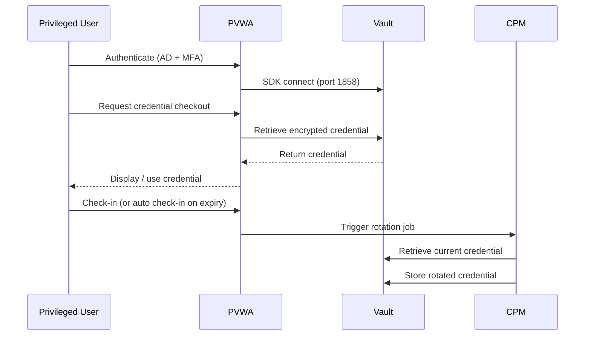
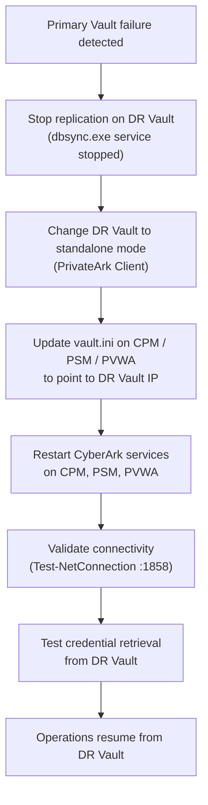

# CyberArk — How It Works

CyberArk Privileged Access Manager (PAM) is built around the Digital Vault, an encrypted hardened credential store that is the sole authoritative source for managed passwords and SSH keys. The Central Policy Manager (CPM) rotates credentials automatically, the Privileged Session Manager (PSM) proxies and records sessions, and the Password Vault Web Access (PVWA) provides the web UI and REST API gateway.

---

## Component Overview

| Component | Role | Typical Count |
|---|---|---|
| Digital Vault | Encrypted credential store, core engine | 2 (primary + DR) |
| CPM (Central Policy Manager) | Automated password rotation | 1–2 per site |
| PSM (Privileged Session Manager) | Session proxy, recording, isolation | 2+ (load-balanced) |
| PVWA (Password Vault Web Access) | Web UI and REST API | 2+ (load-balanced) |
| PSMP | SSH proxy for Linux privileged access | 1–2 per site |
| DR Vault | Asynchronous replication replica of Vault | 1 per DR site |

---

## PAM Component Topology



---

## Network Topology

```text
[Admin workstation / PAW]
         |
         | HTTPS (443)
         v
[PVWA (load-balanced pair)]  <-- AD LDAP/LDAPS (389/636)
         |
         | Vault SDK (1858)
         v
[Digital Vault (primary)]  <--> [DR Vault]
         |                      (replication: 1858)
         |
    +---------+----------+
    |                    |
[CPM]                 [PSM (load-balanced)]
    |                    |
    | (target protocols) | RDP/SSH (through session)
    v                    v
[Target systems]     [Target systems]
```

Key ports:

- PVWA → Vault: TCP 1858
- CPM → Vault: TCP 1858
- PSM → Vault: TCP 1858
- Admin → PVWA: TCP 443
- PSM → Targets: TCP 22 (SSH), TCP 3389 (RDP), TCP 1521 (Oracle), TCP 1433 (MSSQL)
- PSMP → Targets: TCP 22

---

## Credential Checkout Sequence



---

## High Availability and DR

| Scenario | Recovery Method |
|---|---|
| Primary Vault hardware failure | Activate DR Vault; reconfigure CPM/PSM/PVWA to point to DR Vault |
| PVWA node failure | Load balancer removes failed node; remaining node serves traffic |
| CPM failure | Accounts queue for rotation; failover CPM picks up queue on restart |
| PSM node failure | Active sessions on failed node terminate; load balancer routes new sessions to healthy node |

---

## DR Activation Flow



DR Vault activation procedure:

1. Stop replication on the DR Vault: `C:\Program Files (x86)\PrivateArk\Server\dbsync.exe` — stop the sync service.
2. Change DR Vault to standalone mode via PrivateArk Client.
3. Update CPM, PSM, and PVWA `vault.ini` to point to the DR Vault IP.
4. Restart CyberArk services on CPM, PSM, PVWA.
5. Validate connectivity and test a credential retrieval.
