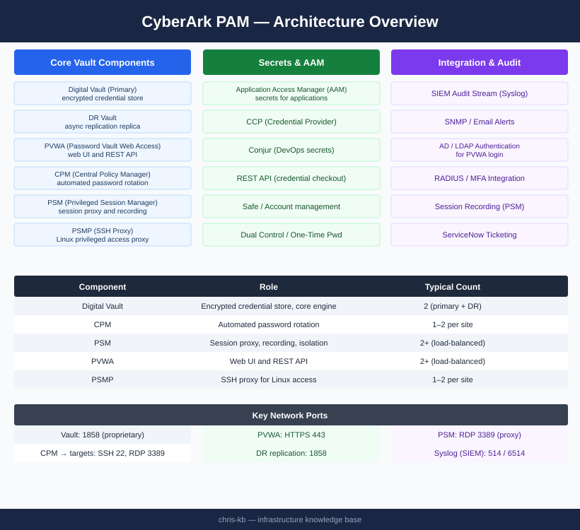
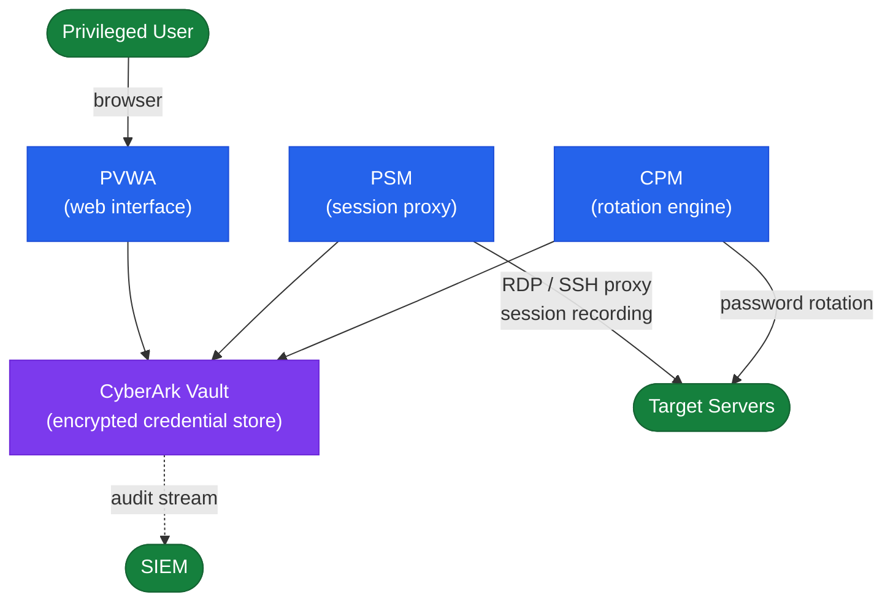

# CyberArk — Architecture

PAM platform with Digital Vault as the encrypted credential store, CPM for automated rotation, PSM for session proxying and recording, and PVWA as the web interface; primary and DR Vault pair with asynchronous replication.

<a class="kb-card" href="how-it-works/">
  <strong>How It Works</strong>
  Component roles, network topology, credential checkout, HA, and DR activation.
</a>

<a class="kb-card" href="integrations/">
  <strong>Integrations</strong>
  Integration with other platforms and external systems.
</a>

<a class="kb-card" href="design-standards/">
  <strong>Design Standards</strong>
  Sizing guidelines, design standards, and best practices.
</a>

## Component Overview

| Component | Role | Typical Count |
|---|---|---|
| Digital Vault | Encrypted credential store, core engine | 2 (primary + DR) |
| CPM (Central Policy Manager) | Automated password rotation | 1–2 per site |
| PSM (Privileged Session Manager) | Session proxy, recording, isolation | 2+ (load-balanced) |
| PVWA (Password Vault Web Access) | Web UI and REST API | 2+ (load-balanced) |
| PSMP | SSH proxy for Linux privileged access | 1–2 per site |
| DR Vault | Asynchronous replication replica of Vault | 1 per DR site |

## PAM Component Topology

