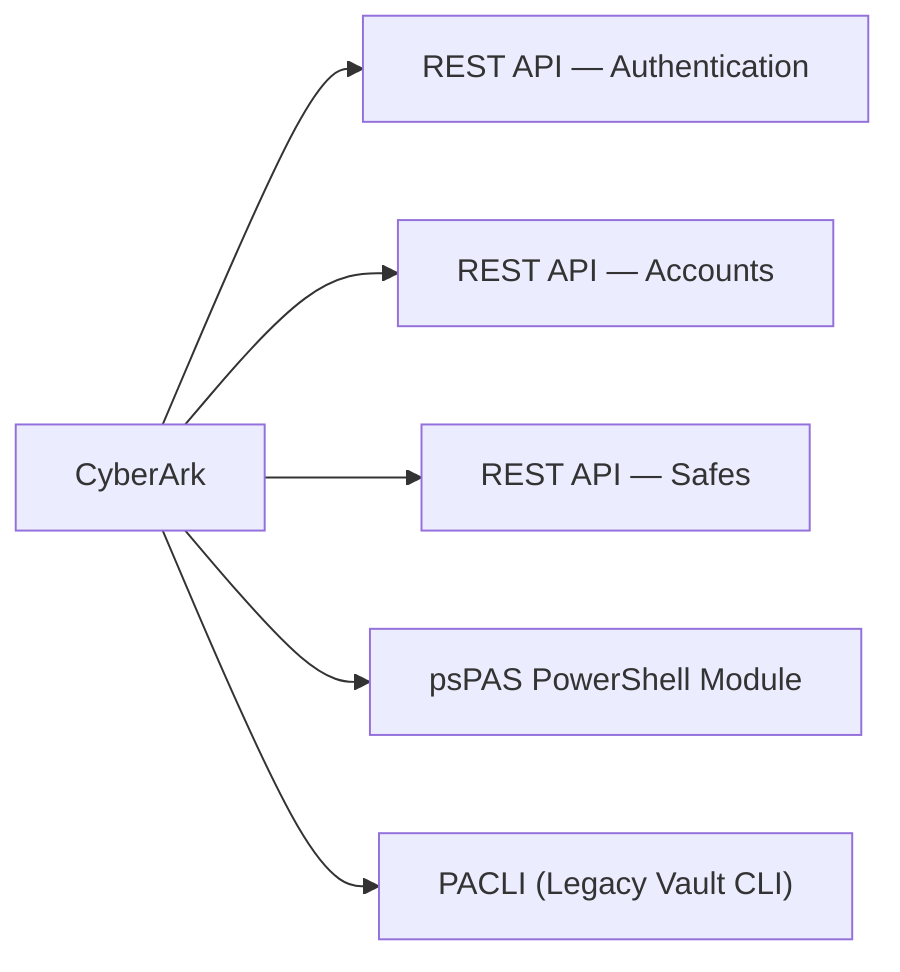

# CyberArk CLI Reference

CyberArk's primary programmatic interface is the PVWA REST API v2. The `psPAS` PowerShell module wraps the REST API with native cmdlets. The legacy PACLI client provides direct Vault operations outside of PVWA.



---

## REST API — Authentication

The PVWA REST API base URL is `https://<pvwa>/PasswordVault/api`. Always end sessions with a Logoff call.

```bash
# Authenticate with CyberArk auth
curl -X POST https://<pvwa>/PasswordVault/api/auth/CyberArk/Logon   -H "Content-Type: application/json"   -d '{"username":"admin","password":"<pass>"}'

# Authenticate with LDAP
curl -X POST https://<pvwa>/PasswordVault/api/auth/LDAP/Logon   -H "Content-Type: application/json"   -d '{"username":"admin","password":"<pass>"}'

# Logoff
curl -X POST https://<pvwa>/PasswordVault/api/auth/Logoff   -H "Authorization: <token>"
```

---

## REST API — Accounts

```bash
# List managed accounts
curl -X GET "https://<pvwa>/PasswordVault/api/accounts?limit=100"   -H "Authorization: <token>"

# Search accounts by username
curl -X GET "https://<pvwa>/PasswordVault/api/accounts?search=svc_oracle"   -H "Authorization: <token>"

# Retrieve an account password (CPM must allow retrieval)
curl -X POST "https://<pvwa>/PasswordVault/api/accounts/<id>/password/retrieve"   -H "Authorization: <token>"   -H "Content-Type: application/json"   -d '{"reason":"maintenance","TicketingSystemName":"","TicketId":""}'

# Trigger immediate password rotation
curl -X POST "https://<pvwa>/PasswordVault/api/accounts/<id>/change"   -H "Authorization: <token>"

# Verify current password
curl -X POST "https://<pvwa>/PasswordVault/api/accounts/<id>/verify"   -H "Authorization: <token>"
```

---

## REST API — Safes

```bash
# List all safes
curl -X GET "https://<pvwa>/PasswordVault/api/safes"   -H "Authorization: <token>"

# Get safe details
curl -X GET "https://<pvwa>/PasswordVault/api/safes/<safe_name>"   -H "Authorization: <token>"

# List safe members
curl -X GET "https://<pvwa>/PasswordVault/api/safes/<safe_name>/members"   -H "Authorization: <token>"
```

---

## psPAS PowerShell Module

```powershell
# Install module
Install-Module psPAS

# Authenticate
$session = New-PASSession -Credential (Get-Credential) -BaseURI "https://<pvwa>"

# List accounts
Get-PASAccount | Select UserName, Address, SafeName

# Get a specific account
Get-PASAccount -SafeName "ProdSafe" | Where-Object { $_.UserName -eq "svc_db" }

# Rotate a password
Invoke-PASCPMOperation -AccountID <id> -ChangeTask

# List safes
Get-PASSafe | Select SafeName, NumberOfDaysRetention

# Get safe members
Get-PASSafeMember -SafeName "ProdSafe"

# Component health summary
Get-PASComponentSummary

# End session
Close-PASSession
```

---

## PACLI (Legacy Vault CLI)

PACLI connects directly to the Vault, bypassing PVWA. Use only when PVWA is unavailable.

```bash
# Initialise PACLI
PACLI INIT

# Define the Vault server
PACLI DEFINEVAULT vault=<vault_name> address=<vault_ip>

# Logon
PACLI LOGON vault=<vault_name> user=admin password=<pass>

# Open a safe
PACLI OPENFILE vault=<vault_name> user=admin safe=<safe_name>

# List files in safe
PACLI FILESLIST vault=<vault_name> user=admin safe=<safe_name>

# Retrieve a credential file
PACLI RETRIEVEFILE vault=<vault_name> user=admin safe=<safe_name> folder=Root file=<account_name> localfolder=/tmp

# Logoff
PACLI LOGOFF vault=<vault_name> user=admin
```
