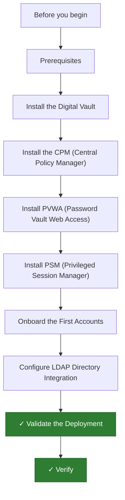

---
tags:
  - deployment
  - security
search:
  boost: 1.5
---
# CyberArk PAM — Initial Deployment

<div class="kb-summary">
CyberArk PAM initial deployment: Digital Vault, CPM, PVWA, PSM, initial account onboarding, LDAP integration, and deployment validation.

*Applies to: CyberArk PAM 12.x / 13.x*
</div>



```d2
direction: right

plan: "Plan" {shape: oval}
prerequisites: "Prerequisites" {shape: rectangle}
install_the_digital_vault: "Install the Digital Vault" {shape: rectangle}
install_the_cpm_central_policy_manag: "Install the CPM (Central Policy Manager)" {shape: rectangle}
install_pvwa_password_vault_web_acce: "Install PVWA (Password Vault Web Access)" {shape: rectangle}
install_psm_privileged_session_manag: "Install PSM (Privileged Session Manager)" {shape: rectangle}
onboard_the_first_accounts: "Onboard the First Accounts" {shape: rectangle}
validate: "Validate" {shape: oval}

plan -> prerequisites
prerequisites -> install_the_digital_vault
install_the_digital_vault -> install_the_cpm_central_policy_manag
install_the_cpm_central_policy_manag -> install_pvwa_password_vault_web_acce
install_pvwa_password_vault_web_acce -> install_psm_privileged_session_manag
install_psm_privileged_session_manag -> onboard_the_first_accounts
onboard_the_first_accounts -> validate
```

## Before you begin

- **Access:** admin credentials for the target system and any upstream dependencies (DNS, NTP, vCenter, directory services)
- **Timing:** safe to run during a scheduled maintenance window; allow 1-2 hours for initial deployment
- **Dependencies:** network connectivity verified; DNS resolvable; NTP configured; any licence keys available
- **Logging:** record every IP address, hostname, and credential set assigned during this deployment

---

This guide covers deploying a CyberArk Privileged Access Management environment from scratch, including the Digital Vault, CPM, PVWA, PSM, initial account onboarding, LDAP integration, and deployment validation.

---

## Prerequisites

| Component | Requirement |
|-----------|-------------|
| Digital Vault | Isolated Windows Server 2019/2022, no domain join |
| CPM | Dedicated Windows Server 2019/2022, domain-joined |
| PVWA | Dedicated Windows Server 2019/2022 + IIS, domain-joined |
| PSM | Dedicated Windows Server 2019/2022, domain-joined |
| Database | SQL Server 2019+ (for PVWA session data) |
| Accounts | CyberArk service account with local admin on each component server |
| Licence | Valid CyberArk licence file |
| Network | Vault on isolated VLAN; CPM/PVWA/PSM reach Vault on port 1858 |

Review CyberArk's official Hardening Guide for each component before installation. Vault hardening cannot be reversed after setup.

---

## Install the Digital Vault

The Vault must be installed on an isolated, non-domain-joined Windows Server. It is the root of trust for all credentials.

1. Mount the CyberArk Vault ISO and run `Setup.exe` as Administrator.
2. Accept the licence agreement and select the installation path.
3. Enter the Vault IP address and configure the ENE (External Network Extender) key when prompted.
4. Set the Vault Administrator password — store this in an offline secure location.
5. Complete installation and start the CyberArk Vault service:

```cmd
net start "CyberArk Logic Container"
net start "CyberArk Event Notification Engine"
```

Verify the Vault is listening:

```powershell
Test-NetConnection -ComputerName <VaultIP> -Port 1858
```

---

## Install the CPM (Central Policy Manager)

The CPM manages automatic password rotation and account verification.

1. Run the CPM installer on a dedicated domain-joined Windows Server.
2. When prompted, enter the Vault IP address and Vault administrator credentials.
3. Configure CPM settings in `CPMSettings.ini`:
   - Scan interval (default 24 hours)
   - Account timeout before forced rotation
4. Start the CPM service and verify it connects to the Vault:

```powershell
Get-Service "CyberArk Central Policy Manager"
```

Check `CPM.log` in the CPM installation directory for connectivity errors. The log should show `Vault connection: OK` within the first rotation cycle.

---

## Install PVWA (Password Vault Web Access)

PVWA is the primary web interface for users and administrators.

1. Run the PVWA installer on a dedicated domain-joined server with IIS installed.
2. Configure the IIS application pool identity to run under the CyberArk service account.
3. Point PVWA to the Vault IP during installation.
4. Configure `PVConfiguration.xml` with site-specific settings (timeout, certificate).
5. Configure LDAP/AD integration during setup (or post-install via Administration panel).
6. Complete installation and browse to the web UI:

```text
https://<pvwa-server>/PasswordVault
```

Log in with the built-in `Administrator` account to confirm the UI loads and the Vault connection is active.

The status indicator in the top-right corner should show the Vault as **Connected**.

---

## Install PSM (Privileged Session Manager)

PSM proxies and records privileged sessions (RDP, SSH, web).

1. Run the PSM installer on a dedicated domain-joined server.
2. During installation, point PSM to the Vault IP and provide the Vault administrator credentials.
3. Configure connection components:
   - `PSM-RDP` — for Windows RDP sessions
   - `PSM-SSH` — for SSH sessions
   - `PSM-WebApp` — for web-based targets (requires Universal Connector)
4. Verify PSM service is running:

```powershell
Get-Service "Cyber-Ark Privileged Session Manager"
```

5. In PVWA → Administration → Options → Connection Components, verify PSM-RDP and PSM-SSH are listed and enabled.

---

## Onboard the First Accounts

Onboarding an account stores its credential in the Vault and places it under CPM management.

1. Log in to PVWA → **Accounts** → **Add Account**.
2. Select the appropriate **Platform** (e.g., `WinServerLocal`, `UnixSSH`).
3. Fill in:
   - **Address** — target server hostname or IP
   - **Username** — local or domain account name
   - **Password** — current password (CPM will rotate after next cycle)
4. Save the account.
5. Verify CPM rotation by triggering an immediate change:
   - Accounts → select the account → **Change** → **Change Now**
6. Confirm the account shows status **Managed** and the last rotation timestamp updates.

---

## Configure LDAP Directory Integration

LDAP integration allows AD users to log in to PVWA using their domain credentials.

1. In PVWA, go to **Administration** → **LDAP Integration**.
2. Click **Add** and fill in:
   - **Directory Type**: Microsoft Active Directory
   - **Host**: DC hostname or IP
   - **Base Context**: `DC=corp,DC=local`
   - **Bind Account**: service account with read access to AD
   - **Bind Password**: service account password
3. Click **Test** to verify connectivity.
4. Under **Mappings**, map AD security groups to CyberArk roles:

| AD Group | CyberArk Role |
|----------|---------------|
| `CyberArk-Admins` | Vault Admins |
| `CyberArk-Users` | End Users |
| `CyberArk-Auditors` | Auditors |

5. Save and test by logging in with a domain user account.

---

## Validate the Deployment

Run end-to-end checks covering all components.

**Vault connectivity from each component:**

```powershell
Test-NetConnection -ComputerName <VaultIP> -Port 1858
```

**Log in as a domain user:**

1. Browse to `https://<pvwa>/PasswordVault`.
2. Log in with an AD user that is mapped to a CyberArk role via LDAP.
3. Confirm the Accounts view loads and assigned accounts are visible.

**PSM session test:**

1. Select an onboarded Windows account → **Connect** → select PSM-RDP.
2. A proxied RDP session should open via the PSM server.
3. After disconnecting, go to **Sessions** → confirm the session recording is present and playable.

**CPM rotation test:**

1. Select a test account → **Change** → **Change Now**.
2. Verify status changes to `Managed` and the timestamp updates.
3. Confirm the new password works on the target system.

**Review logs:**

| Log Location | Purpose |
|-------------|---------|
| `<Vault>\Logs\ITALog.log` | Vault audit events |
| `<CPM>\Logs\CPM.log` | Password rotation activity |
| PVWA IIS logs | Web access and errors |
| PSM `<PSM>\Logs` | Session proxy events |

---

## Verify

- Confirm the service or component is running and reachable
- Check management UI for any errors or warnings
- Run a basic functional test (login, read, write) to confirm end-to-end operation

## See also

- [Architecture](../architecture/)
- [Learning Path](../learning-path/)
- [Operations](../operations/)
- [Security](../security/)
- [Troubleshooting](../troubleshooting/)
- [CyberArk — Overview](../)
