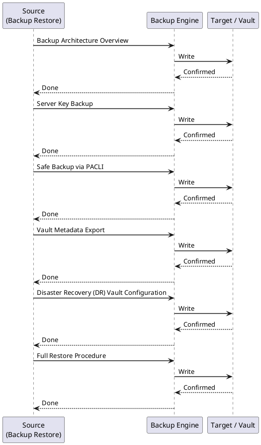
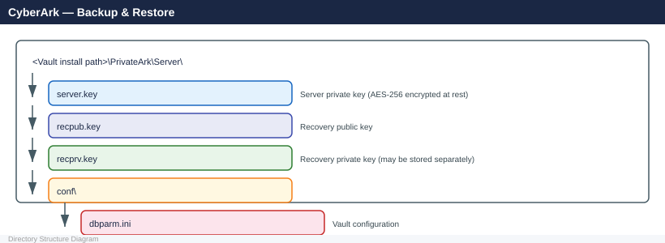
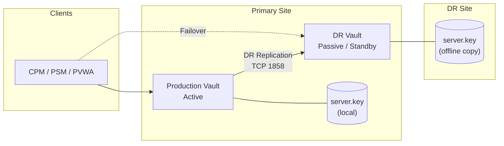

---
tags:
  - operations
  - security
---
# CyberArk — Backup & Restore

<div class="kb-summary">
The CyberArk Vault stores credentials that protect the entire organization. Loss of the Vault with no tested backup means total recovery failure.

*Applies to: CyberArk PAM*
</div>

 This page covers Vault server key backup, database-level backup via PACLI, Disaster Recovery Vault configuration, full restore procedures, and DR failover.

---



## Before you begin

- **Access:** Admin credentials on all affected systems
- **Timing:** safe to run during business hours unless a step is marked ⚠ (causes interruption)
- **Dependencies:** no active upgrades or migrations on the same infrastructure
- **Logging:** capture command output — paste into the change record on completion

---

## Backup Architecture Overview

CyberArk Vault backup has two distinct layers that must both be protected:

| Layer | What It Contains | Backup Method |
|---|---|---|
| Server Key (`recpub.key` / `server.key`) | Encrypts all data in the Vault | Manual secure extraction + offline storage |
| Vault database (Safe data) | Passwords, files, metadata, policies | `PACLIExport`, built-in DR replication, or VSS snapshot |
| Vault metadata | Safe permissions, user accounts, platform definitions | PACLI or PVWA export |
| DR Vault | Full real-time replica | Automatic replication via DR service |

> **Critical:** The server key and the database backup are useless without each other. Store them in separate, secure locations (dual-control access).

---

## Server Key Backup

The Vault Server Key (`server.key`) is the master encryption key. Without it, the Vault database is unreadable.

### Location



### Backup the Server Key

```cmd
REM From the Vault server (run as PrivateArk service account)
REM Stop the Vault service first if taking a cold copy
net stop "PrivateArk Server"

REM Copy key files to secure offline media
xcopy "C:\PrivateArk\Server\server.key"  E:\VaultKeyBackup\ /Y
xcopy "C:\PrivateArk\Server\recpub.key"  E:\VaultKeyBackup\ /Y
xcopy "C:\PrivateArk\Server\recprv.key"  E:\VaultKeyBackup\ /Y
xcopy "C:\PrivateArk\Server\conf\dbparm.ini" E:\VaultKeyBackup\ /Y

net start "PrivateArk Server"
```

> **Security requirement:** The offline media containing `server.key` must be stored in a physically separate, access-controlled location (e.g., fireproof safe, separate data center). Access requires two authorized personnel (dual-control).

### Verify Key Backup Integrity

```cmd
REM Compare checksums after copy
certutil -hashfile "C:\PrivateArk\Server\server.key" SHA256
certutil -hashfile "E:\VaultKeyBackup\server.key" SHA256
REM Outputs must match
```

---

## Safe Backup via PACLI

PACLI (Privileged Access Command Line Interface) is CyberArk's command-line tool for Vault operations, including data export.

### Install and Configure PACLI

```cmd
REM PACLI is installed as part of the CyberArk SDK package
REM Set PACLI path
SET PACLIPATH=C:\Program Files (x86)\CyberArk\ApplicationPasswordSdk\

REM Initialize PACLI session
PACLI INIT

REM Define Vault connection
PACLI DEFINEVAULT VAULT="ProductionVault" ADDRESS="192.168.10.10" PORT=1858 PREAUTH=YES

REM Logon (use a dedicated backup service account with auditor/vault admin permissions)
PACLI LOGON VAULT="ProductionVault" USER="BackupUser" PASSWORD="<password>"
```

### Export a Single Safe

```cmd
REM Export all files and accounts from a Safe to a local directory
PACLI EXPORTSAFE VAULT="ProductionVault" SAFE="IT-Admins" ^
  FOLDER="Root" LOCALFOLDER="C:\VaultBackup\Safes\IT-Admins\" ^
  INCLUDESUBFOLDERS=YES

REM Logoff and terminate
PACLI LOGOFF VAULT="ProductionVault"
PACLI TERM
```

### Bulk Safe Export Script

```powershell
# Export all Safes via PACLI (PowerShell wrapper)
$VaultName    = "ProductionVault"
$VaultAddress = "192.168.10.10"
$BackupUser   = "BackupUser"
$BackupPass   = "VaultBackupPassword"
$BackupRoot   = "C:\VaultBackup\$(Get-Date -Format 'yyyy-MM-dd')"

& PACLI INIT
& PACLI DEFINEVAULT VAULT=$VaultName ADDRESS=$VaultAddress PORT=1858 PREAUTH=YES
& PACLI LOGON VAULT=$VaultName USER=$BackupUser PASSWORD=$BackupPass

# Get list of all Safes
$SafeList = & PACLI SAFESLIST VAULT=$VaultName OUTPUT="(NAME)" |
  Select-String -Pattern '^\S+' | ForEach-Object { $_.Matches[0].Value }

foreach ($Safe in $SafeList) {
    $SafeBackupPath = Join-Path $BackupRoot "Safes\$Safe"
    New-Item -ItemType Directory -Path $SafeBackupPath -Force | Out-Null

    & PACLI EXPORTSAFE VAULT=$VaultName SAFE=$Safe FOLDER="Root" `
        LOCALFOLDER=$SafeBackupPath INCLUDESUBFOLDERS=YES

    Write-Host "Exported Safe: $Safe"
}

& PACLI LOGOFF VAULT=$VaultName
& PACLI TERM

Write-Host "Vault backup complete: $BackupRoot"
```

---

## Vault Metadata Export

Platform definitions, safe templates, and LDAP/user configurations should be exported separately from CyberArk's PVWA (Password Vault Web Access).

### Export Platforms

```text
PVWA → Administration → Platform Management → Export Platform → Download ZIP
```

Or via REST API:

```bash
# Authenticate
TOKEN=$(curl -s -X POST https://pvwa.corp.example.com/PasswordVault/API/auth/CyberArk/Logon \
  -H "Content-Type: application/json" \
  -d '{"username":"BackupUser","password":"VaultBackupPassword"}' | tr -d '"')

# Get all platforms
curl -s -H "Authorization: $TOKEN" \
  https://pvwa.corp.example.com/PasswordVault/API/Platforms?Active=true \
  -o vault-platforms-backup.json

# Logoff
curl -s -X POST -H "Authorization: $TOKEN" \
  https://pvwa.corp.example.com/PasswordVault/API/auth/Logoff
```


```text title="Expected output"
{"CyberArkLogonResult":"eyJQVldhVG9rZW4iOiJFQUFBQUFBQUFBQUFBQUFBQUFBQUFBQUFBQUFBQUFBQUFBQUFBQUFBQUFBQUFBQUFBQUFBQUFBQUFBQUFBQUFBQUFBQUFBQUFBQUFBQUFBQUFBQUFBQUFBQUFBQUFBQUFBQUFBQUFBQUFBQUFBQUFBQUFBQUFBQUFBQUFBQUFBQUFBQUFBQUFBQUFBQUFBQUFBQUFBQUFBQUFBQUFBQUFBQUFBQUFBQUFBQUFBQUFBQUFBQUFBQUFBQUFBQUFBQUFBQUFBQUFBQUFBQUFBQUFBQUFBQUFBQUFBQUFBQUFBQUFBQUFBQUFBQUFBQUFBQUFBQUFBQUFBQUFBQUFBQUFBQUFBQUFBQUFBQUFBQUFBQUFBQUFBQUFBQUFBQUFBQUFBQUFBQUFBQUFBQUFBQUFBQUFBQUFBQUFBQUFBQUFBQUFBQUFBQUFBQUFBQUFBQUFBQUFBQUFBQUFBQUFBQUFBQUFBQUFBQUFBQUFBQUFBQUFBQUFBQUFBQUFBQUFBQUFBQUFBQUFBQUFBQUFBQUFBQUFBQUFBQUFBQUFBQUFBQUFBQUFBQUFBQUFBQUFBQUFBQUFBQUFBQUFBQUFBQUFBQUFBQUFBQUFBQUFBQUFBQUFBQUFBQUFBQUFBQUFBQUFBQUFBQUFBQUFBQUFBQUFBQUFBQUFBQUFBQUFBQUFBQUFBQUFBQUFBQUFBQUFBQUFBQUFBQUFBQUFBQUFBQUFBQUFBQUFBQUFBQUFBQUFBQUFBQUFBQUFBQUFBQUFBQUFB
```
---

## Disaster Recovery (DR) Vault Configuration

CyberArk's built-in DR solution replicates the Vault database to a secondary Vault server in near-real-time using the DR service.

### DR Replication Architecture



### DR Vault dbparm.ini Settings (Primary)

```ini
[Main]
VaultID=ProductionVault
Address=192.168.10.10

[DR]
EnableDR=Yes
DRUser=DR_User
DRPassword=<encrypted>
DRSyncInterval=60         ; seconds between sync cycles
DRRetention=168           ; hours of transaction log retention
BackupVaultAddress=192.168.20.10
BackupVaultPort=1858
```

### Verify DR Replication Status

From the Vault server console or PrivateArk Client:

```text
Administration → Vault Parameters → DR Replication
```

Or check the PrivateArk Server log:

```cmd
type "C:\PrivateArk\Server\Logs\ITALog.log" | findstr /I "DR replication"
```

---

## Full Restore Procedure

### Prerequisites

- Server key (`server.key`, `recpub.key`, `recprv.key`) from secure storage
- Vault backup files (PACLI export or VSS snapshot)
- Fresh OS installation with matching CyberArk Vault version installed

### Restore Steps

**Step 1 — Install CyberArk Vault Software**

Install the same Vault version as the backed-up environment. Do not start the service yet.

**Step 2 — Restore the Server Key**

```cmd
REM Copy key files to the Vault installation directory
xcopy E:\VaultKeyBackup\server.key  "C:\PrivateArk\Server\" /Y
xcopy E:\VaultKeyBackup\recpub.key  "C:\PrivateArk\Server\" /Y
xcopy E:\VaultKeyBackup\recprv.key  "C:\PrivateArk\Server\" /Y
xcopy E:\VaultKeyBackup\dbparm.ini  "C:\PrivateArk\Server\conf\" /Y
```

**Step 3 — Restore the Vault Database**

If restoring from a VSS/filesystem snapshot:

```cmd
REM Stop PrivateArk if running
net stop "PrivateArk Server"

REM Replace Vault database directory with backup copy
robocopy "E:\VaultDBBackup\" "C:\PrivateArk\Server\Database\" /E /COPYALL /R:3
```

If restoring from PACLI export, start the Vault with an empty database, then re-import:

```cmd
net start "PrivateArk Server"
```

Then use PACLI IMPORTSAFE to re-import each Safe:

```cmd
PACLI INIT
PACLI DEFINEVAULT VAULT="ProductionVault" ADDRESS="127.0.0.1" PORT=1858
PACLI LOGON VAULT="ProductionVault" USER="Administrator" PASSWORD="<admin-password>"

PACLI ADDSAFE VAULT="ProductionVault" SAFE="IT-Admins" ...
PACLI IMPORTSAFE VAULT="ProductionVault" SAFE="IT-Admins" ^
  LOCALFOLDER="C:\VaultBackup\Safes\IT-Admins\" INCLUDESUBFOLDERS=YES

PACLI LOGOFF VAULT="ProductionVault"
PACLI TERM
```

**Step 4 — Start and Validate**

```cmd
net start "PrivateArk Server"
```

---

## DR Failover Procedure

Use this procedure when the primary Vault is unrecoverable and the DR Vault must be promoted to active.

### Failover Steps

1. **Confirm primary Vault is unreachable** — check network, hypervisor, service status.

2. **Activate the DR Vault:**

   Log on to the DR Vault server. Run:

   ```cmd
   REM From the DR Vault server
   net stop "PrivateArk Server"

   REM Edit dbparm.ini: change EnableDR=Yes to EnableDR=No (promote to primary)
   notepad "C:\PrivateArk\Server\conf\dbparm.ini"
   REM Set: EnableDR=No

   net start "PrivateArk Server"
   ```

3. **Update DNS / load balancer** to point the Vault VIP to the DR Vault IP.

4. **Reconnect CPM, PSM, and PVWA** — update `Vault.ini` on each component to point to the DR Vault address.

5. **Verify component connectivity:**

```cmd
REM From the PVWA server — test Vault connection
"C:\Program Files (x86)\CyberArk\Password Vault Web Access\Services\CyberArkIISAppPool\bin\PasswordVaultWebAccessTester.exe"
```

---

## Post-Restore Validation Checklist

| Check | Command / Action | Expected Result |
|---|---|---|
| Vault service running | `Get-Service "PrivateArk Server"` | Status: Running |
| Vault accessible from PVWA | Log in to PVWA web UI | Login succeeds |
| Safe list intact | PVWA → Safes | All Safes visible |
| Accounts retrievable | Open a Safe, view password | Password retrieved |
| CPM connectivity | PVWA → Monitoring → CPM | Status: Connected |
| PSM connectivity | PVWA → Monitoring → PSM | Status: Connected |
| DR replication restored | Check `ITALog.log` for DR sync | "DR sync completed" |
| Audit log continuity | PVWA → Reports → Audit | No gaps in events |

---

## Backup Schedule Reference

| Item | Frequency | Retention | Storage Location |
|---|---|---|---|
| Server key (cold copy) | At key generation / rotation | Indefinite | Fireproof safe (dual-control) |
| PACLI Safe export | Daily | 30 days | Encrypted, off-site |
| DR Vault replication | Continuous (every 60s) | 168 hours | DR site |
| PVWA platform export | After any platform change | 6 months | Encrypted archive |
| Vault metadata (REST) | Weekly | 90 days | Encrypted, off-site |

---

## Verify

- Confirm the operation completed without errors in the log or management UI
- Verify the expected state change is visible (service running, object created, config applied)
- Document the outcome in the change record

## See also

- [CyberArk — Procedures](../procedures/)
- [CyberArk — Health Checks](../health-checks/)
- [CyberArk — CLI Reference](../cli-reference/)
- [CyberArk — Scripts](../scripts/)
- [CyberArk — Install and Upgrade](../install-upgrade/)
- [CyberArk — Common Issues](../../troubleshooting/common-issues/)
