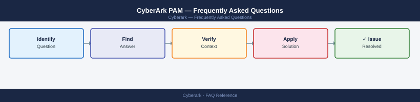

---
tags:
  - cyberark
  - faq
  - operations
---
# CyberArk PAM — Frequently Asked Questions

*Applies to: CyberArk PAS 12.x*

Common questions about CyberArk PAM operations, configuration, and troubleshooting. For step-by-step procedures, see the <a href="index.md">Operations</a> section.

## General

**Q: What CyberArk version is recommended for new deployments?**
A: CyberArk v13.x (Privilege Cloud) or v12.6+ for self-hosted. Check via PrivateArk Client → Help → About or PVWA → Administration → System Health. Keep within 2 versions of latest for support.

**Q: How do I check the current CyberArk PAM version?**
A: `PVWA → Administration → System Health → Version`

## Configuration

**Q: What is the default Master Policy setting for session recording?**
A: Session recording is disabled by default. Enable for all privileged sessions: PVWA → Policies → Master Policy → Session Management → Record and save sessions. This is a key control for SOX and PCI-DSS compliance.

**Q: How do I enable CyberArk PSM for SSH session recording?**
A: Install PSM for SSH (PSMP) on a Linux server. Configure the PSMP in PVWA under Administration → Components → PSM. Add the PSMP server as a Connection Component in your Platforms. Test SSH proxy via `ssh user@psmp-host`.

## Operations

**Q: How do I upgrade CyberArk Vault without downtime?**
A: DR Vault must be upgraded first. Pause replication, upgrade DR Vault, verify, resume replication. Then upgrade the Primary Vault during a maintenance window. Component upgrades (PVWA, CPM, PSM) can be done rolling.

**Q: What is the correct procedure to onboard a new privileged account?**
A: In PVWA, go to Accounts → Add Account. Select the Safe, Platform, and enter credentials. Configure reconcile account if needed. CPM will manage the password automatically per the Platform policy.

## Troubleshooting

**Q: CyberArk shows 'Dual Control request pending'. What does it mean?**
A: A privileged account retrieval requires approval from a second authorised user (Dual Control is enabled on the Safe or Platform). The requester is waiting. The approver must log in to PVWA → My Requests to approve.

**Q: PVWA login is slow — where do I start?**
A: Check PVWA server IIS application pool health. Verify Vault connectivity from PVWA. Check Windows event logs on PVWA server. Verify LDAP/AD integration response time. Check CyberArk Vault log (`italog.log`) for errors.

## Backup and Recovery

**Q: How often should I back up the CyberArk Vault?**
A: Daily replication to DR Vault is the primary protection. Additionally, configure Vault Backup utility (`CAVaultManager`) for an encrypted offline backup weekly. Store offsite. Test restore to an isolated environment quarterly.

**Q: Can I restore a single account's password history without a full Vault restore?**
A: No — individual account history is embedded in the Vault database. For single-account recovery, use the CAVaultManager restore to a test Vault, then export the specific account. Full Vault restore is needed for bulk recovery.

## See Also

- [CyberArk PAM Operations](index.md)
- [CyberArk PAM Troubleshooting](../../troubleshooting/index.md)
