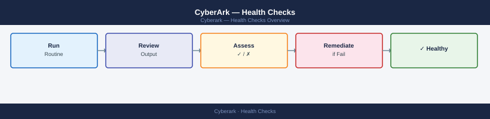

---
tags:
  - operations
  - security
---
# CyberArk — Health Checks


<div class="kb-summary">
Daily operations focus on confirming that the Vault service is running, CPM is successfully rotating passwords, PSM is brokering sessions without errors, and no critical accounts are in a failed rotation state.

*Applies to: CyberArk PAM*
</div>



## Before you begin

- **Access:** Admin credentials on all affected systems
- **Timing:** safe to run during business hours unless a step is marked ⚠ (causes interruption)
- **Dependencies:** no active upgrades or migrations on the same infrastructure
- **Logging:** capture command output — paste into the change record on completion

---

## Run This Routine

Run these checks each morning to confirm CyberArk Vault, CPM, and PSM are operating normally before users begin privileged access sessions.

1. **Vault service status** — on the Digital Vault server, confirm the CyberArk Vault service is Running:
   ```cmd
   net start | findstr /i "cyber"
   ```

2. **PVWA web service** — confirm PVWA API is responding with HTTP 200:
   ```powershell
   Invoke-WebRequest -Uri https://<pvwa>/PasswordVault/api/Auth/Cyberark/Logon -Method POST
   ```

3. **CPM service** — confirm Central Policy Manager is running:
   ```powershell
   Get-Service CyberArkPasswordManager | Select Status
   ```

4. **PSM service** — confirm Privileged Session Manager is running:
   ```powershell
   Get-Service CyberArkPrivilegedSessionManager | Select Status
   ```

5. **Vault DR replication** (if DR Vault is deployed) — in the DR Vault console navigate to: Vault → Disaster Recovery → Replication Status and confirm lag is 0.

6. **Password change failures** — in PVWA navigate to: Accounts → filter by "CPM Status: Failed" — investigate any failures immediately.

7. **Privileged session recordings** — in PVWA navigate to: Monitor → Active Sessions + Recordings — confirm recording is active for all live sessions.

8. **Safe access audit** — in PVWA navigate to: Policies → Safe → review any recently changed safe permissions for unauthorised changes.

9. **License seat usage** — in PVWA navigate to: Administration → License Capacity — flag if remaining seats fall below 10%.

10. **Vault backup recency** — on the Vault server review backup logs; the most recent backup must be within 24 hours:
    ```cmd
    dir <vault-root>\Logs\
    ```

---

 Check the PVWA dashboard for failed rotation jobs (red accounts), CPM heartbeat status, and DR replication lag each morning. Weekly, review session recording storage capacity to ensure sufficient space for recordings retention.

## Daily Checks

- Vault service health: confirm `PrivateArk Server` service is running on primary and DR
- CPM heartbeat: PVWA → Administration → System Health → CPM status green
- PSM health: PVWA → Administration → System Health → PSM status green
- Failed rotation jobs: PVWA → Accounts → filter by "Rotation failed" status
- DR Vault replication: confirm `replication lag = 0` in Vault DR dashboard
- Safe utilisation: flag safes approaching 10,000 object limit

## Weekly Checks

- Session recording storage capacity (target: >30% free)
- Review new safe creation requests against naming standards
- Confirm CPM platform configurations are up to date
- Audit users with "Vault Admin" role for any additions

---

## Verify

- Confirm the operation completed without errors in the log or management UI
- Verify the expected state change is visible (service running, object created, config applied)
- Document the outcome in the change record

## See also

- [CyberArk — Procedures](../procedures/)
- [CyberArk — CLI Reference](../cli-reference/)
- [CyberArk — Scripts](../scripts/)
- [CyberArk — Backup and Restore](../backup-restore/)
- [CyberArk — Install and Upgrade](../install-upgrade/)
- [CyberArk — Common Issues](../../troubleshooting/common-issues/)
