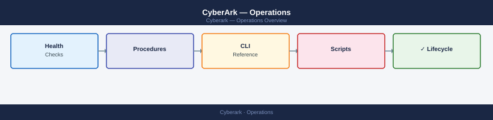

---
tags:
  - operations
  - security
---
# CyberArk — Operations

CyberArk day-to-day operations — safe management, account onboarding, session recording, CPM rotation, and vault health.

*Applies to: CyberArk PAM*

<a class="kb-card" href="cli-reference/">
  <strong>CLI Reference</strong>
  PACLI, REST API, and CyberArk command reference.
</a>

<a class="kb-card" href="health-checks/">
  <strong>Health Checks</strong>
  Daily checks, vault health, and status verification.
</a>

<a class="kb-card" href="procedures/">
  <strong>Procedures</strong>
  Account management, password rotation, and session procedures.
</a>

<a class="kb-card" href="install-upgrade/">
  <strong>Install &amp; Upgrade</strong>
  Version matrix, upgrade paths, and lifecycle management.
</a>

<a class="kb-card" href="backup-restore/">
  <strong>Backup &amp; Restore</strong>
  Vault backup procedures and restore workflows.
</a>

<a class="kb-card" href="scripts/">
  <strong>Scripts</strong>
  Automation scripts for account management and health checks.
</a>

  <a class="kb-card" href="faq/"><strong>FAQ</strong>Frequently asked questions, common issues, and quick answers for day-to-day operations.</a>

