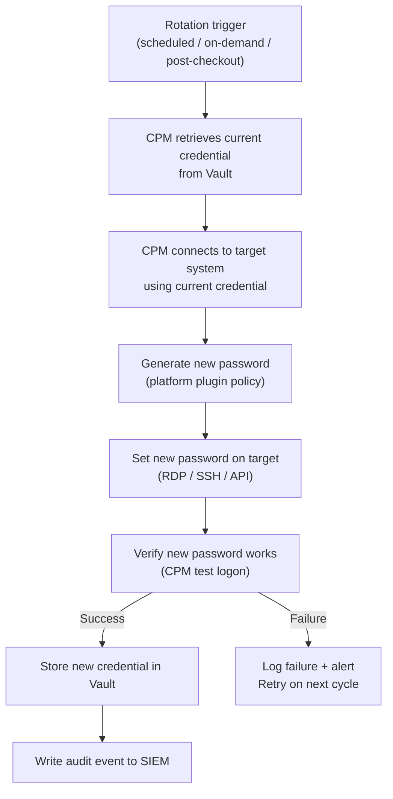

---
tags:
  - operations
  - security
---
# CyberArk — Procedures

<div class="kb-summary">
Operational procedures for account management, password rotation, session management, and audit tasks.

*Applies to: CyberArk PAM*
</div>

## Before you begin

- **Access:** Admin credentials on all affected systems
- **Timing:** safe to run during business hours unless a step is marked ⚠ (causes interruption)
- **Dependencies:** no active upgrades or migrations on the same infrastructure
- **Logging:** capture command output — paste into the change record on completion

---

## Password Rotation Workflow



---

## Account Management

Use this section for practical account management procedures, checks, and field references.

### Common Checks

- Confirm current health
- Review active alerts
- Check recent changes
- Confirm dependencies
- Check logs, events, and monitoring
- Capture current state before changes

### Change Notes

- Confirm change approval
- Confirm maintenance window
- Confirm rollback plan
- Capture current state
- Make one change at a time
- Validate after the change

---

## Password Rotation

Use this section for password rotation procedures.

### Common Checks

- Confirm current health
- Review active alerts
- Check recent changes
- Confirm dependencies
- Check logs, events, and monitoring
- Capture current state before changes

### Change Notes

- Confirm change approval
- Confirm maintenance window
- Confirm rollback plan
- Capture current state
- Make one change at a time
- Validate after the change

---

## Session Management

Use this section for PSM session management procedures and field references.

### Common Checks

- Confirm current health
- Review active alerts
- Check recent changes
- Confirm dependencies
- Check logs, events, and monitoring
- Capture current state before changes

### Change Notes

- Confirm change approval
- Confirm maintenance window
- Confirm rollback plan
- Capture current state
- Make one change at a time
- Validate after the change

---

## Audit

Use this section for audit procedures and reporting.

### Common Checks

- Confirm current health
- Review active alerts
- Check recent changes
- Confirm dependencies
- Check logs, events, and monitoring
- Capture current state before changes

### Change Notes

- Confirm change approval
- Confirm maintenance window
- Confirm rollback plan
- Capture current state
- Make one change at a time
- Validate after the change

---

## Add a Platform for a New Account Type

Platforms define how the CPM manages credentials for a specific system type. Create a custom platform when the built-in platforms do not match the target system's connection method or password policy.

1. Log in to **PVWA** → **Administration → Platform Management**.
2. Select the closest existing platform (e.g., WinServerLocal for Windows local accounts, UnixSSH for Linux).
3. Click **Duplicate** → enter a unique platform name (e.g., `Corp-WinService-Accounts`).
4. Edit the duplicated platform:
   - **CPM Plugin**: confirm the correct plugin (e.g., `WinSSH`, `Oracle`, `MySQL`).
   - **Password Complexity**: set minimum length, complexity rules, and character sets to match the target system's policy.
   - **Connection Components**: add or configure PSM connection components (RDP, SSH) if session recording is required.
5. Set the **Automatic Password Management** interval and verification settings.
6. Click **Save** → **Activate** the platform.
7. Assign the platform when onboarding accounts in the target Safe.

Test the platform with a non-production account before enabling it for production accounts — use **Verify** and **Change** from the account actions menu to confirm CPM connectivity.

---

## Generate an Account Activity Report

Account activity reports provide evidence of privileged account usage for audit and compliance reviews.

1. Log in to **PVWA** → **Reports**.
2. Select **Accounts Activity**.
3. Set the **Date Range** to cover the audit period (e.g., last 90 days for quarterly review).
4. Apply filters as required:
   - **Safe**: limit to a specific Safe (e.g., `Production-Unix-Admins`).
   - **User**: filter by a specific CyberArk user or AD account if investigating an individual.
   - **Account**: filter by target account username or address.
5. Click **Generate Report**.
6. Review the results — each row shows: date/time, requesting user, target account, Safe, action type (Retrieve, Connect, Verify, Change), and session duration.
7. Click **Export CSV** to download the full report for audit evidence.

For PCI-DSS or SOC 2 audits, include the CSV export in the evidence package along with the Safe membership list for the period.

---

## Configure LDAP Directory Mapping

LDAP Directory Mapping allows AD or LDAP group members to authenticate to PVWA and receive CyberArk role permissions without creating individual CyberArk user accounts.

1. Log in to **PVWA** as an Administrator → **Administration → Directory Mapping**.
2. Click **Add** → select the configured LDAP directory (e.g., `corp.example.com`).
3. In the **LDAP Group** field, enter the distinguished name of the AD group:
   `CN=CyberArk-Admins,OU=Groups,DC=corp,DC=example,DC=com`
4. In the **CyberArk Role** field, select the role to assign (e.g., Vault Admins, Auditors, Safe Managers).
5. Optionally restrict access to specific Safes by configuring Safe permissions on the mapped group.
6. Click **Save**.
7. Test by logging in to PVWA with an account that is a member of the mapped AD group.
8. Verify the user receives the expected role and Safe access.

```bash
# Test LDAP connectivity from the Vault server (run as Administrator)
# Use ldp.exe or the built-in CyberArk LDAP test in Administration > LDAP Integration
```

Keep directory mappings documented with the AD group owner. Review mappings quarterly and remove any groups that no longer exist in AD.

---

## Reset a Failed CPM Password Rotation

When a CPM password rotation fails (e.g., the target system rejected the new password, credentials are out of sync), use the reconcile workflow to re-establish a known-good state.

### Diagnose the Failure

1. Log in to **PVWA** → locate the account → check the **Status** field (shows last CPM action and error).
2. Review the CPM log for the specific error: `C:\Program Files (x86)\CyberArk\Password Manager\Logs\PM_Error.log`.

### Attempt Verify First

1. Select the account in PVWA → **Actions → Verify**.
2. If Verify succeeds, the password on the target system matches the Vault — the failure may have been transient.

### Reconcile if Verify Fails

3. Select the account → **Actions → Reconcile**.
4. The CPM connects to the target system using the **Reconcile Account** (a separate admin account with permission to reset passwords).
5. The CPM sets a new password on the target system and stores it in the Vault.

```powershell
# If the reconcile account itself needs resetting, do it manually first:
# 1. Manually set the reconcile account password on the target system
# 2. Update the reconcile account password in the Vault via PVWA:
#    Accounts > find reconcile account > Actions > Update > enter new password
```

6. After reconciliation, run **Verify** again to confirm the Vault password matches the target.
7. Document the failure reason and resolution in the change ticket.

If reconcile also fails, check network connectivity between the CPM server and the target, firewall rules, and whether the reconcile account has the required permissions on the target system.

---

## Verify

- Confirm the operation completed without errors in the log or management UI
- Verify the expected state change is visible (service running, object created, config applied)
- Document the outcome in the change record

## See also

- [CyberArk — Health Checks](../health-checks/)
- [CyberArk — CLI Reference](../cli-reference/)
- [CyberArk — Scripts](../scripts/)
- [CyberArk — Backup and Restore](../backup-restore/)
- [CyberArk — Install and Upgrade](../install-upgrade/)
- [CyberArk — Common Issues](../../troubleshooting/common-issues/)
