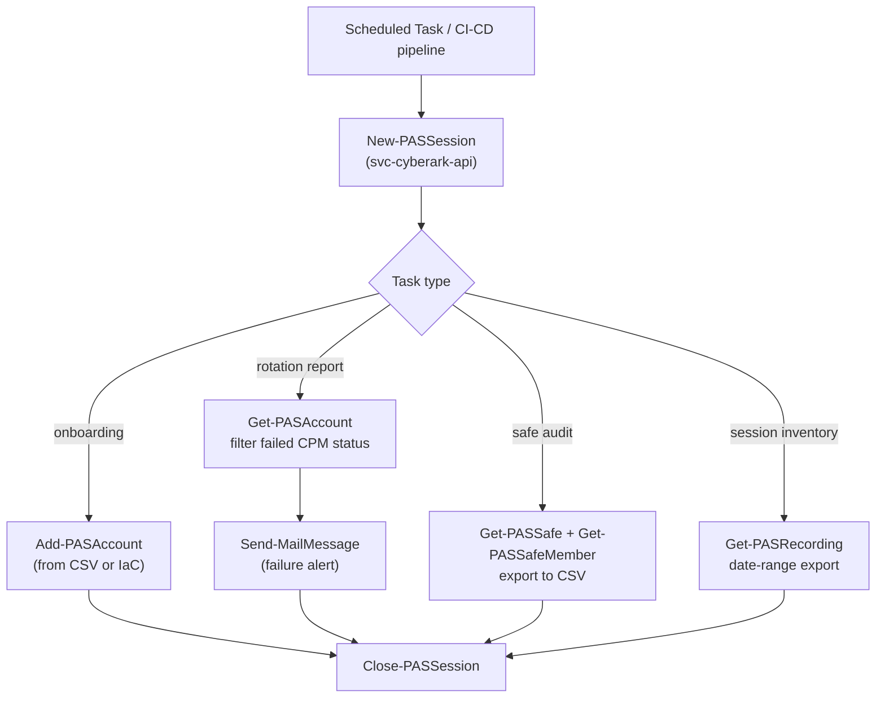

---
tags:
  - operations
  - security
---
# CyberArk — Scripts


<div class="kb-summary">
PowerShell automation using the `psPAS` module and the PVWA REST API. All automation uses a dedicated PVWA service account with the minimum required safe-level and administrative permissions. Never use a personal admin account for scheduled automation.

*Applies to: CyberArk PAM*
</div>

## Before you begin

- **Access:** admin credentials for the target system and any upstream dependencies (DNS, NTP, vCenter, directory services)
- **Timing:** safe to run during a scheduled maintenance window; allow 1-2 hours for initial deployment
- **Dependencies:** network connectivity verified; DNS resolvable; NTP configured; any licence keys available
- **Logging:** record every IP address, hostname, and credential set assigned during this deployment

---

```text
┌──────────────────────── Security Cyberark Operations — Scripts and Automation ────────────────────────┐
│                                                                                                       │
│   ┌───────────────────────────────────────────────────────────────────────────────────────────────┐   │
│   │        Cyberark scripts: automation for reporting, health monitoring, and provisioning        │   │
│   │         REST API available for all operations; PowerShell and Python modules supported        │   │
│   │          Scripts must run from dedicated service accounts with least-privilege roles          │   │
│   │        Store credentials in vault; rotate service account passwords on defined schedule       │   │
│   └───────────────────────────────────────────────────────────────────────────────────────────────┘   │
│                                                                                                       │
│    Script → authenticate REST → execute operation → verify → log result                               │
│                                                                                                       │
│                  ▼                                ▼                                ▼                  │
│                                                                                                       │
│   ┌─────────────────────────────┐  ┌─────────────────────────────┐  ┌─────────────────────────────┐   │
│   │            Layer            │  │          Component          │  │            Notes            │   │
│   │             Core            │  │       Primary service       │  │        Main function        │   │
│   │          Management         │  │        Control plane        │  │         Admin access        │   │
│   │          Monitoring         │  │         Health/perf         │  │      Alerts/dashboards      │   │
│   │           Security          │  │         Auth/encrypt        │  │        Access control       │   │
│   │         Integration         │  │        APIs/plug-ins        │  │         Third-party         │   │
│   └─────────────────────────────┘  └─────────────────────────────┘  └─────────────────────────────┘   │
│                                                                                                       │
│                          ▼                                                 ▼                          │
│                                                                                                       │
│   ┌───────────────────────────────────────────────────────────────────────────────────────────────┐   │
│   │      Layer       │    Component     │      Function     │      Notes       │       Auth       │   │
│   │       Core       │ Primary service  │   Main function   │     See docs     │       RBAC       │   │
│   │    Management    │  Control plane   │    Admin access   │     See docs     │       RBAC       │   │
│   │    Monitoring    │   Health/perf    │  Alerts/dashboard │     See docs     │       RBAC       │   │
│   │     Security     │   Auth/encrypt   │   Access control  │     See docs     │       RBAC       │   │
│   └───────────────────────────────────────────────────────────────────────────────────────────────┘   │
│                                                                                                       │
│    Physical: Security Cyberark Operations infrastructure · management network · monitoring            │
│                                                                                                       │
│    Key terms:                                                                                         │
│                                                                                                       │
│    Cyberark           = Security Cyberark Operations platform overview and core concepts              │
│    Management         = management console and command-line interface for administration              │
│    Monitoring         = health and performance monitoring dashboards and alerting                     │
│    Automation         = REST API, scripting, and pipeline integration capabilities                    │
│    Security           = access control, authentication, and encryption configuration                  │
│    Backup             = backup and recovery procedures and schedule configuration                     │
│    Upgrade            = software version upgrades and firmware patching procedures                    │
│    Troubleshooting    = diagnostic procedures and common issue resolution steps                       │
│    Escalation         = vendor support escalation path and severity triage process                    │
│    Documentation      = vendor knowledge base and official product documentation                      │
│    Change management  = change ticket requirements for production modifications                       │
│    Audit log          = admin action logging for compliance and security review                       │
│                                                                                                       │
└───────────────────────────────────────────────────────────────────────────────────────────────────────┘
```


## Automation Workflow



---

## Prerequisites

```powershell
# Install psPAS module
Install-Module psPAS -Scope CurrentUser

# Authenticate to PVWA (CyberArk authentication)
$credential = Get-Credential  # svc-cyberark-api
New-PASSession -BaseURI "https://pvwa.corp.example.com" -Credential $credential -Type CyberArk

# Authenticate using LDAP / AD credentials
New-PASSession -BaseURI "https://pvwa.corp.example.com" -Credential $credential -Type LDAP

# Close session when done
Close-PASSession
```

---

## Account Onboarding

```powershell
# Onboard a single account
$params = @{
    userName     = "svc-app01"
    address      = "db01.corp.example.com"
    accountName  = "db01-svc-app01"
    platformID   = "WinServerLocal"
    SafeName     = "APP-DB01-Accounts"
    secret       = (ConvertTo-SecureString "InitialPassword123!" -AsPlainText -Force)
    automaticManagementEnabled = $true
}
Add-PASAccount @params

# Bulk onboard from CSV
# CSV columns: userName, address, accountName, platformID, SafeName, secret
Import-Csv "accounts_to_onboard.csv" | ForEach-Object {
    Add-PASAccount `
        -userName $_.userName `
        -address $_.address `
        -accountName $_.accountName `
        -platformID $_.platformID `
        -SafeName $_.SafeName `
        -secret (ConvertTo-SecureString $_.secret -AsPlainText -Force) `
        -automaticManagementEnabled $true
    Write-Host "Onboarded: $($_.accountName)"
}
```

---

## Password Retrieval

```powershell
# Retrieve a password (check-out) — used in automation only, not for interactive retrieval
$account = Get-PASAccount -SafeName "APP-DB01-Accounts" -Keywords "svc-app01"
$cred    = Get-PASAccountPassword -AccountID $account.id

# Use the retrieved password in a script
$securePassword = ConvertTo-SecureString $cred.Password -AsPlainText -Force
$psCredential   = New-Object System.Management.Automation.PSCredential($account.userName, $securePassword)

# Invoke-Command using retrieved credentials
Invoke-Command -ComputerName "db01.corp.example.com" -Credential $psCredential -ScriptBlock {
    # task here
}
```

---

## Safe Management

```powershell
# Create a new safe
Add-PASSafe -SafeName "APP-NEWAPP-Accounts" `
  -Description "Managed accounts for NewApp" `
  -ManagingCPM "PasswordManager" `
  -NumberOfVersionsRetention 5

# Add a safe member with specific permissions
Add-PASSafeMember -SafeName "APP-NEWAPP-Accounts" `
  -MemberName "GG_CyberArk_NewApp_Owners" `
  -UseAccounts $true `
  -RetrieveAccounts $true `
  -ListAccounts $true `
  -AddAccounts $true `
  -UpdateAccountContent $true `
  -UpdateAccountProperties $true `
  -InitiateCPMAccountManagementOperations $true

# List all safes
Get-PASSafe | Select-Object SafeName, Description, ManagingCPM | Sort-Object SafeName

# Export safe membership audit (all safes, all members)
$report = Get-PASSafe | ForEach-Object {
    $safeName = $_.SafeName
    Get-PASSafeMember -SafeName $safeName | ForEach-Object {
        [PSCustomObject]@{
            Safe   = $safeName
            Member = $_.MemberName
            Type   = $_.MemberType
            UseAccounts = $_.Permissions.useAccounts
            RetrieveAccounts = $_.Permissions.retrieveAccounts
        }
    }
}
$report | Export-Csv "SafeMembership_Audit.csv" -NoTypeInformation
```

---

## CPM Rotation Status Report

```powershell
# Report accounts with failed rotation or rotation overdue
$accounts = Get-PASAccount -search "*" | Where-Object {
    $_.secretManagement.status -ne "success" -or
    $_.secretManagement.lastModifiedTime -lt ((Get-Date).AddDays(-90).ToUnixTime())
}

$report = $accounts | Select-Object `
    @{N="AccountName";    E={$_.name}},
    @{N="Safe";           E={$_.safeName}},
    @{N="Address";        E={$_.address}},
    @{N="CPMStatus";      E={$_.secretManagement.status}},
    @{N="LastRotation";   E={[DateTimeOffset]::FromUnixTimeSeconds($_.secretManagement.lastModifiedTime).LocalDateTime}}

$report | Export-Csv "CPM_RotationStatus.csv" -NoTypeInformation
$report | Where-Object { $_.CPMStatus -ne "success" }
```

---

## Session Recording Inventory

```powershell
# List PSM recordings for a date range
$from = (Get-Date).AddDays(-7)
$to   = Get-Date

Get-PASRecording -FromTime $from.ToUnixTime() -ToTime $to.ToUnixTime() |
  Select-Object `
    @{N="User";     E={$_.User}},
    @{N="Target";   E={$_.Target}},
    @{N="Safe";     E={$_.Safe}},
    @{N="Start";    E={[DateTimeOffset]::FromUnixTimeSeconds($_.Start).LocalDateTime}},
    @{N="Duration"; E={$_.Duration}} |
  Export-Csv "PSM_Recordings_$(Get-Date -Format 'yyyyMMdd').csv" -NoTypeInformation
```

---

## Failed Rotation Alert

```powershell
# Send email alert for any accounts with CPM failure (run as scheduled task)
Import-Module psPAS
$credential = Import-Clixml "C:\Scripts\CyberArk\svc-cyberark-api.cred"
New-PASSession -BaseURI "https://pvwa.corp.example.com" -Credential $credential -Type CyberArk

$failed = Get-PASAccount -search "*" |
  Where-Object { $_.secretManagement.status -eq "failure" }

if ($failed.Count -gt 0) {
    $body = $failed | Select-Object name, safeName, address,
      @{N="Status"; E={$_.secretManagement.status}} |
      ConvertTo-Html -Fragment

    Send-MailMessage `
        -To "infra-sec@corp.example.com" `
        -From "noreply-cyberark@corp.example.com" `
        -Subject "CyberArk: $($failed.Count) CPM Rotation Failure(s)" `
        -Body "<html><body>$body</body></html>" `
        -BodyAsHtml `
        -SmtpServer "smtp.corp.example.com"
}

Close-PASSession
```

---

## Verify

- Confirm the operation completed without errors in the log or management UI
- Verify the expected state change is visible (service running, object created, config applied)
- Document the outcome in the change record

## See also

- [CyberArk — Procedures](../procedures/)
- [CyberArk — Health Checks](../health-checks/)
- [CyberArk — CLI Reference](../cli-reference/)
- [CyberArk — Backup and Restore](../backup-restore/)
- [CyberArk — Install and Upgrade](../install-upgrade/)
- [CyberArk — Common Issues](../../troubleshooting/common-issues/)
