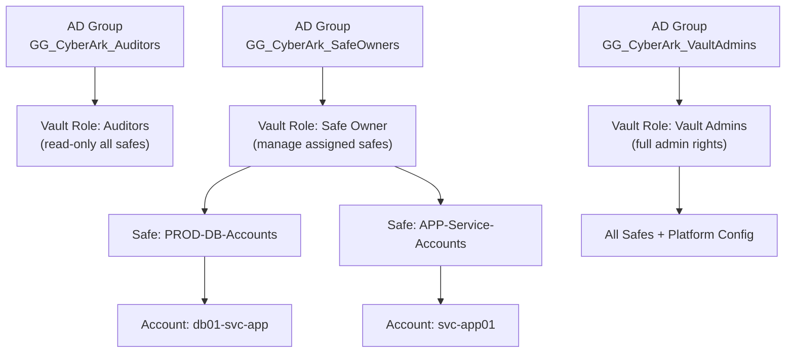

---
tags:
  - security
---
# CyberArk — Access Control

All production safes enforce dual-control to prevent unilateral credential access. Safe access is managed via AD group membership mapped to Vault roles.

*Applies to: CyberArk PAM*

| Control | Implementation |
|---|---|
| Dual-control for PROD | Enforced via Master Policy; requires approver in PVWA before retrieval |
| Master Policy review | Quarterly review of base policy and platform-specific overrides |
| Vault DR access | DR Vault is read-only replica; promotion only during declared disaster |

## Before you begin

- **Access:** Admin credentials on all affected systems
- **Change management:** security changes require CAB approval in most environments
- **Rollback plan:** document current state before any security control change
- **Testing:** validate in a non-production environment first where possible

---

## Safe Access Hierarchy

---

## AD Groups and Vault Roles

| AD Group | Vault Role |
|---|---|
| `GG_CyberArk_Auditors` | Auditors role — read-only access to all safes |
| `GG_CyberArk_SafeOwners` | Safe Owner role — manage assigned safes |
| `GG_CyberArk_VaultAdmins` | Vault Admins — full administrative rights |

## Safe Standards

| Standard | Value |
|---|---|
| Safe naming | `ENV-TEAM-PURPOSE` |
| Domain account naming | `username@domain.fqdn` |
| Local account naming | `local-admin@hostname` |
| Dual-control enforcement | Required for all PROD safes |
| Service account rotation | 90 days |
| Admin account rotation | 60 days |
| Root / local admin rotation | 30 days |
| Max safe member count | 20 (review if exceeded) |
| Master Policy base | Require dual control, enforce check-in/out |

## See also

- [CyberArk — Authentication](../authentication/)
- [CyberArk — Encryption](../encryption/)
- [CyberArk — Security Hardening](../hardening/)
- [CyberArk — Common Issues](../../troubleshooting/common-issues/)
