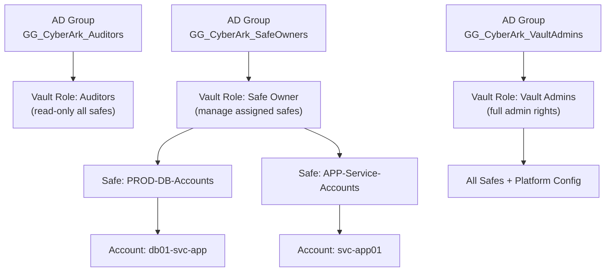

---
tags:
  - security
---
# CyberArk — Access Control


<div class="kb-summary">
All production safes enforce dual-control to prevent unilateral credential access. Safe access is managed via AD group membership mapped to Vault roles.

*Applies to: CyberArk PAM*
</div>
```text
┌───────────────────────────── Security Cyberark Security — Access Control ─────────────────────────────┐
│                                                                                                       │
│   ┌───────────────────────────────────────────────────────────────────────────────────────────────┐   │
│   │         Cyberark access control: RBAC roles, least-privilege, and access audit logging        │   │
│   │        Roles: admin (full), operator (read/modify), read-only (view); map to AD groups        │   │
│   │       Authentication: local accounts, LDAP/AD integration, and MFA for privileged users       │   │
│   │          Audit: log all admin actions; review access logs monthly; rotate credentials         │   │
│   └───────────────────────────────────────────────────────────────────────────────────────────────┘   │
│                                                                                                       │
│    Identify user → assign role → enforce MFA → audit → review quarterly                               │
│                                                                                                       │
│                  ▼                                ▼                                ▼                  │
│                                                                                                       │
│   ┌─────────────────────────────┐  ┌─────────────────────────────┐  ┌─────────────────────────────┐   │
│   │            Layer            │  │          Component          │  │            Notes            │   │
│   │             Core            │  │       Primary service       │  │        Main function        │   │
│   │          Management         │  │        Control plane        │  │         Admin access        │   │
│   │          Monitoring         │  │         Health/perf         │  │      Alerts/dashboards      │   │
│   │           Security          │  │         Auth/encrypt        │  │        Access control       │   │
│   │         Integration         │  │        APIs/plug-ins        │  │         Third-party         │   │
│   └─────────────────────────────┘  └─────────────────────────────┘  └─────────────────────────────┘   │
│                                                                                                       │
│                          ▼                                                 ▼                          │
│                                                                                                       │
│   ┌───────────────────────────────────────────────────────────────────────────────────────────────┐   │
│   │       Role       │   Permissions    │       Scope       │       Auth       │   Review cycle   │   │
│   │      Admin       │    Full CRUD     │       Global      │   MFA required   │     Monthly      │   │
│   │     Operator     │   Read/modify    │      Assigned     │   MFA required   │    Quarterly     │   │
│   │    Read-only     │    View only     │      Assigned     │     Password     │    Quarterly     │   │
│   │   Service acct   │     API only     │    Specific API   │    Token/cert    │      Annual      │   │
│   └───────────────────────────────────────────────────────────────────────────────────────────────┘   │
│                                                                                                       │
│    Physical: Security Cyberark Security infrastructure · management network · monitoring              │
│                                                                                                       │
│    Key terms:                                                                                         │
│                                                                                                       │
│    Cyberark           = Security Cyberark Security platform overview and core concepts                │
│    Management         = management console and command-line interface for administration              │
│    Monitoring         = health and performance monitoring dashboards and alerting                     │
│    Automation         = REST API, scripting, and pipeline integration capabilities                    │
│    Security           = access control, authentication, and encryption configuration                  │
│    Backup             = backup and recovery procedures and schedule configuration                     │
│    Upgrade            = software version upgrades and firmware patching procedures                    │
│    Troubleshooting    = diagnostic procedures and common issue resolution steps                       │
│    Escalation         = vendor support escalation path and severity triage process                    │
│    Documentation      = vendor knowledge base and official product documentation                      │
│    Change management  = change ticket requirements for production modifications                       │
│    Audit log          = admin action logging for compliance and security review                       │
│                                                                                                       │
└───────────────────────────────────────────────────────────────────────────────────────────────────────┘
```


| Control | Implementation |
|---|---|
| Dual-control for PROD | Enforced via Master Policy; requires approver in PVWA before retrieval |
| Master Policy review | Quarterly review of base policy and platform-specific overrides |
| Vault DR access | DR Vault is read-only replica; promotion only during declared disaster |

## Before you begin

- **Access:** Admin credentials on all affected systems
- **Change management:** security changes require CAB approval in most environments
- **Rollback plan:** document current state before any security control change
- **Testing:** validate in a non-production environment first where possible

---

## Safe Access Hierarchy



---

## AD Groups and Vault Roles

| AD Group | Vault Role |
|---|---|
| `GG_CyberArk_Auditors` | Auditors role — read-only access to all safes |
| `GG_CyberArk_SafeOwners` | Safe Owner role — manage assigned safes |
| `GG_CyberArk_VaultAdmins` | Vault Admins — full administrative rights |

## Safe Standards

| Standard | Value |
|---|---|
| Safe naming | `ENV-TEAM-PURPOSE` |
| Domain account naming | `username@domain.fqdn` |
| Local account naming | `local-admin@hostname` |
| Dual-control enforcement | Required for all PROD safes |
| Service account rotation | 90 days |
| Admin account rotation | 60 days |
| Root / local admin rotation | 30 days |
| Max safe member count | 20 (review if exceeded) |
| Master Policy base | Require dual control, enforce check-in/out |
