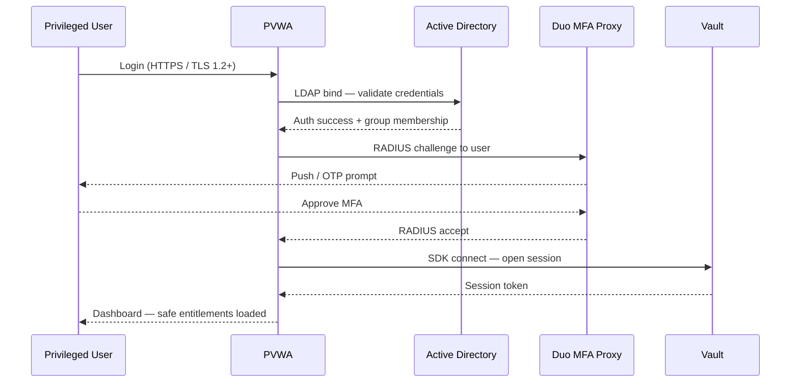

# CyberArk — Authentication

PVWA is accessible over HTTPS only (TLS 1.2 minimum, TLS 1.3 preferred). All privileged user logons require MFA via RADIUS. LDAP/AD group membership drives safe entitlements without requiring manual PVWA user management.

| Control | Implementation |
|---|---|
| PVWA TLS | TLS 1.2+ only; valid internal CA certificate |
| MFA enforcement | RADIUS-based MFA at PVWA logon for all privileged users |
| LDAP / AD auth | PVWA authenticates against AD; group-based safe membership |
| Break-glass account | Emergency Vault Admin account in sealed safe; access via dual-control + incident ticket |

## PVWA Authentication Flow



---

## LDAP Configuration

PVWA Administration > LDAP Integration:

```text
LDAP Host:   ldaps://dc01.corp.example.com:636
Base DN:     DC=corp,DC=example,DC=com
Bind DN:     CN=svc-cyberark-ldap,OU=Service Accounts,OU=Managed,DC=corp,DC=example,DC=com
Bind Pwd:    <managed by CyberArk itself in the Vault>
```

## MFA (RADIUS) Configuration

PVWA Administration > Authentication Methods > RADIUS:
- RADIUS server: `duo-proxy.corp.example.com` port 1812
- Shared secret: stored in CyberArk safe `CyberArk-Platform-Accounts`
- Timeout: 60 seconds
- Retries: 2
---

## Related Reference

- [Standard LDAP Integration](../../../ldap-integration/index.md) — field reference, service account standards, TLS requirements, and connectivity testing
