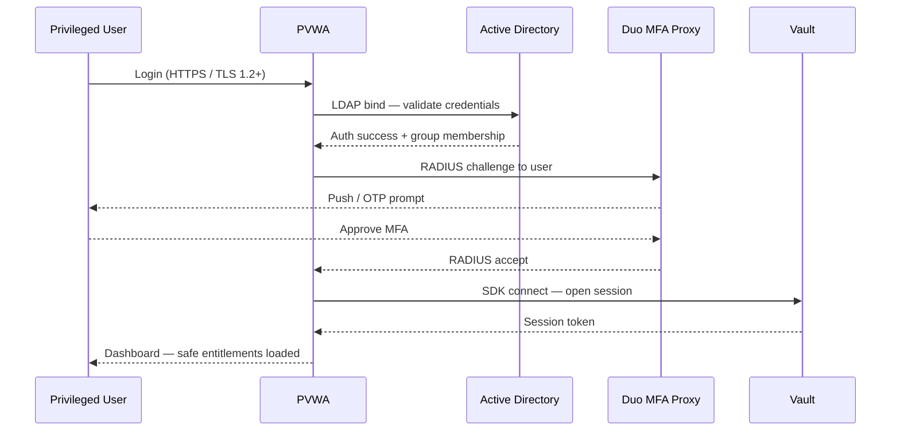

# CyberArk — Authentication


<div class="kb-summary">
PVWA is accessible over HTTPS only (TLS 1.2 minimum, TLS 1.3 preferred). All privileged user logons require MFA via RADIUS. LDAP/AD group membership drives safe entitlements without requiring manual PVWA user management.
</div>
```text
┌───────────────────────────── Security Cyberark Security — Authentication ─────────────────────────────┐
│                                                                                                       │
│   ┌───────────────────────────────────────────────────────────────────────────────────────────────┐   │
│   │         Cyberark authentication: local accounts, LDAP/AD, RADIUS, and SAML SSO options        │   │
│   │        MFA: time-based OTP or hardware token required for all privileged admin accounts       │   │
│   │         Service accounts: dedicated accounts for automation; API tokens/keys preferred        │   │
│   │       Session: idle timeout enforced; concurrent session limits for admin role accounts       │   │
│   └───────────────────────────────────────────────────────────────────────────────────────────────┘   │
│                                                                                                       │
│    Login → authenticate LDAP/SAML/local → MFA → authorise role → session                              │
│                                                                                                       │
│                  ▼                                ▼                                ▼                  │
│                                                                                                       │
│   ┌─────────────────────────────┐  ┌─────────────────────────────┐  ┌─────────────────────────────┐   │
│   │            Layer            │  │          Component          │  │            Notes            │   │
│   │             Core            │  │       Primary service       │  │        Main function        │   │
│   │          Management         │  │        Control plane        │  │         Admin access        │   │
│   │          Monitoring         │  │         Health/perf         │  │      Alerts/dashboards      │   │
│   │           Security          │  │         Auth/encrypt        │  │        Access control       │   │
│   │         Integration         │  │        APIs/plug-ins        │  │         Third-party         │   │
│   └─────────────────────────────┘  └─────────────────────────────┘  └─────────────────────────────┘   │
│                                                                                                       │
│                          ▼                                                 ▼                          │
│                                                                                                       │
│   ┌───────────────────────────────────────────────────────────────────────────────────────────────┐   │
│   │      Method      │     Use case     │  Config location  │       MFA        │     Priority     │   │
│   │     LDAP/AD      │  Staff accounts  │   Auth settings   │     Required     │     Primary      │   │
│   │     SAML SSO     │    Federated     │    SSO settings   │   IdP-enforced   │    Preferred     │   │
│   │      Local       │   Break-glass    │    Local users    │     Required     │  Emergency only  │   │
│   │    API token     │    Automation    │  Service account  │   N/A (token)    │    Automation    │   │
│   └───────────────────────────────────────────────────────────────────────────────────────────────┘   │
│                                                                                                       │
│    Physical: Security Cyberark Security infrastructure · management network · monitoring              │
│                                                                                                       │
│    Key terms:                                                                                         │
│                                                                                                       │
│    Cyberark           = Security Cyberark Security platform overview and core concepts                │
│    Management         = management console and command-line interface for administration              │
│    Monitoring         = health and performance monitoring dashboards and alerting                     │
│    Automation         = REST API, scripting, and pipeline integration capabilities                    │
│    Security           = access control, authentication, and encryption configuration                  │
│    Backup             = backup and recovery procedures and schedule configuration                     │
│    Upgrade            = software version upgrades and firmware patching procedures                    │
│    Troubleshooting    = diagnostic procedures and common issue resolution steps                       │
│    Escalation         = vendor support escalation path and severity triage process                    │
│    Documentation      = vendor knowledge base and official product documentation                      │
│    Change management  = change ticket requirements for production modifications                       │
│    Audit log          = admin action logging for compliance and security review                       │
│                                                                                                       │
└───────────────────────────────────────────────────────────────────────────────────────────────────────┘
```


| Control | Implementation |
|---|---|
| PVWA TLS | TLS 1.2+ only; valid internal CA certificate |
| MFA enforcement | RADIUS-based MFA at PVWA logon for all privileged users |
| LDAP / AD auth | PVWA authenticates against AD; group-based safe membership |
| Break-glass account | Emergency Vault Admin account in sealed safe; access via dual-control + incident ticket |

## PVWA Authentication Flow



---

## LDAP Configuration

PVWA Administration > LDAP Integration:

```text
LDAP Host:   ldaps://dc01.corp.example.com:636
Base DN:     DC=corp,DC=example,DC=com
Bind DN:     CN=svc-cyberark-ldap,OU=Service Accounts,OU=Managed,DC=corp,DC=example,DC=com
Bind Pwd:    <managed by CyberArk itself in the Vault>
```

## MFA (RADIUS) Configuration

PVWA Administration > Authentication Methods > RADIUS:
- RADIUS server: `duo-proxy.corp.example.com` port 1812
- Shared secret: stored in CyberArk safe `CyberArk-Platform-Accounts`
- Timeout: 60 seconds
- Retries: 2
---

## Related Reference

- [Standard LDAP Integration](../../../ldap-integration/index.md) — field reference, service account standards, TLS requirements, and connectivity testing
