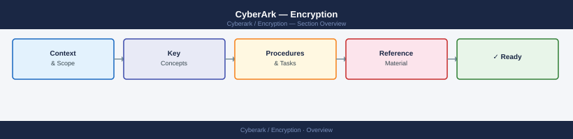

---
tags:
  - security
---
# CyberArk — Encryption


<div class="kb-summary">
Session recordings are encrypted at rest using AES-256. Vault audit log integrity is protected by the Vault's internal signing mechanism. PVWA enforces TLS 1.2 minimum for all connections.

*Applies to: CyberArk PAM*
</div>



```d2
direction: down

encryption_controls: "Encryption Controls" {shape: rectangle}
key_management_reference: "Key Management Reference" {shape: rectangle}

encryption_controls -> key_management_reference: hardens
```

## Before you begin

- **Access:** Admin credentials on all affected systems
- **Change management:** security changes require CAB approval in most environments
- **Rollback plan:** document current state before any security control change
- **Testing:** validate in a non-production environment first where possible

---

## Encryption Controls

| Control | Implementation |
|---|---|
| Session recording encryption | AES-256 at rest on PSM recording storage |
| Audit log integrity | Vault internal log signing; tamper detection on export |
| PVWA TLS | TLS 1.2+ only; valid internal CA certificate |
| Vault server-to-server encryption | All traffic between Primary Vault and DR Vault encrypted over a dedicated replication channel using AES-256; configured in `vault.ini` under the `[SYSLOGNG]` and replication sections |
| DR Vault replication encryption | Replication stream between Primary and DR protected by the Vault's internal PKI; the DR Vault certificate is enrolled during initial DR configuration and must be renewed before expiry |
| PSM recording encryption key rotation | AES-256 key used for recording storage rotated annually or on security team request; key managed by the Vault's internal key store; old key retained for decryption of existing recordings per retention period |
| Safe-level encryption at rest | Each Safe's contents encrypted individually using a per-Safe key derived from the Vault master key; Safe key re-encryption required if the Vault master key is rotated |
| Credential transmission | Passwords retrieved via PVWA, REST API, or SDK are transmitted exclusively over TLS 1.2+; plaintext retrieval over HTTP is disabled by default and enforced by Vault policy |
| Vault master key protection | The Vault master key is split using Shamir's Secret Sharing across operator key files; a configurable quorum (e.g., 3 of 5) of key holders is required to unseal the Vault after a restart |
| CPM-to-target credential change | CPM transmits new credentials to target systems over the native protocol of the platform (SSH for Unix, SMB/LDAP for Windows AD); all communication from CPM is over encrypted channels |
| PSM RDP/SSH gateway encryption | RDP sessions proxied by PSM use TLS transport; SSH sessions use SSH protocol v2 only; SSHv1 and unencrypted RDP (Security Layer: RDP) are disabled in PSM hardening policy |
| API and SDK credential transport | CyberArk REST API and PSMP use HTTPS (TLS 1.2+) exclusively; API tokens are short-lived (default 20-minute expiry) and invalidated on logout |

## Key Management Reference

| Key / Material | Storage Location | Rotation Cadence |
|---|---|---|
| Vault master key | Split across operator key files (Shamir); never stored whole on disk | On suspected compromise or key holder personnel change |
| Safe encryption keys | Derived from Vault master key; stored internally in Vault | Automatically on master key rotation |
| PSM recording AES-256 key | Vault internal key store | Annual or on security event |
| DR replication certificate | Vault internal PKI; stored on DR host | Before certificate expiry (track in Venafi or calendar alert) |
| PVWA TLS certificate | IIS certificate store | Per certificate validity; minimum annual renewal |
| CPM service account credential | CyberArk Safe (self-managed by CPM) | 90-day CPM automatic rotation |

## See also

- [CyberArk — Access Control](../access-control/)
- [CyberArk — Authentication](../authentication/)
- [CyberArk — Security Hardening](../hardening/)
- [CyberArk — Common Issues](../../troubleshooting/common-issues/)
