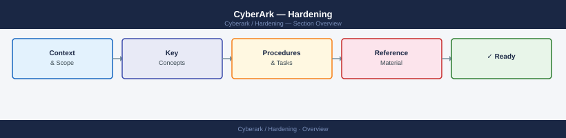

---
tags:
  - security
---
# CyberArk — Hardening

The Digital Vault server must follow the CyberArk-supplied Windows Server hardening baseline and the Vault-specific firewall policy, which permits only the exact ports required by each component; no general internet access or RDP from non-PAW hosts is permitted.

*Applies to: CyberArk PAM*

| Control | Implementation |
|---|---|
| Vault OS hardening | CyberArk-provided Windows hardening GPO; minimal services running |
| Vault firewall policy | CyberArk-defined inbound/outbound rules; deny-all default |
| PVWA TLS | TLS 1.2+ only; valid internal CA certificate |
| Master Policy review | Quarterly review of base policy and platform-specific overrides |

## Before you begin

- **Access:** Admin credentials on all affected systems
- **Change management:** security changes require CAB approval in most environments
- **Rollback plan:** document current state before any security control change
- **Testing:** validate in a non-production environment first where possible

---

## See also

- [CyberArk — Access Control](../access-control/)
- [CyberArk — Authentication](../authentication/)
- [CyberArk — Encryption](../encryption/)
- [CyberArk — Common Issues](../../troubleshooting/common-issues/)
