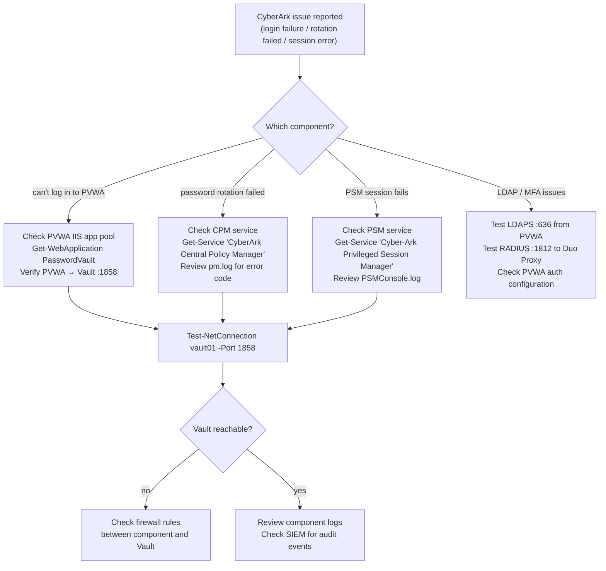

# CyberArk — Diagnostics

Use this page for practical CyberArk troubleshooting notes, checks, commands, change notes, and field references.

## CyberArk Diagnostic Flow

## Common Checks

- Confirm current health
- Review active alerts
- Check recent changes
- Confirm dependencies
- Check logs, events, and monitoring
- Capture current state before changes

## Incident Notes

Capture:

- Symptom
- Start time
- Impact
- System or service name
- Error message
- What changed
- What was checked
- Next action

## Change Notes

- Confirm change approval
- Confirm maintenance window
- Confirm rollback plan
- Capture current state
- Make one change at a time
- Validate after the change

## Useful Commands

Add tested commands here.
