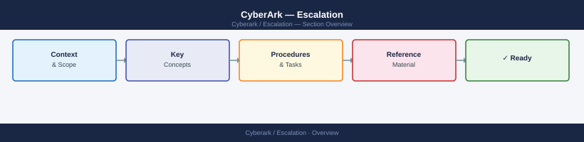
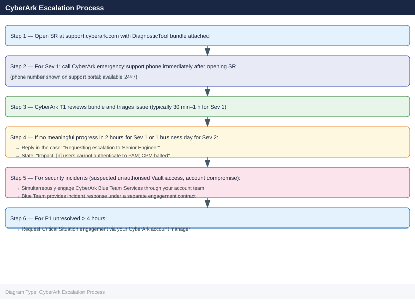

---
tags:
  - security
  - troubleshooting
search:
  boost: 1.5
---
# CyberArk — Escalation

<div class="kb-summary">
CyberArk PAM support escalation: how to run the DiagnosticTool, collect component logs, open a case at support.cyberark.com, and follow the escalation path for Vault, CPM, PSM, and PVWA failures.

*Applies to: CyberArk PAM (Self-Hosted) 12.x / 13.x*
</div>



## Before you begin

- **Access:** Admin credentials to PVWA (`Administrator` account or equivalent); RDP/local access to the Vault server
- **Gather first:** PVWA System Health page status, exact error message, and affected usernames or Safe names
- **Scope:** confirm whether the issue affects a single user/Safe, a specific component (CPM, PSM), or the entire Vault service
- **Do not restart:** do not restart PrivateArk Server (the Vault service) without CyberArk support guidance — it can leave the Vault in an inconsistent state during a recovery operation
- **Security incidents:** if the issue involves suspected unauthorised access or a compromised account, contact both CyberArk support AND your internal security team simultaneously

---

## Severity Levels

| Severity | Definition | Response SLA | Contact |
|---|---|---|---|
| P1 — Critical | Vault completely down; all password retrieval failing; entire PAM platform inaccessible | 1 hour (24×7) | Open SR + call CyberArk emergency line |
| P2 — High | PSM sessions failing for all users; CPM unable to rotate any passwords; PVWA degraded | 4 hours (business hours + on-call) | Open SR online |
| P3 — Medium | Single component degraded (one CPM, one PSM connector); workaround available | 1 business day | Open SR online |
| P4 — Low | Non-critical UI issue; documentation question; feature request | 2 business days | Open SR online |

## Pre-Escalation Triage Checklist

| Check | Where to Check | Expected |
|---|---|---|
| Vault service running | Vault server: `services.msc` → PrivateArk Server | Status: Running |
| Vault port reachable | From PVWA server: `Test-NetConnection -ComputerName <vault> -Port 1858` | `TcpTestSucceeded: True` |
| PVWA accessible | Browse to `https://<pvwa-fqdn>/PasswordVault/` | Login page loads |
| System Health green | PVWA → Admin → System Health | All components green |
| DR Vault sync current | PVWA → Admin → System Health → Vault DR | Sync time < 30 min ago |
| CPM service running | CPM server: `services.msc` → CyberArk Password Manager | Status: Running |
| PSM service running | PSM server: `services.msc` → CyberArk Privileged Session Manager | Status: Running |
| Disk space on Vault | Vault server: `dir C:\PrivateArk\Safe` | < 80% full |

---

## Step-by-Step Data Collection

Collect all of the following before opening an SR.

### 1. Run the CyberArk DiagnosticTool on the Vault server

```powershell
# RDP to the Vault server as a local admin (not a domain account)
# Navigate to the DiagnosticTool directory
cd "C:\Program Files (x86)\CyberArk\Password Vault\Diagnostics"

# Run the tool — collects logs, configuration, and component health
.\DiagnosticTool.exe

# The tool creates an output ZIP in the same directory
# Example: DiagnosticToolOutput_2026-06-15_11-00-00.zip
Get-ChildItem "C:\Program Files (x86)\CyberArk\Password Vault\Diagnostics\*.zip" | Sort-Object LastWriteTime -Descending | Select-Object -First 1
```

### 2. Collect component versions

```powershell
# Vault version — from PVWA Admin UI
# PVWA → Administration → System Health → click Vault component

# Or check registry on Vault server:
Get-ItemProperty HKLM:\SOFTWARE\WOW6432Node\CyberArk\CyberArk* | Select-Object PSChildName, DisplayVersion

# Get PVWA version
Get-Content "C:\inetpub\wwwroot\PasswordVault\Version.txt"

# Get CPM version (on CPM server)
Get-ItemProperty HKLM:\SOFTWARE\WOW6432Node\CyberArk\CyberArk* | Select-Object PSChildName, DisplayVersion

# Get PSM version (on PSM server)
Get-ItemProperty HKLM:\SOFTWARE\WOW6432Node\CyberArk\CyberArk* | Select-Object PSChildName, DisplayVersion
```

### 3. Collect component logs manually (if DiagnosticTool fails)

```powershell
# Vault server — PrivateArk Server log
$logPath = "C:\PrivateArk\Logs"
Get-ChildItem $logPath -Filter "*.log" | Sort-Object LastWriteTime -Descending | Select-Object -First 5
Copy-Item "$logPath\ITAlog.log" C:\Temp\
Copy-Item "$logPath\PrivateArk.log" C:\Temp\

# Windows Event logs from Vault server (Application + System, last 48h)
$start = (Get-Date).AddHours(-48)
Get-WinEvent -LogName Application -StartTime $start | Export-Csv C:\Temp\AppEventLog.csv -NoTypeInformation
Get-WinEvent -LogName System    -StartTime $start | Export-Csv C:\Temp\SysEventLog.csv -NoTypeInformation

# PVWA logs
$pvwaLog = "C:\inetpub\wwwroot\PasswordVault\Logs"
Copy-Item "$pvwaLog\CyberArk.log" C:\Temp\

# CPM log (on CPM server)
Copy-Item "C:\Program Files (x86)\CyberArk\Password Manager\Logs\PMConsole.log" C:\Temp\

# PSM log (on PSM server)
Copy-Item "C:\Program Files (x86)\CyberArk\PSM\Logs\PSMConsole.log" C:\Temp\
```

### 4. Capture PVWA System Health

```powershell
# API approach — get component health programmatically
$pvwaUrl = "https://<pvwa-fqdn>/PasswordVault"

# Get auth token
$body = @{username="Administrator"; password="<password>"} | ConvertTo-Json
$auth = Invoke-RestMethod -Uri "$pvwaUrl/API/auth/CyberArk/Logon" -Method POST -Body $body -ContentType "application/json"
$token = $auth

# Get system health
Invoke-RestMethod -Uri "$pvwaUrl/API/ComponentsMonitoringSummary" `
  -Method GET -Headers @{Authorization = "Bearer $token"} |
  ConvertTo-Json -Depth 10 | Out-File C:\Temp\SystemHealth.json

# Logoff
Invoke-RestMethod -Uri "$pvwaUrl/API/auth/Logoff" -Method POST -Headers @{Authorization = "Bearer $token"}
```

### 5. Write the timeline

```text
CyberArk Vault version: 13.2.0
PVWA version: 13.2.0
CPM version: 13.2.0
PSM version: 13.2.0

Vault server: vault01.corp.local (Windows Server 2022)
PVWA server: pvwa01.corp.local

Issue first observed: 2026-06-15 09:30 UTC
Last known good state: 2026-06-15 08:00 UTC

Error observed:
  - Users receiving "Vault connection error" on PVWA login
  - CPM jobs showing "PSMGW008E: Cannot connect to vault"
  - ITAlog showing repeated "Authentication failure" entries

Steps already taken:
  - Verified PrivateArk Server service is running
  - Confirmed port 1858 reachable from PVWA server
  - Did NOT restart PrivateArk Server

Changes in 24h before issue:
  - Windows Update applied to Vault server (KB5034441)
  - No CyberArk config changes

Blast radius:
  - All PVWA users cannot log in
  - CPM cannot perform any password changes
```

---

## How to Open a CyberArk Support Case

1. Go to **support.cyberark.com** and sign in with your CyberArk account.
   - If no account: click **Register** and use your company email linked to your CyberArk contract.

2. Click **Open a Case** (top navigation).

3. Under **Product**, select the affected component: **Privileged Access Manager — Self-Hosted** (or the appropriate product).

4. Under **Version**, enter the exact version string.

5. Under **Severity**, select:
   - **Severity 1**: Vault completely down; no users can authenticate; production PAM unavailable
   - **Severity 2**: PSM or CPM failing for all users; PVWA degraded; workaround not available
   - **Severity 3**: Single component failing with a workaround; non-critical account rotation failing
   - **Severity 4**: How-to question; feature request; documentation

6. In the **Summary** field: `CyberArk 13.2.0 — PVWA login failing for all users — Vault connection error since 09:30 UTC`.

7. In the **Description**, paste:
   - Component versions (Vault, PVWA, CPM, PSM)
   - System Health screenshot description
   - Timeline (from step 5 above)
   - Key error messages from ITAlog and PVWA logs
   - What you have already verified

8. Upload attachments:
   - `DiagnosticToolOutput_<date>.zip`
   - `ITAlog.log` and `PrivateArk.log` from the Vault
   - `CyberArk.log` from PVWA
   - `PMConsole.log` from CPM (if CPM-related)
   - `PSMConsole.log` from PSM (if PSM-related)

9. Click **Submit**. You receive a case number by email.

10. **Severity 1 only:** On the case page, use the phone number shown for your region. Call immediately — the portal response alone is not fast enough for P1.

---

## Escalation Path



---

## What NOT to Do

| Do NOT do this | Why | What to do instead |
|---|---|---|
| Restart PrivateArk Server without CyberArk guidance | Can interrupt an in-progress replication to DR Vault; may cause Safe inventory inconsistency | Open SR first; restart only when CyberArk support confirms it is safe |
| Delete Vault log files to free up disk space | Logs are the primary diagnostic artifact; CyberArk support will need them | Archive logs to another disk; open SR immediately if disk is full on the Vault |
| Modify PrivateArk.ini or DBParm.ini without CyberArk approval | These files control Vault encryption and storage parameters; incorrect values can corrupt the Vault | Only change these files with explicit written guidance in the SR |
| Attempt to unlock a Safe from PVWA while the Vault shows an error | May cause split-brain in Safe state | Wait for Vault to return to a stable state before making administrative changes |
| Grant the Vault service account domain admin rights as a "fix" | Violates least-privilege; creates new security risk | The Vault service account needs only local privileges on the Vault server |

---

## Useful Commands for Case Updates

```powershell
# Quick state snapshot for each case update
Get-Service "PrivateArk*","CyberArk*" | Select-Object Name, Status, StartType

# Test Vault connectivity from PVWA server
Test-NetConnection -ComputerName <vault-hostname> -Port 1858

# Last 50 ITAlog entries (on Vault server)
Get-Content "C:\PrivateArk\Logs\ITAlog.log" -Tail 50

# Safe count and account count via PVWA API (substitute token from auth step)
Invoke-RestMethod -Uri "https://<pvwa>/PasswordVault/API/Safes?limit=1" `
  -Method GET -Headers @{Authorization = "Bearer $token"} |
  Select-Object -ExpandProperty Total

# CPM pending jobs count
Get-Content "C:\Program Files (x86)\CyberArk\Password Manager\Logs\PMConsole.log" -Tail 100 |
  Where-Object { $_ -match "ERROR|FAIL|pending" }

# Windows Event log for PrivateArk-specific errors
Get-WinEvent -LogName Application -MaxEvents 100 |
  Where-Object { $_.ProviderName -like "*CyberArk*" -or $_.ProviderName -like "*PrivateArk*" } |
  Select-Object TimeCreated, Id, LevelDisplayName, Message | Format-List
```

---

## See also

- [CyberArk — Common Issues](../common-issues/)
- [CyberArk — Diagnostics](../diagnostics/)
- [CyberArk — Procedures](../../operations/procedures/)

---

## Verify resolution

- Confirm PVWA login page loads and users can authenticate
- Run PVWA System Health check — all components green
- Verify CPM can perform a password change on a test account
- Open a PSM session to a test target and confirm connection completes
- Monitor System Health for 30 minutes after the fix before closing the SR
