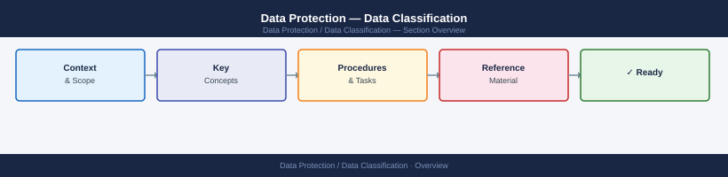

---
tags:
  - security
---
# Data Protection — Data Classification



```powershell
Install-Module ExchangeOnlineManagement
Connect-IPPSSession

# List sensitivity labels
Get-Label | Select-Object DisplayName, Priority, IsDefault, Guid

# Check label policy assignments
Get-LabelPolicy | Select-Object Name, Labels, Users, Workloads
```


## Before you begin

- **Access:** Admin credentials on all affected systems
- **Change management:** security changes require CAB approval in most environments
- **Rollback plan:** document current state before any security control change
- **Testing:** validate in a non-production environment first where possible

---

