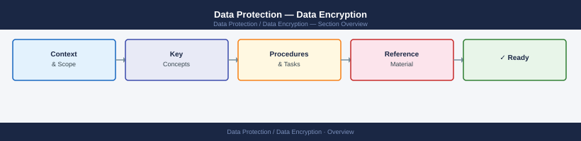

---
tags:
  - security
---
# Data Protection — Data Encryption



```bash
# Check if encrypted
cryptsetup isLuks /dev/sdb && echo "LUKS" || echo "Not encrypted"

# List open encrypted volumes
dmsetup ls --target crypt

# Dump LUKS header info
cryptsetup luksDump /dev/sdb
```

```nginx
ssl_protocols TLSv1.2 TLSv1.3;
ssl_prefer_server_ciphers on;
ssl_ciphers 'ECDHE-ECDSA-AES256-GCM-SHA384:ECDHE-RSA-AES256-GCM-SHA384';
```
```sql
CREATE DATABASE ENCRYPTION KEY WITH ALGORITHM = AES_256
ENCRYPTION BY SERVER CERTIFICATE <cert-name>;
ALTER DATABASE <dbname> SET ENCRYPTION ON;

SELECT db_name(database_id), encryption_state, percent_complete
FROM sys.dm_database_encryption_keys;
```

```d2
direction: right

center: "Data Encryption" {shape: hexagon}
component_a: "Component A" {shape: rectangle}
component_b: "Component B" {shape: rectangle}
component_c: "Component C" {shape: rectangle}

center -> component_a
center -> component_b
center -> component_c
```

## Before you begin

- **Access:** Admin credentials on all affected systems
- **Change management:** security changes require CAB approval in most environments
- **Rollback plan:** document current state before any security control change
- **Testing:** validate in a non-production environment first where possible

---

