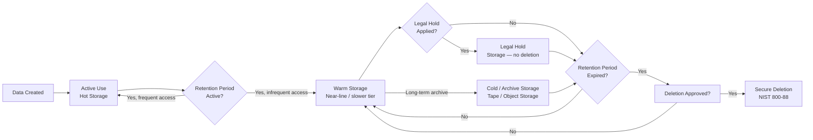

---
tags:
  - security
---
# Data Retention Policy


<div class="kb-summary">
This policy defines mandatory retention periods, storage tier assignments, and deletion procedures for all data types across the enterprise. Retention decisions are driven by business need, legal obligation, and regulatory requirement — not storage cost alone.
</div>

---

## Data Lifecycle Overview


```text
┌─────────────────────────────── Data Protection — Data Retention Policy ───────────────────────────────┐
│                                                                                                       │
│   ┌───────────────────────────────────────────────────────────────────────────────────────────────┐   │
│   │     Retention policy: minimum time data must be kept; maximum time before secure deletion     │   │
│   │     Legal hold suspends all deletion for data subject to litigation or regulatory inquiry     │   │
│   │        Verify deletions: cryptographic erasure or physical destruction with certificate       │   │
│   └───────────────────────────────────────────────────────────────────────────────────────────────┘   │
│                                                                                                       │
│                          ▼                                                 ▼                          │
│                                                                                                       │
│   ┌──────────────────────────────────────────────┐  ┌─────────────────────────────────────────────┐   │
│   │             Retention Schedules              │  │             Deletion Procedures             │   │
│   │      ─────────────────────────────────       │  │      ─────────────────────────────────      │   │
│   │         Financial records: 7+ years          │  │          Check no active legal hold         │   │
│   │         HR records: varies by region         │  │         Confirm retention period met        │   │
│   │         Audit/security logs: 1-3 yr          │  │         Cryptographic erasure or DoD        │   │
│   │          Email: 3-7 years (policy)           │  │          Certificate of destruction         │   │
│   │            Backups: per RPO tier             │  │           Remove from all systems           │   │
│   └──────────────────────────────────────────────┘  └─────────────────────────────────────────────┘   │
│                                                                                                       │
│   │    Data type     │    Min retain    │     Max retain    │    Regulation    │  Delete method   │   │
│   │ ──────────────── │ ──────────────── │ ───────────────── │ ──────────────── │──────────────────│   │
│   │    Financial     │     7 years      │      10 years     │    SOX/local     │   Secure erase   │   │
│   │  Security logs   │      1 year      │      3 years      │    PCI / ISO     │    Log purge     │   │
│   │   PII/personal   │     2 years      │      5 years      │       GDPR       │   Crypto erase   │   │
│   │     Backups      │     Per RPO      │      90 days      │      Policy      │   Tape destroy   │   │
│                                                                                                       │
│    Key terms:                                                                                         │
│                                                                                                       │
│    Legal hold       = Suspend all deletion for data subject to litigation; placed by legal team       │
│    Crypto erasure   = Delete encryption key so data is permanently unreadable without destruction     │
│    DoD 5220.22-M    = US DoD secure wipe standard; multiple overwrite passes on magnetic media        │
│    Retention period = Minimum time data must exist before deletion can be authorised                  │
│    eDiscovery       = Search and collection of electronic data for legal proceedings                  │
│    Disposition      = Final action on data: delete, archive, or transfer at end of retention          │
│                                                                                                       │
└───────────────────────────────────────────────────────────────────────────────────────────────────────┘
```

---

## Log Retention Implementation

### SIEM — Splunk Index Retention

```ini
# /opt/splunk/etc/system/local/indexes.conf

[security_logs]
homePath   = $SPLUNK_DB/security_logs/db
coldPath   = $SPLUNK_DB/security_logs/colddb
thawedPath = $SPLUNK_DB/security_logs/thaweddb
frozenTimePeriodInSecs = 63072000   # 2 years = 730 days online
coldToFrozenDir = /mnt/archive/splunk/security_logs  # cold storage path
maxDataSize = auto_high_volume

[audit_logs]
homePath   = $SPLUNK_DB/audit_logs/db
coldPath   = $SPLUNK_DB/audit_logs/colddb
thawedPath = $SPLUNK_DB/audit_logs/thaweddb
frozenTimePeriodInSecs = 157680000  # 5 years archive
coldToFrozenDir = /mnt/archive/splunk/audit_logs
```

### Windows Event Log Forwarding and Retention

```powershell
# Set Windows Event Log max size and retention policy on source systems via GPO
# GPO Path: Computer Configuration > Policies > Windows Settings > Security Settings > Event Log

# Or via PowerShell on individual hosts:
Limit-EventLog -LogName Security -MaximumSize 1GB -OverflowAction OverwriteOlder
Limit-EventLog -LogName System   -MaximumSize 512MB -OverflowAction OverwriteOlder
Limit-EventLog -LogName Application -MaximumSize 512MB -OverflowAction OverwriteOlder

# Enable Windows Event Forwarding subscription (run on collector)
wecutil cs "C:\WEF\SecurityEventsSubscription.xml"
wecutil rs SecurityEvents
```

Windows Event Logs forwarded to SIEM are retained per SIEM policy (1 year online, archive thereafter). Local logs are a buffer only — do not rely on local retention for compliance.

### Linux Syslog Retention (rsyslog + logrotate)

```bash
# /etc/logrotate.d/syslog
/var/log/syslog {
    daily
    rotate 365
    compress
    delaycompress
    missingok
    notifempty
    postrotate
        /usr/lib/rsyslog/rsyslog-rotate
    endscript
}
```

Remote forwarding to SIEM is required; local rotation is a buffer for connectivity loss.

---

## Legal Hold Process

Legal hold suspends normal retention and deletion for data relevant to litigation, investigation, or regulatory inquiry.

### Legal Hold Procedure

1. **Initiation** — Legal or Compliance team issues a Legal Hold Notice identifying custodians, date range, and data types in scope.
2. **CMDB tag applied** — All affected data assets tagged `legal-hold: true` in the CMDB.
3. **Technical hold applied**:
   - Microsoft Purview: eDiscovery hold placed on mailboxes and SharePoint sites.
   - Veeam: retention lock enabled on relevant restore points via Immutable Backup Repository flag.
   - Commvault: hold flag applied to affected subclients — deletion jobs blocked.
4. **DBA / Sysadmin confirmation** — Custodians confirm hold applied and sign acknowledgement.
5. **Hold register updated** — Entry created in GRC system: matter reference, custodians, data scope, hold date.
6. **Hold release** — Legal team issues release notice. Holds released within 5 business days. Normal retention resumes; data that has passed its retention date is queued for deletion.

```powershell
# Microsoft Purview — place eDiscovery hold on mailbox and SharePoint
Connect-IPPSSession -UserPrincipalName admin@corp.onmicrosoft.com

New-CaseHoldPolicy -Name "Hold-LitigationMatter-2026-001" `
    -Case "Litigation-2026-001" `
    -ExchangeLocation "john.doe@corp.com" `
    -SharePointLocation "https://corp.sharepoint.com/sites/Finance"

New-CaseHoldRule -Name "Hold-Rule-2026-001" `
    -Policy "Hold-LitigationMatter-2026-001" `
    -ContentMatchQuery "subject:ProjectAlpha AND date>=2025-01-01"
```

---

## Secure Data Deletion Procedure

Deletion must follow NIST SP 800-88 Rev. 1 guidelines.

| Media Type | Method | Standard | Notes |
|---|---|---|---|
| Magnetic HDD (spinning) | Overwrite (1-pass) then degauss | NIST 800-88 Clear + Purge | Use DBAN or blancco for overwrite |
| SSD / NVMe (ATA Secure Erase) | ATA Secure Erase command | NIST 800-88 Purge | `hdparm --security-erase` or vendor tool |
| SAN LUN (PowerMax / Pure) | Crypto-erase (if self-encrypting drive) or LUN zero-out | NIST 800-88 Purge | Use array vendor tool (PowerMax CLI, purity erase) |
| Tape (LTO) | Degauss + physical destruction | NIST 800-88 Destroy | Third-party destruction with certificate |
| Cloud object storage (S3, Azure Blob) | API delete + bucket crypto-key deletion (if BYOK) | CSP policy + key destruction | Confirm with CSP data destruction certificate |
| Paper / printed records | Cross-cut shredding (DIN 66399 P-4 minimum) | GDPR Art. 5 | Witnessed shredding for Restricted data |

### PowerMax — Crypto-Erase a Volume

```bash
# Identify volume
symdev -sid 001 list -v | grep <volume-name>

# Mark volume for crypto-erase (requires array admin role)
symdev -sid 001 -dev <DeviceID> set secure_erase

# Confirm erase completion
symdev -sid 001 -dev <DeviceID> show | grep -i erase
```

---

## Retention Compliance Monitoring

```powershell
# Weekly check: Veeam jobs with restore points older than policy allows
$jobs = Get-VBRJob -Type Backup
foreach ($job in $jobs) {
    $oldPoints = Get-VBRRestorePoint -Job $job | Where-Object {
        $_.CreationTime -lt (Get-Date).AddDays(-365)
    }
    if ($oldPoints) {
        Write-Warning "Job '$($job.Name)' has $($oldPoints.Count) restore points older than 1 year — review retention policy"
    }
}
```

```bash
# Check for files on archive NFS share older than retention limit
# Example: flag files in audit archive older than 6 years
find /mnt/archive/audit_logs -type f -mtime +2190 -exec ls -lh {} \; > /tmp/expired_audit_files.txt
wc -l /tmp/expired_audit_files.txt
```

---

## Exceptions and Escalation

Retention exceptions require formal approval before they are implemented.

| Scenario | Approver | Documentation Required |
|---|---|---|
| Extended retention beyond policy (business request) | Data Owner + CISO | Written business justification, risk acknowledgement |
| Early deletion before retention period (e.g., data minimisation exercise) | Legal + Data Owner | Legal sign-off confirming no litigation risk, no hold in place |
| Legal hold extension | Legal team | Updated hold notice with revised release date |
| Deletion of data subject to active legal hold | Not permitted | Must escalate to Legal — do not proceed |

All exceptions are logged in the GRC system with approver name, date, and justification. Exceptions are reviewed at the quarterly governance meeting.
