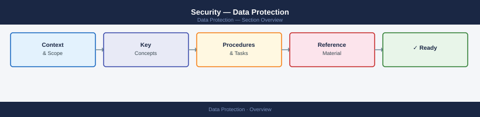

---
tags:
  - security
---
# Security — Data Protection

Data protection reference covering classification tiers, encryption standards, key management, governance frameworks, and data retention policy for enterprise environments.

<a class="kb-card" href="data-classification/">
  <strong>Data Classification</strong>
  Classification tiers, labelling standards, handling requirements, and policy enforcement.
</a>

<a class="kb-card" href="data-encryption/">
  <strong>Data Encryption</strong>
  Encryption standards, key management, at-rest and in-transit encryption configuration.
</a>

<a class="kb-card" href="data-governance/">
  <strong>Data Governance</strong>
  Data ownership, classification policy, lineage, and governance framework standards.
</a>

<a class="kb-card" href="data-retention-policy/">
  <strong>Data Retention Policy</strong>
  Retention schedules, data classification tiers, legal hold, and deletion standards.
</a>

<a class="kb-card" href="key-management/">
  <strong>Key Management</strong>
  KMS architecture, key rotation, HSM integration, and secret lifecycle procedures.
</a>

