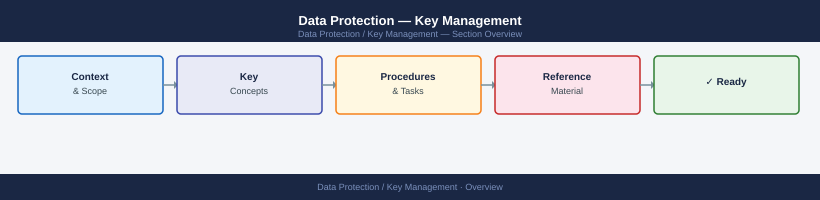

---
tags:
  - security
---
# Data Protection — Key Management



```bash
# Create a key
aws kms create-key --description "prod-data-key" --key-usage ENCRYPT_DECRYPT

# Enable automatic rotation (annual, symmetric only)
aws kms enable-key-rotation --key-id <key-id>

# Check rotation status
aws kms get-key-rotation-status --key-id <key-id>

# Schedule deletion (7–30 day waiting period)
aws kms schedule-key-deletion --key-id <key-id> --pending-window-in-days 30

# Cancel deletion
aws kms cancel-key-deletion --key-id <key-id>
```

```bash
# Check key manager status
security key-manager show

# Query encryption keys
security key-manager key query

# Check volume encryption state
volume show -fields encryption-state
```

## Before you begin

- **Access:** Admin credentials on all affected systems
- **Change management:** security changes require CAB approval in most environments
- **Rollback plan:** document current state before any security control change
- **Testing:** validate in a non-production environment first where possible

---

