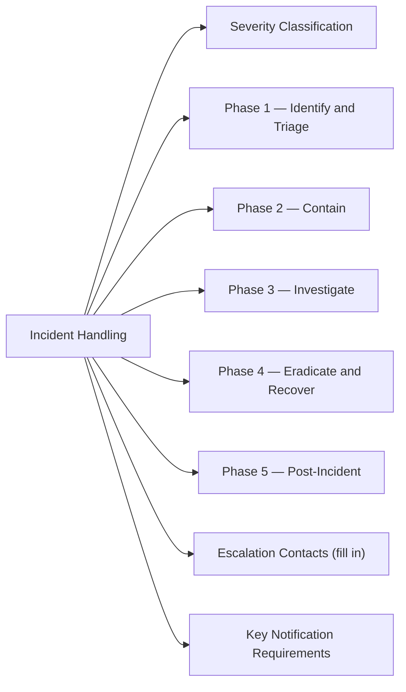

# Security Incident Handling



## Severity Classification

| Severity | Definition | Example | Response Time |
|---|---|---|---|
| P1 — Critical | Active breach, ransomware, data exfiltration in progress | Ransomware spreading, admin credential stolen | Immediate (call on-call now) |
| P2 — High | Confirmed compromise with limited scope, or high-confidence threat | Single workstation infected, phishing link clicked | 1 hour |
| P3 — Medium | Suspicious activity, potential threat, no confirmed impact | Anomalous login from foreign IP, port scan | Business day |
| P4 — Low | Informational security event, policy violation | Password policy violation, USB insertion | Within 1 week |

## Phase 1 — Identify and Triage

```bash
# Check for active suspicious processes (Linux)
ps aux | grep -E "nc|ncat|nmap|metasploit|mimikatz|powersploit"

# Recent logins from unusual IPs
last -n 50
grep "Failed password\|Accepted password" /var/log/auth.log | tail -50

# Windows — check for active remote sessions
query session /server:<hostname>
Get-EventLog -LogName Security -InstanceId 4624,4625 -Newest 50
```

## Phase 2 — Contain

**Network isolation (do not power off — preserve forensic state):**

```powershell
# Windows — disable NIC (keeps system running but disconnected)
Get-NetAdapter | Disable-NetAdapter -Confirm:$false

# Or block at firewall / network switch level
# Contact network team to port-isolate the switch port
```

```bash
# Linux — drop all traffic except management (use with caution)
iptables -I INPUT -s <mgmt-ip> -j ACCEPT
iptables -I OUTPUT -d <mgmt-ip> -j ACCEPT
iptables -P INPUT DROP
iptables -P OUTPUT DROP
iptables -P FORWARD DROP
```

**CyberArk — rotate or suspend compromised accounts immediately:**
1. CyberArk PVWA → Accounts → locate account → Change password (immediate rotation)
2. For suspected account compromise: suspend account in AD and rotate all credentials

## Phase 3 — Investigate

**Windows event IDs to review:**

| Event ID | Meaning |
|---|---|
| 4624 | Successful logon |
| 4625 | Failed logon |
| 4648 | Logon with explicit credentials |
| 4720 | User account created |
| 4728 | Member added to security-enabled global group |
| 4740 | User account locked out |
| 7045 | New service installed |

```powershell
# Pull security events from last 4 hours
Get-WinEvent -FilterHashtable @{LogName='Security'; StartTime=(Get-Date).AddHours(-4)} |
  Where-Object {$_.Id -in @(4624,4625,4648,4720,4728,7045)} |
  Select-Object TimeCreated, Id, Message | Format-List
```

**Linux — audit log:**
```bash
# Recent sudo usage
grep sudo /var/log/auth.log | tail -50

# File access audit (if auditd running)
ausearch -k <audit-key> -ts recent

# Network connections at time of incident
ss -tnp
netstat -anp | grep ESTABLISHED
```

## Phase 4 — Eradicate and Recover

- Remove malicious files, scheduled tasks, persistence mechanisms
- Re-image if full compromise suspected (do not trust a compromised OS)
- Restore from known-good backup (verify backup pre-dates compromise)
- Apply patches that were exploited
- Reset all passwords for affected accounts and service accounts

## Phase 5 — Post-Incident

```markdown
Incident Report (template):
- Date/time detected:
- Date/time contained:
- Systems affected:
- Data at risk / confirmed exfiltrated:
- Root cause:
- Attack vector:
- Timeline:
- Actions taken:
- Lessons learned:
- Remediation items (with owners and due dates):
```

## Escalation Contacts (fill in)

| Role | Contact | When to Escalate |
|---|---|---|
| Security Lead | | Any P1/P2 |
| CISO | | P1 — confirmed breach |
| Legal / Compliance | | Any data exfiltration risk |
| PR / Comms | | External disclosure required |
| Vendor TAC | | Platform-specific technical response |

## Key Notification Requirements

- **GDPR**: 72 hours from awareness of personal data breach to supervisory authority
- **PCI-DSS**: Notify card brands within 24 hours of suspected cardholder data compromise
- **Internal SLA**: Management notified within 1 hour of P1 identification
