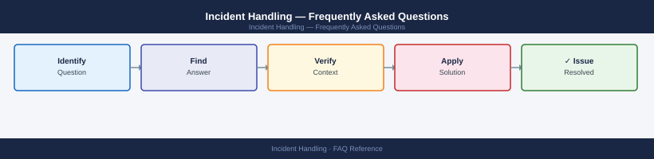

---
tags:
  - incident-handling
  - faq
  - operations
---
# Incident Handling — Frequently Asked Questions

Common questions about Incident Handling operations, configuration, and troubleshooting. For step-by-step procedures, see the <a href="index.md">Operations</a> section.

## General

**Q: How do I check the current incident handling process version?**
A: Check your incident response plan (IRP) document version in your GRC tool or document management system. ISO 27001 requires annual review of the IRP. Verify last review date is within 12 months.

**Q: How do I check the current Incident Handling version?**
A: `Check GRC tool → Policies → Incident Response Plan → Version history`

## Configuration

**Q: What is the default incident severity classification?**
A: P1 (Critical): service down, data breach active. P2 (High): significant degradation or potential breach. P3 (Medium): limited impact, workaround available. P4 (Low): cosmetic or informational. Adjust definitions per organisation risk tolerance.

**Q: How do I enable automated incident triage with SOAR?**
A: Integrate your SIEM (Splunk, Microsoft Sentinel) with a SOAR platform (Palo Alto XSOAR, Splunk SOAR). Configure playbooks to auto-triage common alert types (failed logins, malware detection) and create incidents in ServiceNow automatically.

## Operations

**Q: How do I update the incident response plan without disrupting active incident handling?**
A: Update the IRP in draft status. Review with the incident response team. Publish the new version. Brief all responders on changes. Run a tabletop exercise within 30 days to validate the updated procedures.

**Q: What is the correct procedure to add a new system to the incident scope?**
A: Add the system to your CMDB with security classification. Configure logging to the SIEM. Create detection rules for expected threat scenarios. Brief the incident response team on the system's architecture and blast radius.

## Troubleshooting

**Q: SIEM shows a 'High Severity Alert' for unusual admin activity. What does it mean?**
A: An admin account accessed systems outside normal patterns. Immediately verify with the account owner. If unconfirmed: disable the account, preserve logs, and invoke the incident response plan for potential credential compromise.

**Q: Incident resolution times are exceeding SLA — where do I start?**
A: Review MTTR metrics per incident type. Identify bottlenecks (escalation delays, missing runbooks, tool access). Create or improve runbooks for the top 5 most common incident types. Conduct post-incident reviews for all P1/P2.

## Backup and Recovery

**Q: How often should I test the incident response plan?**
A: Tabletop exercise quarterly. Full technical drill (simulated incident) annually. Test communication trees (call lists, out-of-band comms) semi-annually. Document results and update the IRP based on findings.

**Q: Can I recover deleted security logs needed for an incident investigation?**
A: Logs should be shipped to an immutable SIEM/log storage (Splunk, Elastic, S3 with Object Lock) where deletion is prevented. If local logs are deleted, check your log forwarding pipeline — well-architected environments retain logs independently of source systems.

## See Also

- [Incident Handling Operations](index.md)
- [Incident Handling Troubleshooting](../../troubleshooting/index.md)
