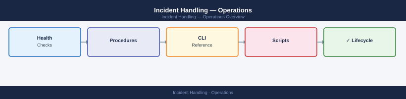

---
tags:
  - operations
  - security
---
# Incident Handling — Operations

Incident handling operational procedures: incident classification, triage workflows, evidence collection, escalation, and post-incident review.

<a class="kb-card" href="procedures/">
  <strong>Standard Procedures</strong>
  Incident handling procedures — first response, classification, escalation matrix, evidence collection, and post-incident review steps.
</a>

