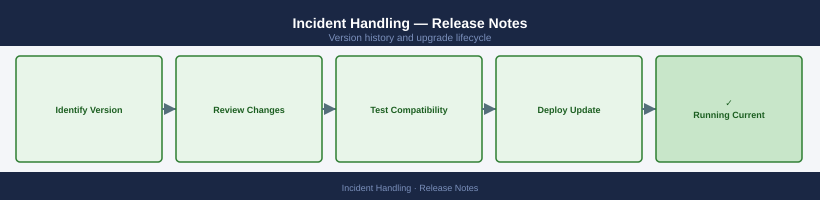

---
tags:
  - security
description: "Version history and release notes for Incident Handling."
---
# Incident Handling — Release Notes

*Applies to: All products (Security)*

Version history and release notes for Incident Handling.

## Before you begin

No special prerequisites — review the version table and cross-reference your deployed version before applying any update.

## Version History

| Version | Released | Summary | Notes |
|---------|----------|---------|-------|
| 2024-Q4 | 2024-Q4 | IR — NIST SP 800-61r3 alignment update | [Release Notes](#) |
| 2024-Q2 | 2024-Q2 | IR — playbook automation (SOAR integration) | [Release Notes](#) |
| 2023-Q4 | 2023-Q4 | IR — severity classification update | [Release Notes](#) |
| 2023-Q2 | 2023-Q2 | IR — tabletop exercise framework revision | [Release Notes](#) |
| 2022-Q4 | 2022-Q4 | IR — evidence handling chain-of-custody update | [Release Notes](#) |

## Key Terminology

**Major Version**
: A release containing significant new features or architectural changes; may require additional planning and testing.

**Patch Release**
: A targeted fix release that addresses bugs or security issues within a major/minor version.

**EOL (End of Life)**
: Date after which the vendor no longer provides updates, security patches, or technical support.

**Upgrade Path**
: The supported sequence of versions a system must traverse to reach a target version (some versions cannot be skipped).

## Upgrade Path

Review the vendor's official upgrade documentation and compatibility matrix before beginning any version change. Validate that all dependent components (OS, drivers, integration plugins) support the target version. Perform upgrades in a staged approach: dev/test environment first, then production. Capture a snapshot or backup immediately prior to the upgrade window. After the upgrade, run post-validation health checks and confirm all services are operating normally.
