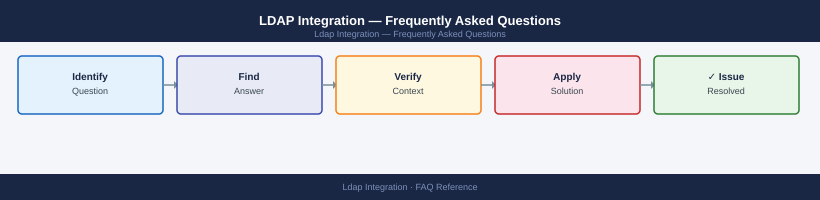

---
tags:
  - ldap-integration
  - faq
  - operations
description: "Common questions about LDAP Integration operations, configuration, and troubleshooting. For step-by-step procedures, see the Operations section."
---
# LDAP Integration — Frequently Asked Questions

*Applies to: All products (Security)*

Common questions about LDAP Integration operations, configuration, and troubleshooting. For step-by-step procedures, see the <a href="index.md">Operations</a> section.

## General

**Q: How do I verify the LDAP server version and connectivity?**
A: Check AD DS version with `Get-ADDomainController | Select OperatingSystem`. For OpenLDAP: `ldapsearch -x -H ldap://server -b '' -s base objectClass=* namingContexts`. Verify port 389 (LDAP) or 636 (LDAPS) is open.

**Q: How do I check the current LDAP Integration version?**
A: `ldapsearch -x -H ldap://server:389 -b '' -s base`

## Configuration

**Q: What is the default LDAP bind method and when should it change?**
A: Anonymous bind is the default in many configurations but should be disabled in production. Use a dedicated service account (bind DN) with read-only access. Always use LDAPS (port 636) or StartTLS — never plain LDAP in production.

**Q: How do I enable LDAP over TLS (LDAPS) for an application integration?**
A: Install the LDAP server's CA certificate in the application's trust store. Configure the application's LDAP connection to use port 636 and `ssl: true`. Test with `ldapsearch -H ldaps://server:636`. Renew the LDAP server cert before expiry.

## Operations

**Q: How do I migrate an LDAP integration from one directory server to another?**
A: Run both servers in parallel. Update the application's LDAP config to point to the new server. Test in staging. Switch DNS/IP to the new server for production. Keep the old server running for 1 week as fallback.

**Q: What is the correct procedure to add a new application LDAP integration?**
A: Create a dedicated service account in AD/LDAP with minimal permissions (read-only, specific OU). Configure the application with the bind DN, password, base DN, and search filter. Test with `ldapsearch` before go-live.

## Troubleshooting

**Q: Application shows 'LDAP: error code 49 — 80090308: invalid credentials'. What does it mean?**
A: The bind DN password is incorrect or the account is locked/expired. Reset the service account password (coordinate with all applications using it). Check the account's lockout policy and review failed login events in AD.

**Q: LDAP-based authentication is slow — where do I start?**
A: Check network latency to the LDAP server. Verify the search base DN is scoped narrowly (specific OU, not root). Add indexes for commonly searched attributes (`sAMAccountName`, `mail`). Check DC load during peak login periods.

## Backup and Recovery

**Q: How often should I back up LDAP configuration?**
A: For AD: backed up as part of DC System State backup (daily). For OpenLDAP: export with `slapcat > backup.ldif` weekly. Store bind DN passwords in a secrets manager. Document all integrations in CMDB.

**Q: Can I restore a single LDAP entry without a full directory restore?**
A: For AD: use AD Recycle Bin (`Restore-ADObject`) for deleted objects. For OpenLDAP: manually re-add the entry from the LDIF backup using `ldapadd`. For modified entries, use `ldapmodify` to restore specific attributes.

## See Also

- [LDAP Integration Operations](index.md)
- [LDAP Integration Troubleshooting](../../troubleshooting/index.md)
