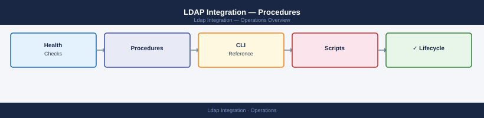

---
tags:
  - operations
  - security
---
# LDAP Integration — Procedures

<div class="kb-summary">
Step-by-step procedures for connecting, configuring, and troubleshooting LDAP identity sources across vCenter, Aria Operations, and other enterprise platforms.
  <a class="kb-card" href="faq/"><strong>FAQ</strong><span>Frequently asked questions, common issues, and quick answers for day-to-day operations.</span></a>
</div>



```d2
direction: right

hub: "Operations\nOperations" {shape: hexagon}
test_ldap_connectivity: "Test LDAP Connectivity" {shape: rectangle}
configure_ldap_bind_account: "Configure LDAP Bind Account" {shape: rectangle}
add_ldap_identity_source_to_vcenter: "Add LDAP Identity Source to vCenter" {shape: rectangle}
configure_ldap_in_aria_operations: "Configure LDAP in Aria Operations" {shape: rectangle}
troubleshoot_ldap_authentication_fai: "Troubleshoot LDAP Authentication Failures" {shape: rectangle}
rotate_ldap_bind_account_password: "Rotate LDAP Bind Account Password" {shape: rectangle}

hub -> test_ldap_connectivity
hub -> configure_ldap_bind_account
hub -> add_ldap_identity_source_to_vcenter
hub -> configure_ldap_in_aria_operations
hub -> troubleshoot_ldap_authentication_fai
hub -> rotate_ldap_bind_account_password
```

## Before you begin

- **Access:** Admin credentials on all affected systems
- **Timing:** safe to run during business hours unless a step is marked ⚠ (causes interruption)
- **Dependencies:** no active upgrades or migrations on the same infrastructure
- **Logging:** capture command output — paste into the change record on completion

---

## Test LDAP Connectivity

Verify network and TLS connectivity to the LDAP directory before configuring any application integration.

1. From the application server, test TCP connectivity to the LDAP port:
   ```bash
   Test-NetConnection -ComputerName dc01.corp.local -Port 636   # LDAPS
   Test-NetConnection -ComputerName dc01.corp.local -Port 389   # LDAP
   ```
2. Confirm the LDAP server certificate is valid (for LDAPS):
   ```bash
   openssl s_client -connect dc01.corp.local:636 -showcerts 2>/dev/null | openssl x509 -noout -dates
   ```
3. Perform a bind test using `ldapsearch`:
   ```bash
   ldapsearch -H ldaps://dc01.corp.local:636 \
     -D "CN=svc-ldap,OU=Service Accounts,DC=corp,DC=local" \
     -w 'P@ssw0rd' -b "DC=corp,DC=local" "(sAMAccountName=testuser)"
   ```
4. Confirm the search returns the expected user object; a result of `numEntries: 1` indicates success.
5. Document the verified endpoint, port, and base DN for use in subsequent configuration steps.

---

## Configure LDAP Bind Account

Create and harden a dedicated service account used by applications to query the directory.

1. Create the service account in the designated Service Accounts OU:
   ```powershell
   New-ADUser -Name "svc-ldap" -SamAccountName "svc-ldap" `
     -Path "OU=Service Accounts,DC=corp,DC=local" `
     -AccountPassword (ConvertTo-SecureString "InitialP@ss1!" -AsPlainText -Force) `
     -PasswordNeverExpires $true -Enabled $true
   ```
2. Grant only read access to the directory by adding the account to the built-in `Read-only Domain Controllers` group or delegating read permissions on the target OU:
   ```powershell
   # Delegate read on Users OU
   dsacls "OU=Users,DC=corp,DC=local" /G "corp\svc-ldap:GR"
   ```
3. Deny interactive logon rights via GPO: `Computer Configuration > Windows Settings > Security Settings > Local Policies > User Rights Assignment > Deny log on locally`.
4. Record the account DN and store the password in the enterprise vault (CyberArk, HashiCorp Vault).
5. Set a calendar reminder to review the account's access annually.

---

## Add LDAP Identity Source to vCenter

Register Active Directory as an LDAP identity source in vCenter SSO so AD users can authenticate.

1. Log in to vCenter as `administrator@vsphere.local` and navigate to **Administration > Single Sign On > Configuration > Identity Provider**.
2. Click **Add** and select **Active Directory over LDAP**.
3. Enter the following parameters:
   - **Domain name**: `corp.local`
   - **Domain alias**: `CORP`
   - **Base DN for users**: `OU=Users,DC=corp,DC=local`
   - **Base DN for groups**: `OU=Security Groups,DC=corp,DC=local`
   - **Primary server URL**: `ldaps://dc01.corp.local:636`
   - **Secondary server URL**: `ldaps://dc02.corp.local:636`
   - **Username**: `CN=svc-ldap,OU=Service Accounts,DC=corp,DC=local`
   - **Password**: (from vault)
4. Click **Test Connection** — confirm success before saving.
5. Click **OK** to register the identity source.
6. Navigate to **Administration > Access Control > Global Permissions** and assign the appropriate vCenter role (e.g., Read-Only) to an AD test group; verify the group can log in.

---

## Configure LDAP in Aria Operations

Connect VMware Aria Operations to Active Directory via LDAP so AD users can log in directly.

1. Log in to Aria Operations as an administrator and go to **Administration > Access Control > Authentication Sources**.
2. Click **Add** and select **LDAP**.
3. Complete the form:
   - **Host**: `ldaps://dc01.corp.local`
   - **Port**: `636`
   - **Use SSL**: Enabled
   - **Base DN**: `DC=corp,DC=local`
   - **Bind DN**: `CN=svc-ldap,OU=Service Accounts,DC=corp,DC=local`
   - **Bind Password**: (from vault)
   - **User search filter**: `(sAMAccountName={0})`
   - **Group search filter**: `(objectClass=group)`
4. Click **Test** to validate the bind and user search; confirm a test AD username is found.
5. Click **Save**.
6. Assign an Aria Operations role to an AD group under **Administration > Access Control > User Groups**.
7. Log out and log back in as an AD user to confirm end-to-end authentication.

---

## Troubleshoot LDAP Authentication Failures

Diagnose and resolve authentication errors reported by users or applications using LDAP.

1. Reproduce the failure and note the exact error message from the application log or event viewer.
2. Check the application's LDAP configuration has not drifted (bind account DN, server URL, port):
   ```bash
   ldapsearch -H ldaps://dc01.corp.local:636 -D "CN=svc-ldap,OU=Service Accounts,DC=corp,DC=local" \
     -w 'CurrentPass' -b "DC=corp,DC=local" "(sAMAccountName=failinguser)"
   ```
3. On the domain controller, check the Directory Services event log for error 49 (invalid credentials) or 52e (account disabled): `Get-WinEvent -LogName "Directory Service" | Where-Object {$_.Id -in 49,2889}`.
4. Verify the bind account password has not expired or been locked: `Get-ADUser svc-ldap -Properties PasswordExpired,LockedOut`.
5. Confirm the LDAP server certificate has not expired (for LDAPS):
   ```bash
   openssl s_client -connect dc01.corp.local:636 2>/dev/null | openssl x509 -noout -dates
   ```
6. If the certificate has expired, re-enrol it via the CA and re-import it to the application's trust store, then retry the bind.

---

## Rotate LDAP Bind Account Password

Update the LDAP bind account password in Active Directory and all consuming applications without causing an outage.

1. Retrieve the new password from the enterprise vault or generate a new one meeting complexity requirements.
2. Update the password in Active Directory:
   ```powershell
   Set-ADAccountPassword -Identity svc-ldap `
     -NewPassword (ConvertTo-SecureString "NewSecureP@ss2!" -AsPlainText -Force) -Reset
   ```
3. Update the password in each consuming application before the old password is invalidated:
   - **vCenter SSO**: Administration > Single Sign On > Configuration > Identity Provider > Edit > update password field.
   - **Aria Operations**: Administration > Access Control > Authentication Sources > Edit > update bind password.
   - **Any other app**: follow the relevant configuration UI or API.
4. Test authentication from each application immediately after the update to confirm no breakage.
5. Store the new password in the vault and record the rotation date in the service account register.
6. Set a reminder for the next rotation interval (typically 90 or 180 days per policy).

---

## Validate LDAP Group Sync

Confirm that AD group memberships are accurately reflected in application role assignments after a sync or configuration change.

1. In Active Directory, add a test user to the target AD group:
   ```powershell
   Add-ADGroupMember -Identity "vCenter-ReadOnly" -Members testuser01
   ```
2. In the application (vCenter, Aria Operations, etc.), trigger a manual group sync if available, or wait for the next scheduled sync interval.
3. Log in as `testuser01` and confirm the correct role and permissions are present.
4. Remove `testuser01` from the AD group and re-test to confirm access is revoked after the next sync.
5. Review the application's LDAP sync log for any errors or warnings: in vCenter check `/var/log/vmware/sso/ldap-cache.log`.
6. Document the validated sync interval and group mapping in the integration runbook.

---

## Verify

- Confirm the operation completed without errors in the log or management UI
- Verify the expected state change is visible (service running, object created, config applied)
- Document the outcome in the change record

## See also

- [Security — Overview](../)
