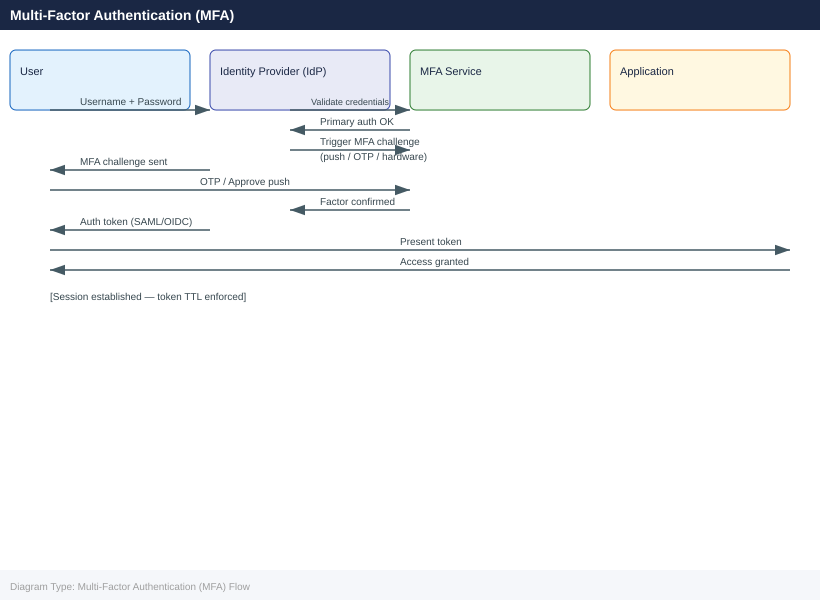
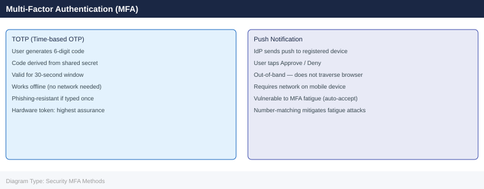

# Multi-Factor Authentication (MFA)

<div class="kb-summary">
Multi-Factor Authentication (MFA) reference covering Overview, MFA Authentication Flow, TOTP vs Push Comparison, Daily Checks, Health Commands and 1 more sections.
</div>





<div class="kb-grid">
  <a class="kb-card" href="operations/">
    <div class="kb-card-icon">⚙️</div>
    <div class="kb-card-title">Operations</div>
    <div class="kb-card-desc">Authentication flows, MFA method management, health checks, enrollment</div>
  </a>
</div>

## Overview

MFA adds an additional authentication factor beyond passwords to protect accounts and systems from unauthorized access.

## Daily Checks

| Check | Command | Notes |
|---|---|---|
| Review authentication failures |  |  |
| Validate MFA service availability |  |  |
| Confirm token synchronization |  |  |
| Review access logs |  |  |

## Health Commands

```bash
Get-MsolUser
Get-MsolCompanyInformation
```

## Upgrade Workflow

1. Backup configuration
2. Validate identity provider connectivity
3. Apply updates
4. Test user authentication flows
